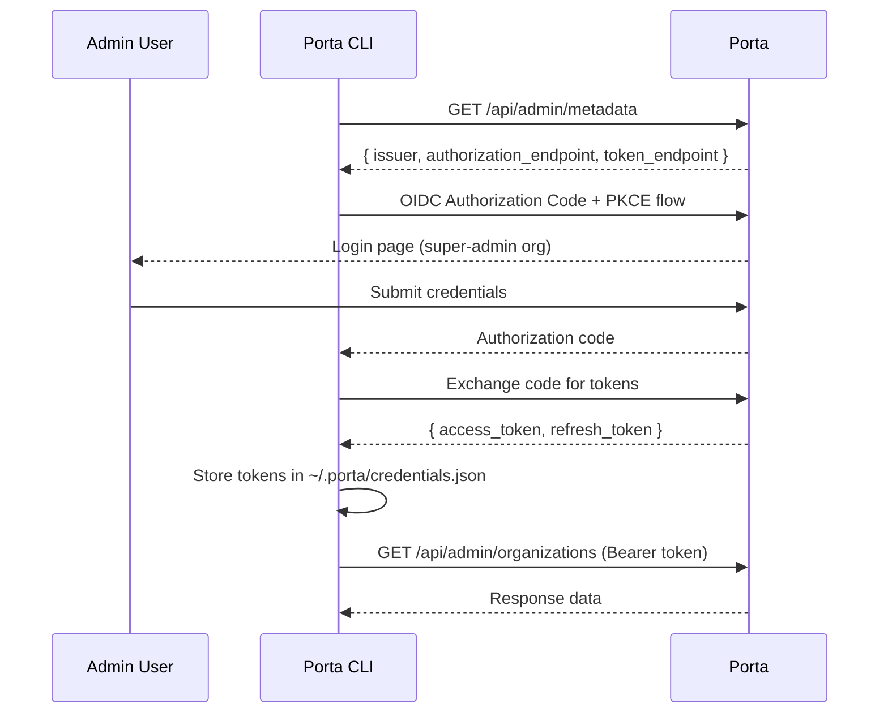

# Admin API Authentication

The Admin API uses **JWT Bearer token authentication** with ES256-signed tokens. Tokens are issued by Porta itself through the super-admin organization's OIDC endpoints (self-authentication).

## How It Works



## Token Validation

When a request reaches an Admin API endpoint, the `admin-auth` middleware performs these checks:

1. **Extract token** — parse `Authorization: Bearer <token>` header
2. **Verify signature** — validate ES256 signature against Porta's active signing keys
3. **Check issuer** — verify the token's `iss` claim matches the super-admin organization's OIDC issuer
4. **Load user** — look up the user by `sub` claim
5. **Check user status** — verify the user is `active`
6. **Check organization** — verify the user belongs to the super-admin organization
7. **Check RBAC role** — verify the user has the `porta-admin` role

If any check fails, the middleware returns `401 Unauthorized`.

## Authenticated Context

After successful authentication, the middleware populates `ctx.state.adminUser`:

```typescript
interface AdminUser {
  id: string;
  email: string;
  organizationId: string;
  roles: string[];
}
```

All downstream route handlers can access the authenticated user via `ctx.state.adminUser`.

## Getting a Token

### Via CLI (Recommended)

The easiest way to authenticate is through the Porta CLI:

```bash
# Login — opens browser for OIDC authentication
porta login

# Verify identity
porta whoami

# Logout — clear stored credentials
porta logout
```

The CLI stores credentials at `~/.porta/credentials.json` with `0600` file permissions. It automatically refreshes expired access tokens using the stored refresh token.

### Via OIDC Flow (Programmatic)

For programmatic access, perform the standard OIDC Authorization Code + PKCE flow against the super-admin organization:

1. Discover endpoints:
   ```
   GET /api/admin/metadata
   ```

2. Generate PKCE `code_verifier` and `code_challenge` (S256)

3. Redirect to authorization:
   ```
   GET /{super-admin-slug}/auth/authorize?
     response_type=code&
     client_id={admin-client-id}&
     redirect_uri={your-callback}&
     scope=openid profile email roles&
     code_challenge={challenge}&
     code_challenge_method=S256
   ```

4. Exchange code for tokens:
   ```
   POST /{super-admin-slug}/auth/token
   Content-Type: application/x-www-form-urlencoded

   grant_type=authorization_code&
   code={code}&
   redirect_uri={your-callback}&
   client_id={admin-client-id}&
   code_verifier={verifier}
   ```

## Token Refresh

Access tokens are short-lived. Use the refresh token to obtain new access tokens:

```
POST /{super-admin-slug}/auth/token
Content-Type: application/x-www-form-urlencoded

grant_type=refresh_token&
refresh_token={refresh_token}&
client_id={admin-client-id}
```

The CLI handles token refresh automatically — it checks token expiry before each request and refreshes if needed.

## Metadata Endpoint

The metadata endpoint is the only **unauthenticated** Admin API endpoint. It returns the OIDC discovery information needed to initiate the login flow:

```bash
GET /api/admin/metadata
```

```json
{
  "issuer": "https://auth.example.com/porta-admin",
  "authorization_endpoint": "https://auth.example.com/porta-admin/auth/authorize",
  "token_endpoint": "https://auth.example.com/porta-admin/auth/token",
  "end_session_endpoint": "https://auth.example.com/porta-admin/auth/end_session"
}
```
