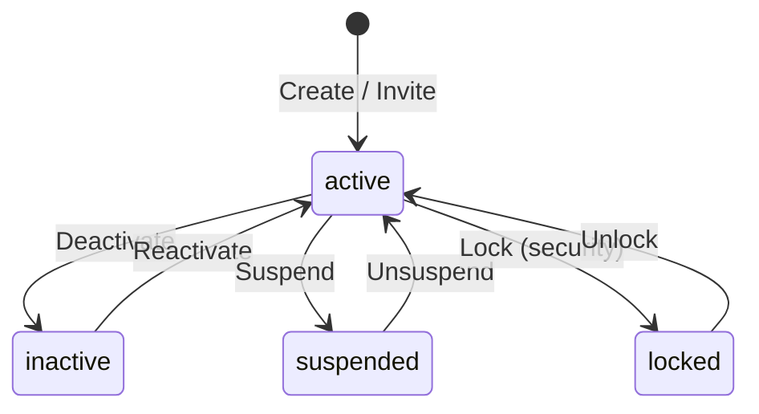

# Users API

Manage users within an organization. Users are the end-user accounts that authenticate through Porta's OIDC endpoints.

**Base path:** `/api/admin/organizations/:orgId/users`

## Create User

```http
POST /api/admin/organizations/:orgId/users
```

| Field | Type | Required | Description |
|-------|------|----------|-------------|
| `email` | string | ✅ | Email address (must be unique within org) |
| `given_name` | string | | First name |
| `family_name` | string | | Last name |
| `nickname` | string | | Nickname |
| `password` | string | | Password (NIST SP 800-63B compliant) |
| `phone_number` | string | | Phone number |
| `locale` | string | | User locale (e.g., `en`) |
| `picture` | string | | Profile picture URL |

```json
{
  "email": "alice@example.com",
  "given_name": "Alice",
  "family_name": "Smith",
  "password": "a-secure-password-here"
}
```

**Response:** `201 Created`

## Invite User

```http
POST /api/admin/organizations/:orgId/users/invite
```

**Permission:** `user:invite`

Creates a user (if they don't exist) and sends an enhanced invitation email. Supports optional personal message, role/claim pre-assignment, and inviter tracking. Pre-assigned roles and claims are stored in the invitation token and automatically applied when the user accepts the invitation.

| Field | Type | Required | Description |
|-------|------|----------|-------------|
| `email` | string | ✅ | Email address |
| `displayName` | string | | Display name for the invitation email |
| `personalMessage` | string | | Personal message from the admin (max 500 chars, included in email) |
| `roles` | array | | Roles to pre-assign on acceptance |
| `roles[].applicationId` | uuid | ✅ | Application the role belongs to |
| `roles[].roleId` | uuid | ✅ | Role ID to assign |
| `claims` | array | | Custom claim values to pre-assign on acceptance |
| `claims[].applicationId` | uuid | ✅ | Application the claim belongs to |
| `claims[].claimDefinitionId` | uuid | ✅ | Claim definition ID |
| `claims[].value` | any | ✅ | Claim value |
| `locale` | string | | Locale for the invitation email (default: org default) |

**Response:** `201 Created` (new user) or `200 OK` (existing user re-invited).

```json
{
  "data": {
    "userId": "uuid",
    "email": "user@example.com",
    "created": true,
    "invitationSent": true,
    "expiresAt": "2026-01-08T00:00:00.000Z"
  }
}
```

**Pre-assignment behavior:**
- Referenced applications, roles, and claim definitions are validated at invite time
- Pre-assignments are applied automatically when the invitation is accepted
- If a role or claim is deleted between invitation and acceptance, that assignment is skipped (best-effort)
- Previous pending invitation tokens for the same user are automatically invalidated

## Preview Invitation Email

```http
POST /api/admin/organizations/:orgId/users/invite/preview
```

**Permission:** `user:invite`

Renders the invitation email without sending it. Returns the HTML, plain text, and subject line for admin review before sending.

| Field | Type | Required | Description |
|-------|------|----------|-------------|
| `email` | string | ✅ | Recipient email (for template personalization) |
| `displayName` | string | | Display name |
| `personalMessage` | string | | Personal message to include |
| `locale` | string | | Locale for rendering |

**Response:** `200 OK`

```json
{
  "data": {
    "html": "<html>...</html>",
    "text": "Plain text version...",
    "subject": "John Doe has invited you to Acme Corp"
  }
}
```

## List Users

```http
GET /api/admin/organizations/:orgId/users
```

Supports `page`, `pageSize`, `search`, `status`, `sort`, `order` parameters. Search queries match against email, given name, family name, and nickname.

**Response:** `200 OK` — Paginated user list.

## Get User

```http
GET /api/admin/organizations/:orgId/users/:userId
```

**Response:** `200 OK` — Full user profile.

## Update User

```http
PUT /api/admin/organizations/:orgId/users/:userId
```

Updatable fields: `given_name`, `family_name`, `nickname`, `phone_number`, `locale`, `picture`.

::: info
Email changes are not supported through this endpoint to prevent authentication issues.
:::

**Response:** `200 OK`

## Status Lifecycle

Users have four possible statuses (`UserStatus`): `active`, `inactive`,
`suspended`, and `locked`. (Invitation is a token flow, not a status — a freshly
invited user is created `active` and sets a password on accepting.)



### Status Transition Endpoints

```http
POST /api/admin/organizations/:orgId/users/:userId/deactivate
POST /api/admin/organizations/:orgId/users/:userId/reactivate
POST /api/admin/organizations/:orgId/users/:userId/suspend
POST /api/admin/organizations/:orgId/users/:userId/unsuspend
POST /api/admin/organizations/:orgId/users/:userId/lock
POST /api/admin/organizations/:orgId/users/:userId/unlock
```

Each returns `204 No Content`. A `POST .../activate` alias for `reactivate`
exists on the standalone (`/api/admin/users/:userId`) router for SPA compatibility.


## Set Password

```http
POST /api/admin/organizations/:orgId/users/:userId/password
```


| Field | Type | Required | Description |
|-------|------|----------|-------------|
| `password` | string | ✅ | New password (NIST SP 800-63B compliant) |

Passwords are hashed with **Argon2id** before storage.

**Response:** `200 OK`

## User Roles

See [Roles & Permissions API](/api/rbac) for user-role assignment endpoints at:

```
/api/admin/organizations/:orgId/users/:userId/roles
```

## User Claims

See [Custom Claims API](/api/custom-claims) for user claim value endpoints.

## User 2FA

Manage two-factor authentication for individual users. All endpoints require the `admin:user:2fa` permission.

### Get 2FA Status

```http
GET /api/admin/organizations/:orgId/users/:userId/two-factor/status
```

**Permission:** `admin:user:read`

Returns the user's current 2FA enrollment status, method, and recovery code count.

**Response (200):**

```json
{
  "enabled": true,
  "method": "email",
  "totpConfigured": false,
  "recoveryCodesRemaining": 10
}
```

| Field | Type | Description |
|-------|------|-------------|
| `enabled` | boolean | Whether 2FA is currently enabled |
| `method` | `"email"` \| `"totp"` \| `null` | Active 2FA method, null if disabled |
| `totpConfigured` | boolean | Whether a TOTP authenticator is configured |
| `recoveryCodesRemaining` | number | Number of unused recovery codes |

### Disable 2FA

```http
POST /api/admin/organizations/:orgId/users/:userId/two-factor/disable
```

**Permission:** `admin:user:2fa`

Force-disables 2FA for a user, removing their TOTP configuration and recovery codes. Protected by super-admin guard — cannot disable the super-admin user's 2FA.

**Response (200):**

```json
{ "message": "Two-factor authentication disabled" }
```

**Error responses:**

| Status | Reason |
|--------|--------|
| 400 | 2FA is not currently enabled for this user |
| 403 | Target user is the super-admin (protected) |
| 404 | User not found in this organization |

### Reset 2FA

```http
POST /api/admin/organizations/:orgId/users/:userId/two-factor/reset
```

**Permission:** `admin:user:2fa`

Resets 2FA by disabling it and clearing all enrollment data, forcing the user to re-enroll. Protected by super-admin guard.

**Response (200):**

```json
{ "message": "Two-factor authentication reset" }
```

### Regenerate Recovery Codes

```http
POST /api/admin/organizations/:orgId/users/:userId/two-factor/recovery-codes/regenerate
```

**Permission:** `admin:user:2fa`

Generates a new set of 10 recovery codes, invalidating all previous codes. The new plaintext codes are returned once — they cannot be retrieved again. Protected by super-admin guard.

**Response (200):**

```json
{
  "recoveryCodes": [
    "A1B2C3D4E5",
    "F6G7H8I9J0",
    "..."
  ]
}
```

## Organization 2FA Policy

Manage the organization-level 2FA enforcement policy.

### Get Policy

```http
GET /api/admin/organizations/:orgId/two-factor/policy
```

**Permission:** `admin:org:read`

**Response (200):**

```json
{
  "twoFactorPolicy": "optional"
}
```

### Update Policy

```http
PUT /api/admin/organizations/:orgId/two-factor/policy
```

**Permission:** `admin:org:update`

| Field | Type | Required | Description |
|-------|------|----------|-------------|
| `twoFactorPolicy` | string | Yes | One of: `optional`, `required_email`, `required_totp`, `required_any` |

**Response (200):**

```json
{
  "twoFactorPolicy": "required_email"
}
```

### Get 2FA Summary

```http
GET /api/admin/organizations/:orgId/two-factor/summary
```

**Permission:** `admin:org:read`

Returns aggregate 2FA enrollment statistics for the organization.

**Response (200):**

```json
{
  "totalUsers": 50,
  "enabledCount": 35,
  "disabledCount": 15,
  "totpCount": 20,
  "emailCount": 15,
  "complianceRate": 0.7
}
```

| Field | Type | Description |
|-------|------|-------------|
| `totalUsers` | number | Total users in the organization |
| `enabledCount` | number | Users with 2FA enabled |
| `disabledCount` | number | Users without 2FA |
| `totpCount` | number | Users using TOTP method |
| `emailCount` | number | Users using email OTP method |
| `complianceRate` | number | Ratio of enabled/total (0–1, 4 decimal places) |

## Account Lockout

Porta automatically locks accounts after repeated failed login attempts (default: 5 attempts). Locked accounts auto-unlock after a cooldown period (default: 15 minutes).

The `POST .../lock` and `POST .../unlock` endpoints (see [Status Transitions](#status-transition-endpoints) above) allow administrators to manually lock or unlock a user at any time. The auto-lockout system uses the same underlying status transitions.

Lockout thresholds are configurable via the [System Configuration API](/api/config):
- `account_lockout_threshold` — Number of failed attempts before auto-lock (default: `5`)
- `account_lockout_cooldown_minutes` — Minutes before auto-unlock (default: `15`)

See the [Deployment Guide](/guide/deployment#account-lockout) for full details.

## GDPR Data Export

```http
GET /api/admin/organizations/:orgId/users/:userId/export
```

Exports all personal data for a user as a JSON document (GDPR Article 20 — data portability). The export includes:

- User profile (email, name, phone, locale, etc.)
- Organization membership
- Role assignments (with role names and application context)
- Custom claim values (with claim definitions)
- Audit log entries related to the user
- Two-factor authentication enrollment status
- Active OIDC sessions and grants

**Response:** `200 OK` — JSON document containing all user data.

## GDPR Data Purge

```http
POST /api/admin/organizations/:orgId/users/:userId/purge
```

Permanently anonymizes and deletes a user's personal data (GDPR Article 17 — right to erasure). This operation:

1. Anonymizes the user record (replaces email, names, etc. with anonymized placeholders)
2. Deletes all associated data: role assignments, custom claim values, tokens, 2FA enrollment, and audit metadata
3. Executes everything in a single database transaction

**Response:** `200 OK` — Confirmation of purge completion.

::: danger Irreversible
Data purge cannot be undone. Super-admin users cannot be purged as a safety measure.
:::

## Standalone User Routes

In addition to the org-scoped routes above, a set of **standalone user routes** is available at `/api/admin/users/:userId`. These provide direct access to user detail and mutation operations by user ID, without requiring the organization ID in the URL path.

**Base path:** `/api/admin/users/:userId`

These routes are primarily used by the Admin GUI SPA, where the user detail page navigates by user ID only. They delegate to the same service functions and require the same admin authentication and RBAC permissions as the org-scoped routes.

### Available Standalone Endpoints

| Method | Path | Description | Permission |
|--------|------|-------------|------------|
| `GET` | `/:userId` | Get user by ID | `user:read` |
| `PUT` | `/:userId` | Update user profile | `user:update` |
| `POST` | `/:userId/deactivate` | Deactivate user | `user:suspend` |
| `POST` | `/:userId/reactivate` | Reactivate user | `user:suspend` |
| `POST` | `/:userId/activate` | Alias for reactivate | `user:suspend` |
| `POST` | `/:userId/suspend` | Suspend user | `user:suspend` |
| `POST` | `/:userId/unsuspend` | Unsuspend user | `user:suspend` |
| `POST` | `/:userId/lock` | Lock user | `user:suspend` |
| `POST` | `/:userId/unlock` | Unlock user | `user:suspend` |
| `POST` | `/:userId/password` | Set password | `user:update` |
| `DELETE` | `/:userId/password` | Clear password | `user:update` |
| `POST` | `/:userId/verify-email` | Mark email verified | `user:update` |
| `GET` | `/:userId/history` | Change history | `user:read` |

::: tip
The `activate` endpoint is an alias for `reactivate`, provided for client compatibility. Both perform the same `inactive → active` status transition.
:::
