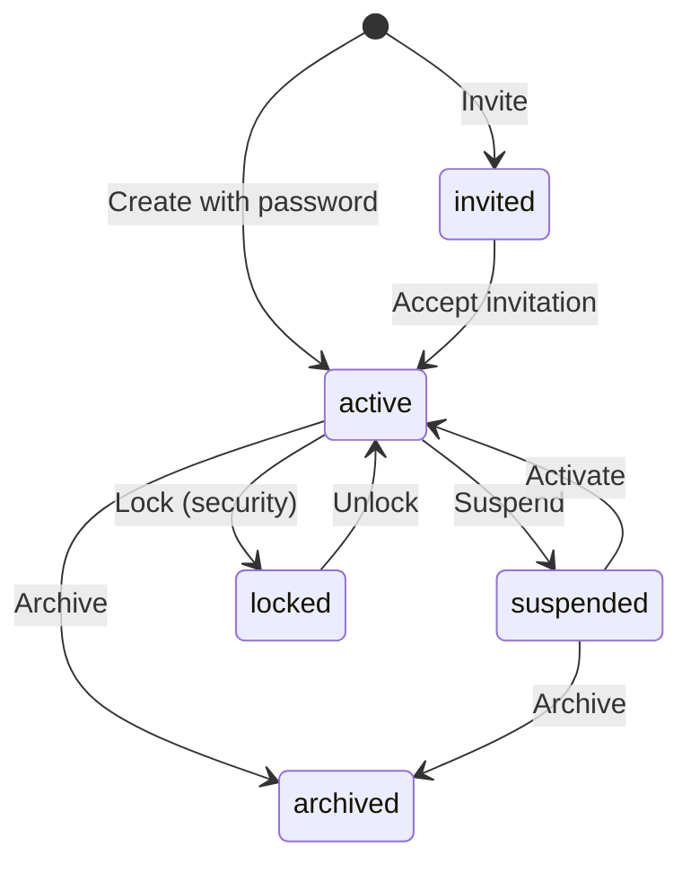

# Users API

Manage users within an organization. Users are the end-user accounts that authenticate through Porta's OIDC endpoints.

**Base path:** `/api/admin/organizations/:orgId/users`

## Create User

```http
POST /api/admin/organizations/:orgId/users
```

| Field | Type | Required | Description |
|-------|------|----------|-------------|
| `email` | string | ✅ | Email address (must be unique within org) |
| `given_name` | string | | First name |
| `family_name` | string | | Last name |
| `nickname` | string | | Nickname |
| `password` | string | | Password (NIST SP 800-63B compliant) |
| `phone_number` | string | | Phone number |
| `locale` | string | | User locale (e.g., `en`) |
| `picture` | string | | Profile picture URL |

```json
{
  "email": "alice@example.com",
  "given_name": "Alice",
  "family_name": "Smith",
  "password": "a-secure-password-here"
}
```

**Response:** `201 Created`

## Invite User

```http
POST /api/admin/organizations/:orgId/users/invite
```

Creates a user with `invited` status and sends an invitation email.

| Field | Type | Required | Description |
|-------|------|----------|-------------|
| `email` | string | ✅ | Email address |
| `given_name` | string | | First name |
| `family_name` | string | | Last name |

**Response:** `201 Created` — User with `invited` status.

## List Users

```http
GET /api/admin/organizations/:orgId/users
```

Supports `page`, `pageSize`, `search`, `status`, `sort`, `order` parameters. Search queries match against email, given name, family name, and nickname.

**Response:** `200 OK` — Paginated user list.

## Get User

```http
GET /api/admin/organizations/:orgId/users/:userId
```

**Response:** `200 OK` — Full user profile.

## Update User

```http
PUT /api/admin/organizations/:orgId/users/:userId
```

Updatable fields: `given_name`, `family_name`, `nickname`, `phone_number`, `locale`, `picture`.

::: info
Email changes are not supported through this endpoint to prevent authentication issues.
:::

**Response:** `200 OK`

## Status Lifecycle

Users have six possible statuses with controlled transitions:



### Status Transition Endpoints

```http
POST /api/admin/organizations/:orgId/users/:userId/suspend
POST /api/admin/organizations/:orgId/users/:userId/activate
POST /api/admin/organizations/:orgId/users/:userId/lock
POST /api/admin/organizations/:orgId/users/:userId/unlock
POST /api/admin/organizations/:orgId/users/:userId/archive
```

Each returns `200 OK` with the updated user object.

## Set Password

```http
POST /api/admin/organizations/:orgId/users/:userId/set-password
```

| Field | Type | Required | Description |
|-------|------|----------|-------------|
| `password` | string | ✅ | New password (NIST SP 800-63B compliant) |

Passwords are hashed with **Argon2id** before storage.

**Response:** `200 OK`

## User Roles

See [Roles & Permissions API](/api/rbac) for user-role assignment endpoints at:

```
/api/admin/organizations/:orgId/users/:userId/roles
```

## User Claims

See [Custom Claims API](/api/custom-claims) for user claim value endpoints.

## User 2FA

```http
GET  /api/admin/organizations/:orgId/users/:userId/2fa/status
POST /api/admin/organizations/:orgId/users/:userId/2fa/disable
POST /api/admin/organizations/:orgId/users/:userId/2fa/reset
```

These endpoints allow administrators to view 2FA status, force-disable 2FA, or reset 2FA for a user (forcing re-enrollment).

## Account Lockout

Porta automatically locks accounts after repeated failed login attempts (default: 5 attempts). Locked accounts auto-unlock after a cooldown period (default: 15 minutes).

The `POST .../lock` and `POST .../unlock` endpoints (see [Status Transitions](#status-transition-endpoints) above) allow administrators to manually lock or unlock a user at any time. The auto-lockout system uses the same underlying status transitions.

Lockout thresholds are configurable via the [System Configuration API](/api/config):
- `account_lockout_threshold` — Number of failed attempts before auto-lock (default: `5`)
- `account_lockout_cooldown_minutes` — Minutes before auto-unlock (default: `15`)

See the [Deployment Guide](/guide/deployment#account-lockout) for full details.

## GDPR Data Export

```http
GET /api/admin/organizations/:orgId/users/:userId/export
```

Exports all personal data for a user as a JSON document (GDPR Article 20 — data portability). The export includes:

- User profile (email, name, phone, locale, etc.)
- Organization membership
- Role assignments (with role names and application context)
- Custom claim values (with claim definitions)
- Audit log entries related to the user
- Two-factor authentication enrollment status
- Active OIDC sessions and grants

**Response:** `200 OK` — JSON document containing all user data.

## GDPR Data Purge

```http
POST /api/admin/organizations/:orgId/users/:userId/purge
```

Permanently anonymizes and deletes a user's personal data (GDPR Article 17 — right to erasure). This operation:

1. Anonymizes the user record (replaces email, names, etc. with anonymized placeholders)
2. Deletes all associated data: role assignments, custom claim values, tokens, 2FA enrollment, and audit metadata
3. Executes everything in a single database transaction

**Response:** `200 OK` — Confirmation of purge completion.

::: danger Irreversible
Data purge cannot be undone. Super-admin users cannot be purged as a safety measure.
:::
