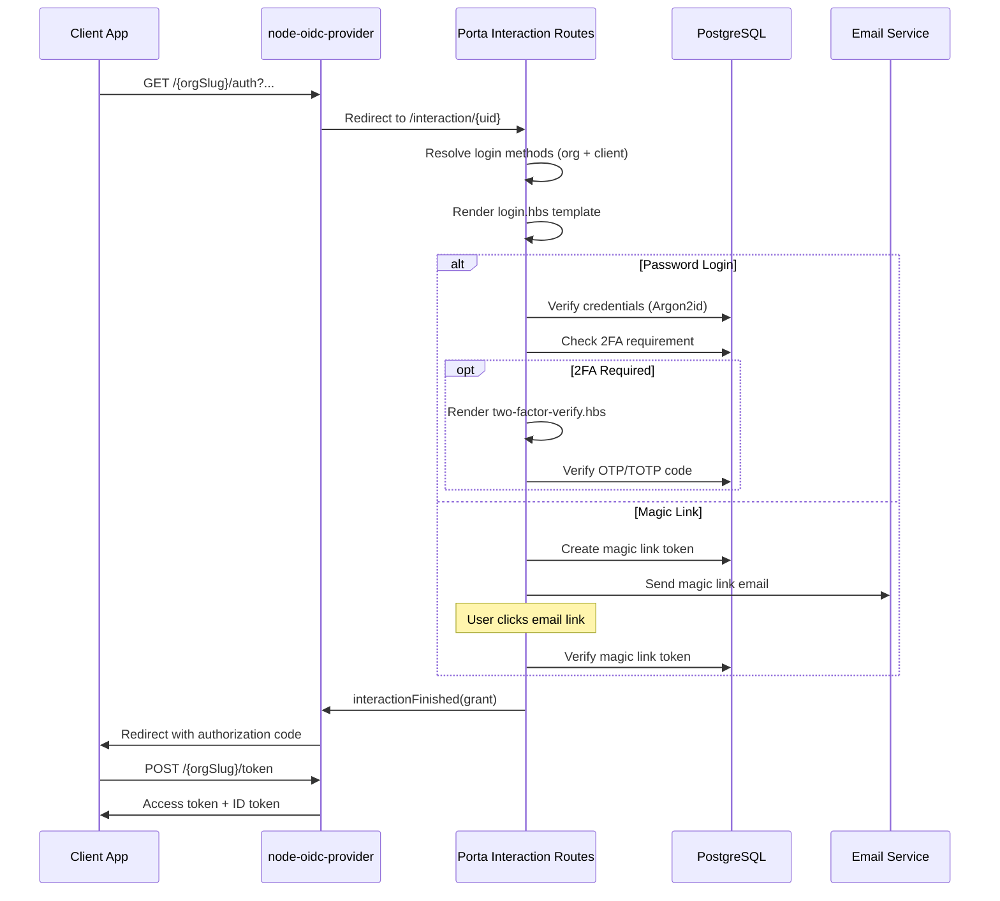

# Architecture & node-oidc-provider

Porta is built on top of [node-oidc-provider](https://github.com/panva/node-oidc-provider), a certified OpenID Connect provider implementation for Node.js. This page explains the relationship between Porta and node-oidc-provider, and how Porta extends it into a full multi-tenant identity platform.

## Built on node-oidc-provider

[node-oidc-provider](https://github.com/panva/node-oidc-provider) is an open-source, [OpenID Certified™](https://openid.net/certification/) implementation authored by [Filip Skokan (panva)](https://github.com/panva). It implements the core OIDC specification with strict standards compliance and is widely used in production systems.

::: tip Credit
Porta would not exist without the excellent work of Filip Skokan and the node-oidc-provider project. If you're building OIDC solutions on Node.js, we highly recommend exploring [node-oidc-provider](https://github.com/panva/node-oidc-provider) directly — it is one of the best OIDC implementations available in any language.
:::

### What node-oidc-provider Provides

node-oidc-provider handles the core OIDC protocol:

- **Authorization endpoint** — Handles `/auth` requests, validates parameters, initiates interactions
- **Token endpoint** — Issues access tokens, refresh tokens, handles client credentials
- **UserInfo endpoint** — Returns claims about the authenticated user
- **JWKS endpoint** — Publishes public signing keys
- **Discovery endpoint** — `/.well-known/openid-configuration`
- **Revocation and Introspection** — Token lifecycle management
- **End Session** — RP-initiated logout
- **PKCE** — Proof Key for Code Exchange
- **Adapter interface** — Pluggable storage for all OIDC artifacts

### What Porta Adds on Top

Porta wraps node-oidc-provider and adds everything needed for a production multi-tenant identity platform:

| Layer | Porta's Addition |
|-------|-----------------|
| **Multi-tenancy** | Path-based organization isolation (`/{orgSlug}/*`) |
| **User management** | Full user CRUD, status lifecycle, password policies |
| **Authentication UI** | Handlebars templates for login, consent, reset, 2FA, invitations |
| **Login methods** | Password + magic link, configurable per org and client |
| **Two-factor auth** | Email OTP, TOTP, recovery codes with per-org policies |
| **RBAC** | Roles and permissions per application, injected into tokens |
| **Custom claims** | Type-validated claim definitions, injected into tokens |
| **Branding** | Per-org logo, colors, CSS, company name |
| **Admin API** | JWT-authenticated REST API for all management operations |
| **Admin CLI** | Command-line tool for bootstrapping and management |
| **Hybrid storage** | Redis for ephemeral data, PostgreSQL for durable data |
| **Audit logging** | Comprehensive security and admin event logging |
| **Key management** | ES256 key generation, rotation, and lifecycle |
| **Email system** | Transactional emails for magic links, resets, invitations, OTP |
| **i18n** | Locale-based translations for all UI pages and emails |

---

## How Porta Integrates with node-oidc-provider

### Provider Configuration

Porta creates a configured `Provider` instance by building a comprehensive configuration object. This is where the OIDC engine is customized:

```
src/oidc/
├── configuration.ts      # Builds the Provider configuration
├── provider.ts           # Creates the Provider instance
├── adapter-factory.ts    # Routes models to Redis or PostgreSQL adapters
├── postgres-adapter.ts   # PostgreSQL adapter for durable artifacts
├── redis-adapter.ts      # Redis adapter for ephemeral artifacts
├── account-finder.ts     # User lookup + claims builder
└── client-finder.ts      # Client metadata lookup from DB
```

The configuration builder (`configuration.ts`) sets up:

- **Supported flows** — Authorization Code + PKCE, Client Credentials, Refresh Tokens
- **Scopes and claims** — Standard OIDC scopes plus RBAC roles and custom claims
- **Token TTLs** — Configurable via `system_config` table with 60-second in-memory cache
- **Signing keys** — ES256 keys loaded from the database
- **Interaction policy** — Delegates login and consent to Porta's Koa routes
- **Client metadata lookup** — Reads from PostgreSQL instead of static config
- **Account/claims finder** — Builds claim sets from user data, RBAC roles, and custom claims

### Interaction Model

node-oidc-provider delegates user interaction (login, consent) to the application. Porta implements this through Koa route handlers:



### Multi-Tenant Overlay

Porta implements multi-tenancy via path-based routing. A tenant resolver middleware intercepts requests and resolves the organization:

```
Request: GET /acme-corp/.well-known/openid-configuration
                ↓
        Tenant Resolver Middleware
                ↓
        1. Extract "acme-corp" from path
        2. Check Redis cache for org
        3. If miss, query PostgreSQL
        4. Verify org status (active/suspended/archived)
        5. Set ctx.state.organization
                ↓
        node-oidc-provider handles the OIDC request
        with org-specific issuer: https://porta.example.com/acme-corp
```

Each organization effectively gets its own OIDC provider namespace with:
- Its own discovery document
- Its own issuer URL
- Its own set of clients and users
- Its own branding on login pages

---

## Hybrid Storage Architecture

One of Porta's key architectural decisions is the hybrid adapter pattern. Different OIDC artifacts have different characteristics, and Porta uses the optimal storage for each:

### Redis Adapters (Ephemeral Data)

| Model | Typical TTL | Why Redis? |
|-------|-------------|-----------|
| Session | 14 days | Fast read/write, auto-expiry, no query needed |
| Interaction | 10 minutes | Very short-lived, high throughput |
| AuthorizationCode | 10 minutes | One-time use, fast lookup |
| ReplayDetection | 1 hour | Prevents token replay, needs fast exists-check |
| ClientCredentials | 10 minutes | Short-lived, high throughput |
| PushedAuthorizationRequest | 1 minute | Very short-lived |

### PostgreSQL Adapters (Durable Data)

| Model | Typical TTL | Why PostgreSQL? |
|-------|-------------|----------------|
| AccessToken | 1 hour | Must survive Redis restart, queryable for revocation |
| RefreshToken | 14 days | Long-lived, must be revocable by grant |
| Grant | 14 days | Tracks user consent, revocation cascades to tokens |
| DeviceCode | 10 minutes | Needs reliable persistence during device flow |

### Adapter Factory

The adapter factory (`adapter-factory.ts`) transparently routes each model to the correct storage backend:

```
Model request → Adapter Factory → Redis Adapter (ephemeral)
                                → PostgreSQL Adapter (durable)
```

This is invisible to node-oidc-provider — it simply uses the adapter interface and Porta handles the routing.

---

## Request Flow

A complete request through Porta passes through several layers:

```
Incoming HTTP Request
    │
    ├── Root Page Handler (/, /robots.txt, /favicon.ico)
    │
    ├── Health Check (/health)
    │
    ├── Admin API (/api/admin/*)
    │   ├── Admin Auth Middleware (JWT Bearer, ES256)
    │   └── Route Handlers → Services → Repositories → DB
    │
    ├── Interaction Routes (/interaction/*)
    │   ├── CSRF Middleware
    │   ├── Rate Limiter
    │   ├── Template Engine → Handlebars
    │   └── Login / Consent / 2FA / Magic Link handlers
    │
    └── OIDC Provider (/{orgSlug}/*)
        ├── Tenant Resolver (org lookup + cache)
        ├── Client Secret Hash Middleware
        ├── OIDC CORS Handler
        └── node-oidc-provider (auth, token, userinfo, jwks, etc.)
```

### Middleware Stack

Porta's Koa middleware stack is ordered carefully:

1. **Error handler** — Global error catching and formatting
2. **Request logger** — Logs all requests with X-Request-Id
3. **Root page** — Neutral response for `/`, `/robots.txt`, `/favicon.ico`
4. **Health check** — `GET /health` with DB + Redis checks
5. **Admin auth** — JWT Bearer authentication for `/api/admin/*`
6. **Admin routes** — REST API handlers
7. **Interaction routes** — Login, consent, 2FA, magic link, password reset
8. **Tenant resolver** — Org resolution for `/{orgSlug}/*`
9. **Client secret hash** — SHA-256 pre-hash for `client_secret_post`
10. **OIDC CORS** — CORS headers for OIDC endpoints
11. **OIDC Provider** — node-oidc-provider mounted at `/{orgSlug}`

---

## Technology Choices

| Decision | Choice | Rationale |
|----------|--------|-----------|
| **Web framework** | Koa | Required by node-oidc-provider (not Express) |
| **OIDC engine** | node-oidc-provider 9.x | OpenID Certified, actively maintained, extensible |
| **Token signing** | ES256 (ECDSA P-256) | Modern, compact signatures, recommended for OIDC |
| **Password hashing** | Argon2id | Winner of the Password Hashing Competition, memory-hard |
| **Template engine** | Handlebars | Logic-less, secure (auto-escaping), easy for non-developers |
| **Database** | PostgreSQL 16 | Reliable, feature-rich, JSONB for metadata |
| **Cache** | Redis 7 | Fast key-value store, built-in TTL, pub/sub potential |
| **Language** | TypeScript (strict) | Type safety, better IDE support, catch errors at compile time |
| **Config validation** | Zod | Runtime validation with TypeScript type inference |

---

## Further Reading

- [node-oidc-provider Documentation](https://github.com/panva/node-oidc-provider/blob/main/docs/README.md) — The upstream library docs
- [OpenID Connect Core Specification](https://openid.net/specs/openid-connect-core-1_0.html) — The OIDC standard
- [OAuth 2.0 for Browser-Based Apps](https://datatracker.ietf.org/doc/html/draft-ietf-oauth-browser-based-apps) — Best practices for SPAs
- [Capabilities Overview](./capabilities.md) — Full feature list
- [OIDC & Authentication](./oidc.md) — Porta-specific OIDC details
- [Deployment Guide](../guide/deployment.md) — Production deployment
