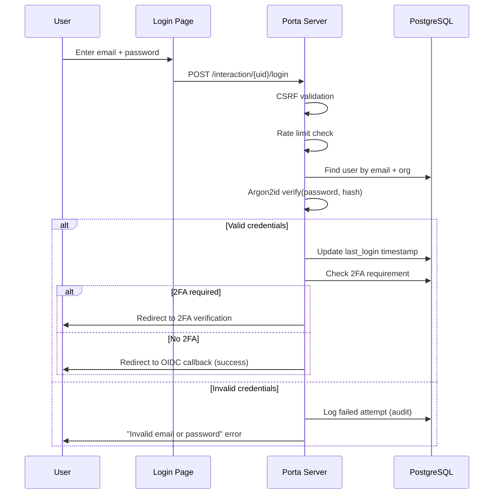
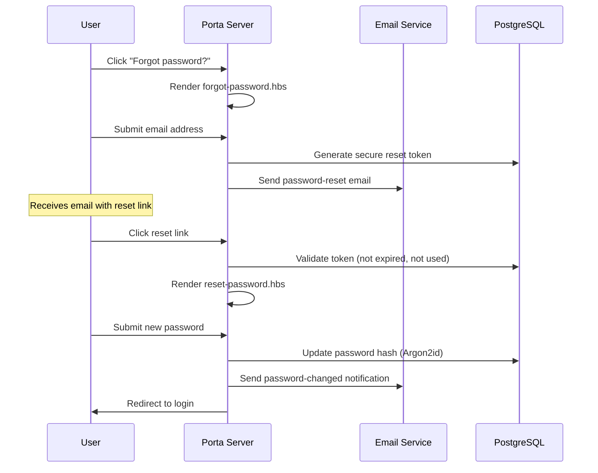
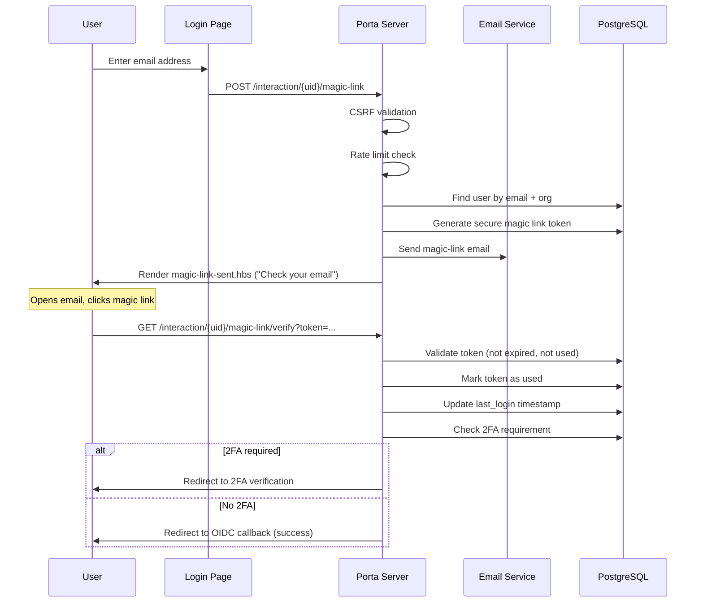
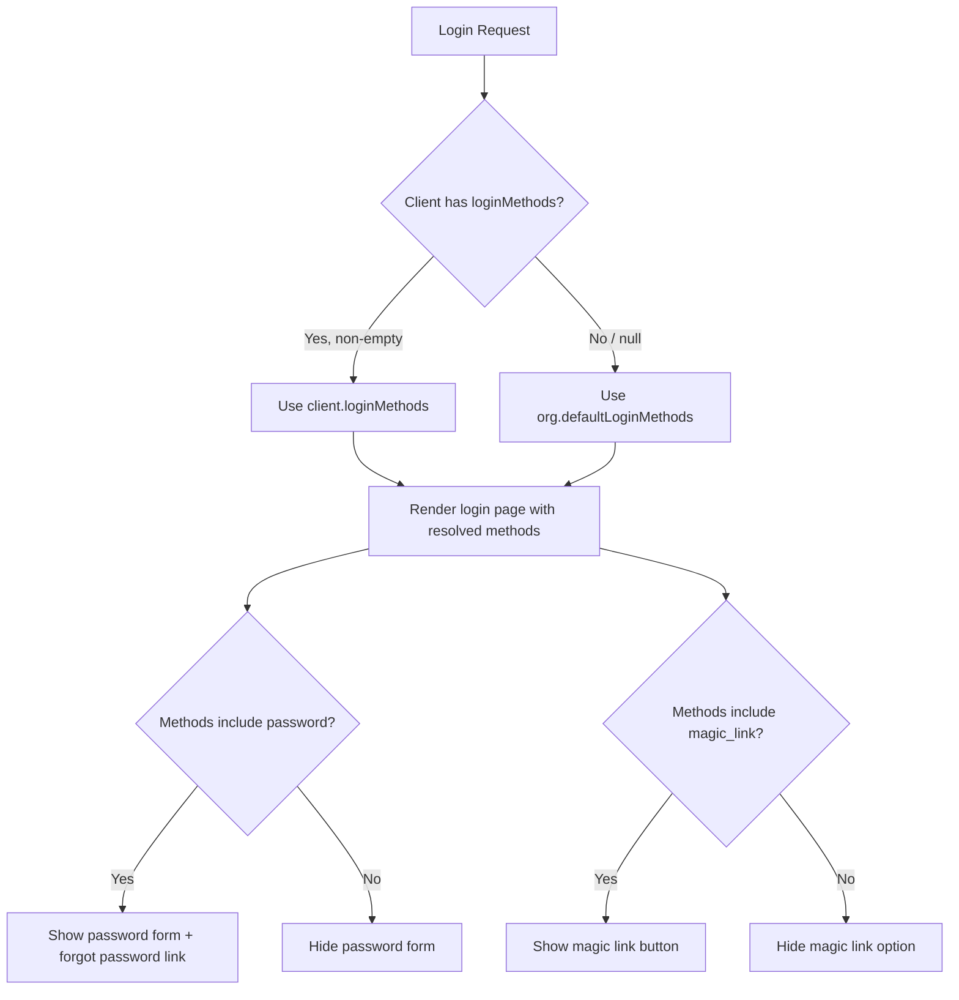

# Authentication Modes

Porta supports multiple authentication methods that can be configured per organization and per client. This page covers all login methods, two-factor authentication options, and how they're configured and enforced.

## Overview

Porta provides a layered authentication system:

| Layer | Methods | Description |
|-------|---------|-------------|
| **Primary authentication** | Password, Magic Link | How users prove their identity |
| **Second factor (2FA)** | Email OTP, TOTP, Recovery Codes | Additional verification after primary auth |

These layers combine to create flexible, secure authentication flows tailored to each organization's needs.

### Login Method Matrix

| Configuration | Login Page Shows | Use Case |
|---------------|-----------------|----------|
| `[password, magic_link]` | Password form + magic link button + forgot password | Default — maximum flexibility |
| `[password]` | Password form + forgot password only | Traditional enterprise apps |
| `[magic_link]` | Email input + magic link button only | Passwordless-first experience |

---

## Password Authentication {#password}

Traditional email + password authentication with enterprise-grade security.

### How It Works



### Password Security

| Feature | Implementation |
|---------|---------------|
| **Hashing algorithm** | Argon2id (winner of the Password Hashing Competition) |
| **Password validation** | NIST SP 800-63B compliant |
| **Minimum length** | 8 characters (configurable) |
| **Breach detection** | Checks against known breached passwords |
| **Timing-safe comparison** | Prevents timing attacks on credential verification |
| **Rate limiting** | Redis-backed per-email rate limiting on login attempts |

### Password Reset Flow

When password login is enabled, users can reset forgotten passwords:



---

## Magic Link Authentication {#magic-link}

Passwordless authentication via secure one-time email links. Users click a link in their email to log in — no password needed.

### How It Works



### Magic Link Security

| Feature | Implementation |
|---------|---------------|
| **Token generation** | Cryptographically secure random tokens |
| **Token expiry** | Configurable (default: 15 minutes) |
| **Single use** | Tokens are invalidated after first use |
| **Rate limiting** | Prevents email flooding attacks |
| **User enumeration protection** | Same response regardless of whether email exists |
| **Session binding** | Magic link is bound to the OIDC interaction session |

### When to Use Magic Link

Magic link is ideal for:
- **Consumer applications** where users dislike remembering passwords
- **Internal tools** where email access implies authorization
- **Mobile-first** experiences where typing passwords is cumbersome
- **Low-friction onboarding** where you want to minimize signup steps

---

## Two-Factor Authentication (2FA) {#two-factor}

After successful primary authentication (password or magic link), Porta can require a second factor for additional security.

### Email OTP {#email-otp}

A 6-digit one-time password sent to the user's email.

| Feature | Detail |
|---------|--------|
| **Code format** | 6 numeric digits |
| **Delivery** | Email via configured SMTP |
| **Expiry** | Configurable (default: 10 minutes) |
| **Max active codes** | 3 per user (prevents flooding) |
| **Template** | Customizable via `emails/otp-code.hbs` |

**User flow:**
1. User completes primary login (password or magic link)
2. Porta generates a 6-digit code and stores it in the database
3. Code is emailed to the user
4. User enters the code on the verification page
5. Porta validates the code (not expired, not used)
6. Authentication is complete

### TOTP (Authenticator Apps) {#totp}

Time-based One-Time Password using authenticator apps like Google Authenticator, Authy, Microsoft Authenticator, or any TOTP-compatible app.

| Feature | Detail |
|---------|--------|
| **Algorithm** | TOTP (RFC 6238) |
| **Code format** | 6 numeric digits, 30-second window |
| **Setup** | QR code scanning or manual secret entry |
| **Secret storage** | AES-256-GCM encrypted in PostgreSQL |
| **Verification** | Time-window tolerance (±1 step) |

**Setup flow:**
1. User navigates to 2FA setup
2. Porta generates a TOTP secret and encrypts it with AES-256-GCM
3. QR code is displayed for scanning with an authenticator app
4. User enters a verification code from their app to confirm setup
5. Recovery codes are generated and displayed (one-time view)

**Login flow:**
1. User completes primary login
2. Porta detects TOTP is configured for this user
3. User enters the current 6-digit code from their authenticator app
4. Porta verifies the code against the encrypted secret
5. Authentication is complete

### Recovery Codes {#recovery}

One-time backup codes for account recovery when the primary 2FA method is unavailable (lost phone, no email access).

| Feature | Detail |
|---------|--------|
| **Format** | 8-character alphanumeric codes with dash (e.g., `A1B2-C3D4`) |
| **Count** | 10 codes generated per setup |
| **Storage** | Argon2id hashed (not stored in plain text) |
| **Usage** | Each code can be used exactly once |
| **Case-insensitive** | `a1b2-c3d4` matches `A1B2-C3D4` |
| **Dash-insensitive** | `A1B2C3D4` matches `A1B2-C3D4` |

::: warning Important
Recovery codes are shown only once during 2FA setup. Users should save them in a secure location. If all recovery codes are used and the primary 2FA method is lost, an admin must manually disable 2FA for the user.
:::

---

## Per-Organization Configuration {#per-org}

Each organization has a `default_login_methods` setting that controls which primary authentication methods are available to all clients in that organization.

### Setting Organization Login Methods

**Via CLI:**
```bash
# Enable both password and magic link (default)
porta org update <org-id> --login-methods password,magic_link

# Password only
porta org update <org-id> --login-methods password

# Magic link only
porta org update <org-id> --login-methods magic_link
```

**Via Admin API:**
```bash
curl -X PUT http://localhost:3000/api/admin/organizations/<org-id> \
  -H "Authorization: Bearer $TOKEN" \
  -H "Content-Type: application/json" \
  -d '{ "defaultLoginMethods": ["password", "magic_link"] }'
```

### 2FA Organization Policy

2FA enforcement is configured per organization:

| Policy | Behavior |
|--------|----------|
| **`optional`** | Users can optionally enable 2FA in their account settings |
| **`encouraged`** | Users are prompted to set up 2FA but can skip |
| **`required`** | All users must configure 2FA before accessing applications |

---

## Per-Client Overrides {#per-client}

Individual clients can override the organization's default login methods. This allows different applications within the same organization to offer different login experiences.

### Setting Client Login Methods

**Via CLI:**
```bash
# Override to password only for this client
porta client update <client-id> --login-methods password

# Override to magic link only
porta client update <client-id> --login-methods magic_link

# Clear override (inherit from organization)
porta client update <client-id> --clear-login-methods
```

**Via Admin API:**
```bash
# Set override
curl -X PUT http://localhost:3000/api/admin/clients/<client-id>/login-methods \
  -H "Authorization: Bearer $TOKEN" \
  -H "Content-Type: application/json" \
  -d '{ "loginMethods": ["password"] }'

# Clear override (inherit from org)
curl -X DELETE http://localhost:3000/api/admin/clients/<client-id>/login-methods \
  -H "Authorization: Bearer $TOKEN"
```

---

## Resolution Logic {#resolution}

When a user initiates a login, Porta determines the available login methods using this resolution logic:



### Enforcement Points

Login methods are enforced at **five** endpoints, **before** any user lookup or CSRF validation:

1. **`GET /interaction/:uid`** — Login page rendering
2. **`POST /interaction/:uid/magic-link`** — Magic link request
3. **`GET /interaction/:uid/forgot-password`** — Password reset form
4. **`POST /interaction/:uid/forgot-password`** — Password reset submission
5. **`POST /interaction/:uid/reset-password`** — New password submission

If a user attempts to use a disabled login method, Porta responds with:
- **HTTP 403** status code
- Audit event: `security.login_method_disabled`
- Error message explaining the method is not available

---

## Security Considerations

### Rate Limiting

All authentication endpoints are rate-limited to prevent brute-force attacks:

| Endpoint | Limit | Window |
|----------|-------|--------|
| Password login | Configurable | Per email + org |
| Magic link request | Configurable | Per email + org |
| 2FA code verification | Configurable | Per user |
| Password reset request | Configurable | Per email |

### Audit Logging

Every authentication event is logged for security monitoring:

| Event | Logged Data |
|-------|------------|
| `auth.login.success` | User ID, method, client, org, IP |
| `auth.login.failure` | Email attempted, failure reason, org, IP |
| `auth.magic_link.sent` | Email, org, IP |
| `auth.magic_link.verified` | User ID, org |
| `auth.2fa.verified` | User ID, method (otp/totp/recovery) |
| `auth.2fa.failed` | User ID, method, failure reason |
| `auth.password_reset.requested` | Email, org |
| `auth.password_reset.completed` | User ID, org |
| `security.login_method_disabled` | Attempted method, client, org |

### Timing-Safe Operations

Porta uses constant-time comparisons for all credential verification to prevent timing side-channel attacks:
- Password verification via Argon2id (inherently timing-safe)
- Magic link token comparison
- TOTP code verification
- Recovery code verification

---

## Next Steps

- [Capabilities Overview](./capabilities.md) — Full feature list
- [Custom UI Tutorial](../guide/custom-ui.md) — Customize login pages and emails
- [OIDC & Authentication](./oidc.md) — OIDC protocol details
- [Two-Factor Authentication](./two-factor.md) — 2FA concept details
- [Login Methods](./login-methods.md) — Login method configuration details
