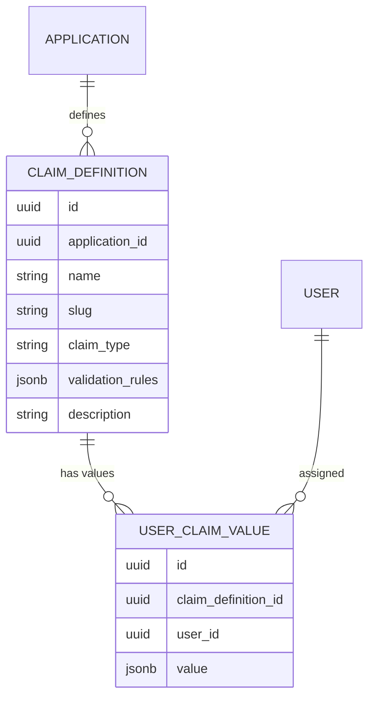

# Custom Claims

Custom claims allow you to attach **application-specific data** to user tokens without modifying the core user model. They're ideal for business-specific attributes like department, employee ID, subscription tier, or feature flags.

## How It Works

Custom claims are a two-layer system:

1. **Claim Definitions** — defined per application, specifying the claim name, data type, and validation rules
2. **User Claim Values** — the actual values assigned to individual users



## Supported Claim Types

| Type | Description | Example |
|------|-------------|---------|
| `string` | Free-text value | `"Engineering"` |
| `number` | Numeric value | `42` |
| `boolean` | True/false flag | `true` |
| `json` | Arbitrary JSON object or array | `{"tier": "pro", "seats": 10}` |

## Validation Rules

Each claim definition can specify validation rules that are enforced when setting values:

```json
{
  "name": "department",
  "claim_type": "string",
  "validation_rules": {
    "required": true,
    "enum": ["Engineering", "Sales", "Marketing", "Support"]
  }
}
```

```json
{
  "name": "employee_id",
  "claim_type": "number",
  "validation_rules": {
    "min": 1000,
    "max": 99999
  }
}
```

## Claims in Tokens

When a user authenticates and the `custom_claims` scope is requested, their custom claim values are injected into the access token and ID token:

```json
{
  "sub": "user-uuid",
  "email": "alice@example.com",
  "custom_claims": {
    "erp": {
      "department": "Engineering",
      "employee_id": 12345,
      "is_manager": true
    }
  }
}
```

Claims are grouped by application slug, so multiple applications can define claims with the same name without conflict.

## Managing Custom Claims

### Define a Claim (Admin API)

```bash
POST /api/admin/applications/{appId}/claims
{
  "name": "department",
  "claim_type": "string",
  "description": "Employee department",
  "validation_rules": {
    "required": true,
    "enum": ["Engineering", "Sales", "Marketing", "Support"]
  }
}
```

### Set a User's Claim Value (Admin API)

```bash
PUT /api/admin/applications/{appId}/claims/{claimId}/users/{userId}
{
  "value": "Engineering"
}
```

### Via CLI

```bash
# Define a claim
porta app claim create --app-id <id> --name "department" \
  --type string --description "Employee department"

# Set a user's claim value
porta user claims set --org-id <id> --user-id <id> \
  --claim-id <id> --value "Engineering"

# List a user's claim values
porta user claims list --org-id <id> --user-id <id>
```

## Caching

Claim definitions and user claim values are cached in Redis for fast token generation. The cache is invalidated when definitions are updated or user values change.
