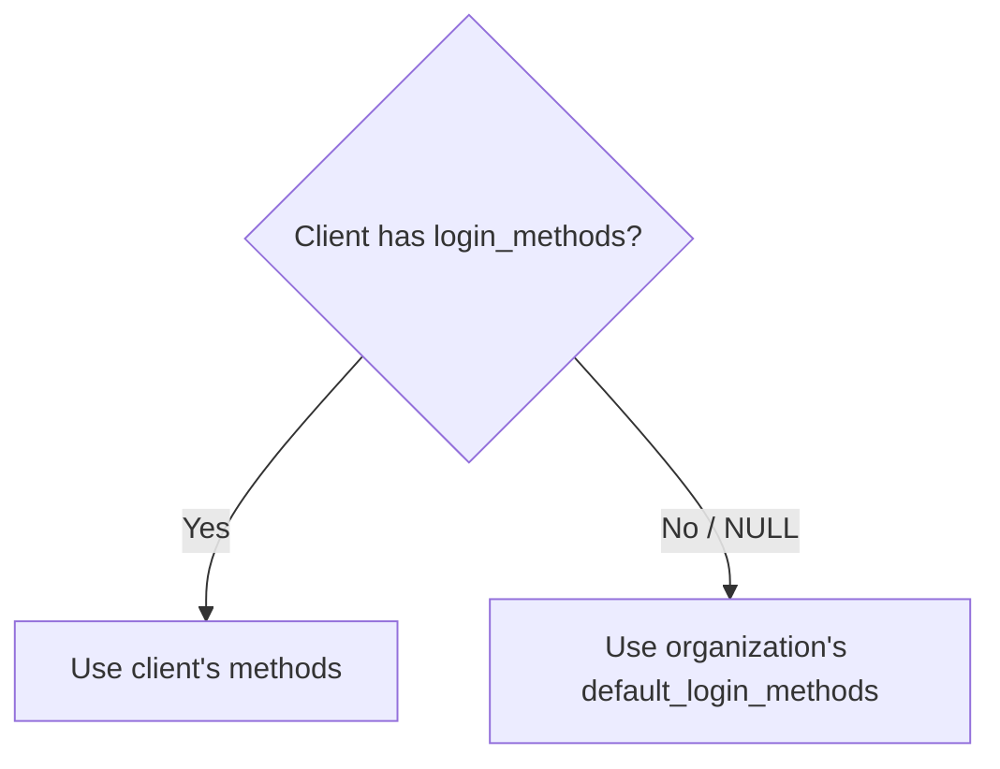

# Login Methods

Porta supports configurable **login methods** that control how users can authenticate. Login methods can be set at the organization level and optionally overridden per client.

## Available Methods

| Method | Description |
|--------|-------------|
| `password` | Traditional email + password authentication |
| `magic_link` | Passwordless authentication via a link sent to the user's email |

## Resolution Logic

Login methods are resolved using a **client → organization** inheritance chain:



- **Per-client override**: A client can specify its own `login_methods` array. When set, this completely overrides the organization default.
- **Organization default**: If the client's `login_methods` is `NULL`, the organization's `default_login_methods` is used. This field is `NOT NULL` with a database default of `{password, magic_link}`.

## Login Page Modes

The login page adapts its UI based on the resolved login methods:

| Resolved Methods | Login Page Behavior |
|------------------|---------------------|
| `[password, magic_link]` | Shows both password form and magic link option |
| `[password]` | Shows password form only, magic link hidden |
| `[magic_link]` | Shows magic link only, password form hidden |
| `[]` (empty) | Fallback — shows an informational message |

## Enforcement Points

Login method restrictions are enforced at **five endpoints**, checked before any CSRF validation, rate limiting, or user lookup occurs:

| Endpoint | Enforced Method |
|----------|-----------------|
| `POST /interaction/:uid/login` | `password` |
| `POST /:orgSlug/auth/magic-link` | `magic_link` |
| `GET /:orgSlug/auth/forgot-password` | `password` |
| `POST /:orgSlug/auth/forgot-password` | `password` |
| `POST /:orgSlug/auth/reset-password` | `password` |

When a disabled method is attempted, Porta returns a **403 Forbidden** response and logs a `security.login_method_disabled` audit event.

## Login Hint

The OIDC `login_hint` parameter is respected when present. If the authorization request includes a `login_hint` (typically an email address), the login page pre-fills the email field, providing a smoother user experience.

## Managing Login Methods

### Per-Organization Default

```bash
# Via CLI
porta org update --id <orgId> --default-login-methods password,magic_link

# Via Admin API
PUT /api/admin/organizations/{orgId}
{ "default_login_methods": ["password", "magic_link"] }
```

### Per-Client Override

```bash
# Set client-specific login methods
porta client login-methods set --client-id <id> --methods password

# Clear override (inherit from org)
porta client login-methods clear --client-id <id>

# View effective login methods
porta client login-methods get --client-id <id>

# Via Admin API
PUT /api/admin/clients/{clientId}
{ "login_methods": ["password"] }
```

## Use Cases

### Password-Only for Internal Apps

For an internal employee portal where you want to enforce corporate passwords:

```bash
porta client login-methods set --client-id <internal-app> --methods password
```

### Magic-Link-Only for Customer Portal

For a customer-facing app where you want a frictionless passwordless experience:

```bash
porta client login-methods set --client-id <customer-app> --methods magic_link
```

### Mixed Defaults

Set the organization default to support both methods, then override specific clients as needed:

```bash
porta org update --id <orgId> --default-login-methods password,magic_link
porta client login-methods set --client-id <admin-app> --methods password
```
