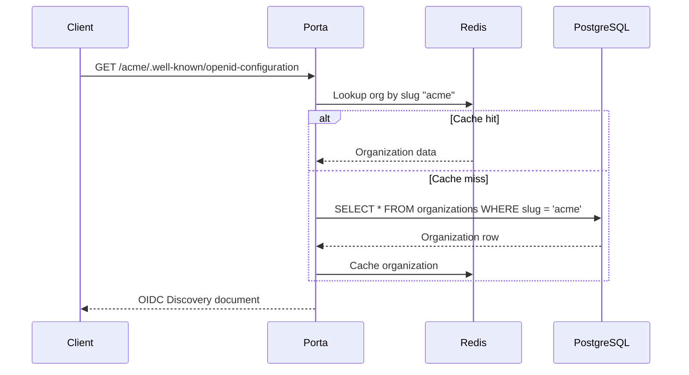
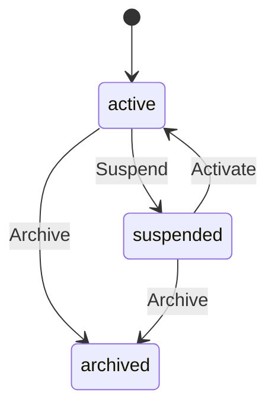

# Multi-Tenancy

Porta is designed from the ground up as a **multi-tenant** identity provider. Every tenant is represented by an **organization**, and all OIDC endpoints, users, clients, and configuration are scoped to that organization.

## Path-Based Isolation

Unlike subdomain-based multi-tenancy, Porta uses **URL path prefixes** to isolate tenants:

```
https://auth.example.com/{org-slug}/.well-known/openid-configuration
https://auth.example.com/{org-slug}/auth/token
https://auth.example.com/{org-slug}/auth/authorize
```

This approach has several advantages:

- **Single domain** — no wildcard TLS certificates or DNS configuration per tenant
- **Simple deployment** — one instance serves all tenants
- **Easy discovery** — clients only need the org slug to locate their OIDC endpoints

## Tenant Resolution

When a request arrives, the **tenant resolver** middleware extracts the organization slug from the URL path and resolves it to an organization record:



Organizations are cached in Redis for fast resolution. The cache is invalidated automatically when an organization is updated or its status changes.

## Organization Lifecycle

Each organization has a **status** that controls access:

| Status | Description |
|--------|-------------|
| `active` | Fully operational — users can authenticate, APIs work normally |
| `suspended` | Temporarily disabled — all authentication requests are rejected |
| `archived` | Permanently decommissioned — organization cannot be reactivated |

Status transitions follow strict rules:



::: warning
Archiving is irreversible. Once archived, an organization and all its data are effectively sealed.
:::

## Super-Admin Organization

One special organization is marked as the **super-admin** (`is_super_admin = true`). This organization:

- Hosts the administrative users who manage all other tenants
- Is the issuer of admin API JWT tokens
- Cannot be suspended or archived
- Is guaranteed to be unique (enforced by a partial unique index)

The super-admin organization is created during the initial `porta init` bootstrap process.

## Branding

Each organization can customize its login UI through branding fields:

| Field | Description |
|-------|-------------|
| `logo_url` | Logo displayed on login pages |
| `favicon_url` | Browser tab icon |
| `primary_color` | Primary accent color (hex) |
| `company_name` | Display name shown to users |
| `custom_css` | Optional CSS overrides for login templates |
| `default_locale` | Default language for login UI (e.g., `en`) |

These values are passed to the Handlebars template engine when rendering login, consent, and error pages.

## Data Isolation

All user-facing data is scoped to an organization through foreign keys:

- **Users** belong to an organization
- **Clients** belong to an organization (and an application)
- **User roles** are assigned within an organization context
- **User claim values** are scoped to a user (who belongs to an org)

This ensures complete data isolation between tenants at the database level.
