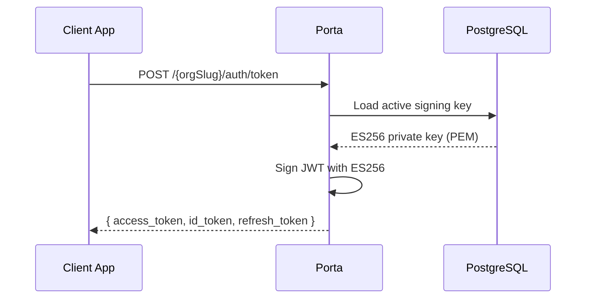
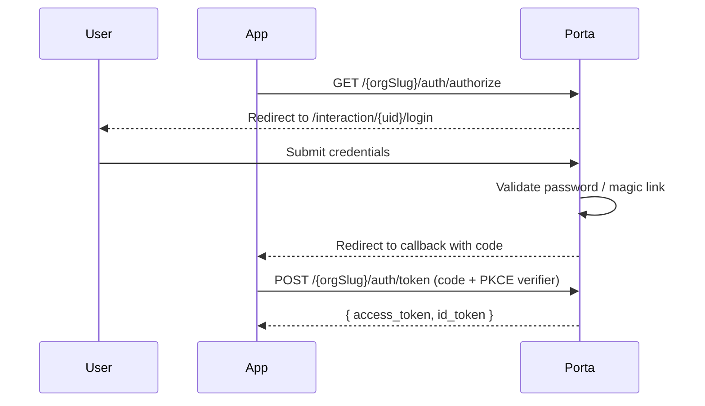

# OIDC & Authentication

Porta is a fully standards-compliant **OpenID Connect (OIDC)** provider built on top of [node-oidc-provider](https://github.com/panva/node-oidc-provider). It supports modern authentication flows with a focus on security best practices.

## Supported Flows

| Flow | Use Case | PKCE |
|------|----------|------|
| Authorization Code + PKCE | SPAs, mobile apps, server-side web apps | Required for public clients |
| Client Credentials | Machine-to-machine (M2M) communication | N/A |
| Refresh Token | Long-lived sessions with token rotation | N/A |

::: tip Recommendation
Always use **Authorization Code + PKCE** for user-facing applications. The implicit flow is intentionally not supported due to security concerns.
:::

## OIDC Endpoints

All OIDC endpoints are scoped to an organization via the org slug prefix:

| Endpoint | Path |
|----------|------|
| Discovery | `/{orgSlug}/.well-known/openid-configuration` |
| Authorization | `/{orgSlug}/auth/authorize` |
| Token | `/{orgSlug}/auth/token` |
| UserInfo | `/{orgSlug}/auth/userinfo` |
| JWKS | `/{orgSlug}/auth/jwks` |
| End Session | `/{orgSlug}/auth/end_session` |
| Revocation | `/{orgSlug}/auth/revocation` |
| Introspection | `/{orgSlug}/auth/introspection` |

## Token Signing

Porta uses **ES256 (ECDSA P-256)** for token signing:

- Signing keys are generated as PEM key pairs and stored in the database
- Multiple active keys are supported for key rotation
- The JWKS endpoint exposes the public keys for token verification
- Keys can be managed via the Admin API or CLI (`porta keys`)

## Hybrid Storage Adapters

Porta uses a **hybrid adapter strategy** that routes OIDC artifacts to the optimal storage backend:

| Storage | Artifact Types | Why |
|---------|---------------|-----|
| **Redis** | Session, Interaction, AuthorizationCode, ReplayDetection, ClientCredentials, PushedAuthorizationRequest | Short-lived, high-throughput, auto-expiry via TTL |
| **PostgreSQL** | AccessToken, RefreshToken, Grant, DeviceCode | Long-lived, need audit trail, survive restarts |

This gives you the speed of Redis for ephemeral data and the durability of PostgreSQL for tokens that matter.

## Scopes & Claims

Porta supports standard OIDC scopes and maps them to user profile claims:

| Scope | Claims Returned |
|-------|-----------------|
| `openid` | `sub` |
| `profile` | `name`, `given_name`, `family_name`, `nickname`, `picture`, `locale`, `updated_at` |
| `email` | `email`, `email_verified` |
| `phone` | `phone_number`, `phone_number_verified` |

In addition, Porta injects **RBAC roles** and **custom claims** into tokens when the appropriate scopes are requested. See [RBAC & Permissions](/concepts/rbac) and [Custom Claims](/concepts/custom-claims) for details.

## Login Interactions

When a user needs to authenticate, Porta presents a server-rendered login page built with Handlebars templates:

The login page supports multiple authentication methods (password, magic link) and can be customized per organization through [branding](/concepts/multi-tenancy#branding) and [login methods](/concepts/login-methods).

## Client Types

Porta supports two OIDC client types:

| Type | `token_endpoint_auth_method` | Secret Required | Use Case |
|------|------------------------------|-----------------|----------|
| **Public** | `none` | No | SPAs, mobile apps (must use PKCE) |
| **Confidential** | `client_secret_post` | Yes | Server-side apps, M2M |

Client secrets are hashed with **Argon2id** for storage and additionally pre-hashed with **SHA-256** at the middleware level for compatibility with node-oidc-provider.

## CORS

OIDC endpoints support CORS to allow browser-based applications (SPAs) to communicate with the token and userinfo endpoints directly. CORS origins are configured per client via the `cors_origins` field.
