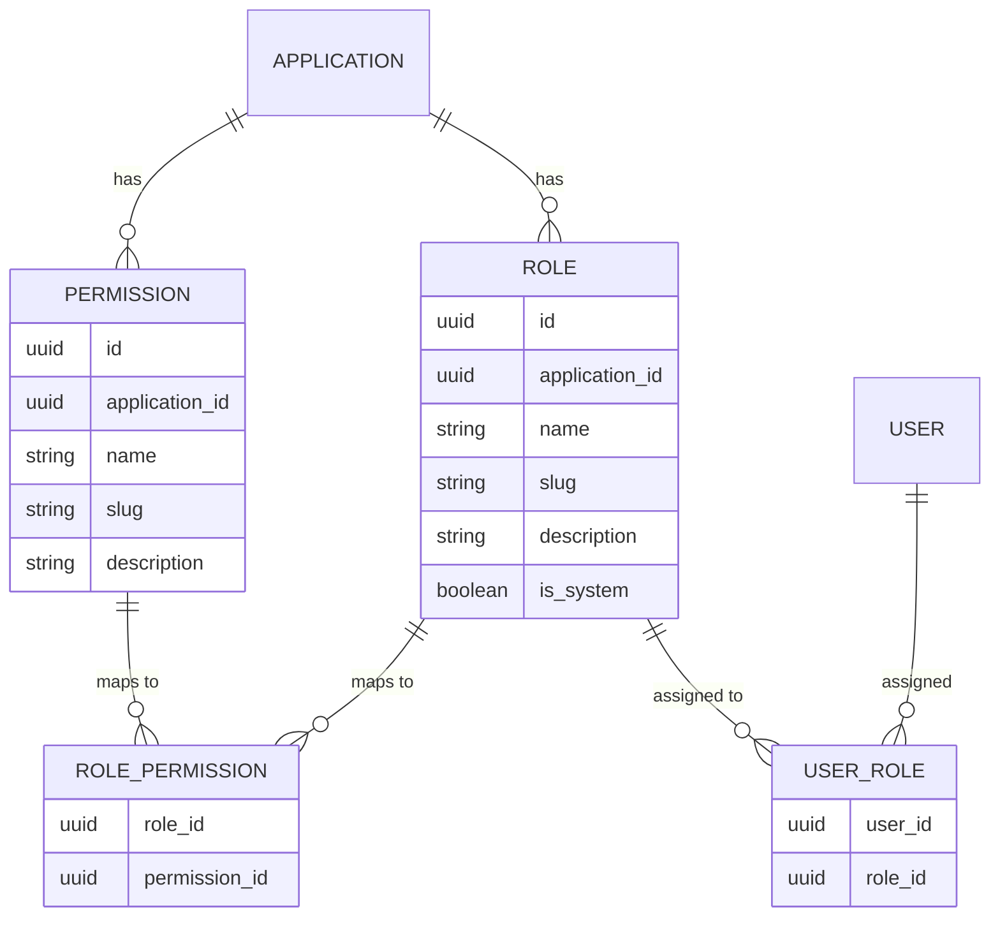
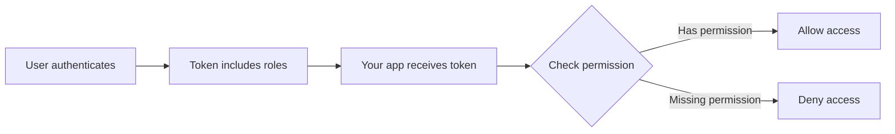

# RBAC & Permissions

Porta provides a full **Role-Based Access Control (RBAC)** system that is scoped to applications. Roles and permissions are defined per application, and users are assigned roles within their organization context.

## Data Model



## Key Concepts

### Applications Scope Roles

Roles and permissions are defined **per application**, not globally. This means:

- An ERP application can have roles like `erp-admin`, `accountant`, `viewer`
- A CRM application can have roles like `sales-manager`, `support-agent`
- Role names don't conflict across applications

### Organization Scope Assignments

User-role assignments are checked within the **organization context**. A user in Organization A with the `admin` role has no authority in Organization B.

### System Roles

Some roles are marked as **system roles** (`is_system = true`). These are created during bootstrap and cannot be deleted. The most important system role is `porta-admin`, which grants access to the Admin API.

## How Roles Appear in Tokens

When a user authenticates, their roles are included in the access token and ID token under the `roles` claim:

```json
{
  "sub": "user-uuid",
  "email": "alice@example.com",
  "roles": [
    {
      "application": "erp",
      "roles": ["admin", "accountant"]
    },
    {
      "application": "crm",
      "roles": ["viewer"]
    }
  ]
}
```

Roles are included when the `roles` scope is requested during the authorization flow.

## Permission Resolution

Permissions are attached to roles through **role-permission mappings**. When checking authorization in your application:

1. Get the user's roles from the token
2. Look up the permissions for those roles (via Porta's API or cache them)
3. Check if the required permission is present



## Managing RBAC

### Via Admin API

```bash
# Create a role
POST /api/admin/applications/{appId}/roles
{ "name": "Sales Manager", "description": "Can manage sales pipeline" }

# Create a permission
POST /api/admin/applications/{appId}/permissions
{ "name": "deals:write", "description": "Create and edit deals" }

# Assign permission to role
POST /api/admin/applications/{appId}/roles/{roleId}/permissions
{ "permissionId": "..." }

# Assign role to user
POST /api/admin/organizations/{orgId}/users/{userId}/roles
{ "roleId": "..." }
```

### Via CLI

```bash
# Create role and permission
porta app role create --app-id <id> --name "Sales Manager"
porta app permission create --app-id <id> --name "deals:write"

# Assign permission to role
porta app role assign-perm --app-id <id> --role-id <id> --permission-id <id>

# Assign role to user
porta user roles assign --org-id <id> --user-id <id> --role-id <id>
```

## Granular Admin Roles

Porta's admin API uses a **granular role-based permission system** for fine-grained access control. The system ships with 5 built-in admin roles and 17+ permissions across 6 domains.

### Built-in Admin Roles

| Role | Slug | Description |
| --- | --- | --- |
| **Super Admin** | `porta-super-admin` | Full access to all admin operations. Automatically assigned to the initial admin user during `porta init`. |
| **Organization Manager** | `porta-org-manager` | Manages organizations, users, and their assignments. Cannot modify system config or signing keys. |
| **Application Manager** | `porta-app-manager` | Manages applications, clients, roles, permissions, and claims. Cannot modify users or organizations. |
| **Auditor** | `porta-auditor` | Read-only access to all resources plus audit logs and stats. Cannot modify any data. |
| **Support** | `porta-support` | Can view users and organizations, manage sessions. Limited write access for user support tasks. |

### Permission Domains

Permissions are organized by domain with standard CRUD-style operations:

| Domain | Permissions | Description |
| --- | --- | --- |
| **Organizations** | `org:create`, `org:read`, `org:update`, `org:suspend`, `org:archive` | Organization lifecycle management |
| **Users** | `user:create`, `user:read`, `user:update`, `user:suspend`, `user:invite` | User account management |
| **Applications** | `app:create`, `app:read`, `app:update`, `app:archive` | Application configuration |
| **Clients** | `client:create`, `client:read`, `client:update`, `client:revoke` | OIDC client management |
| **System** | `config:read`, `config:write`, `key:read`, `key:rotate`, `audit:read` | System configuration and operations |
| **Sessions** | `session:read`, `session:revoke` | Active session management |

### Legacy Compatibility

The original `porta-admin` role is automatically mapped to `porta-super-admin` permissions for backward compatibility. Existing deployments that used the `porta-admin` role will continue to work with full admin access after upgrading.

### Super-Admin Protection

The super-admin user (first user created via `porta init`) is protected from destructive operations:

- Cannot be suspended, locked, or deactivated
- Cannot be deleted
- Cannot have their admin role removed
- The super-admin user ID is stored in `system_config` as `super_admin_user_id`

## Caching

Role and permission lookups are cached in Redis with automatic invalidation when assignments change. This ensures that token generation remains fast even with complex RBAC hierarchies.
