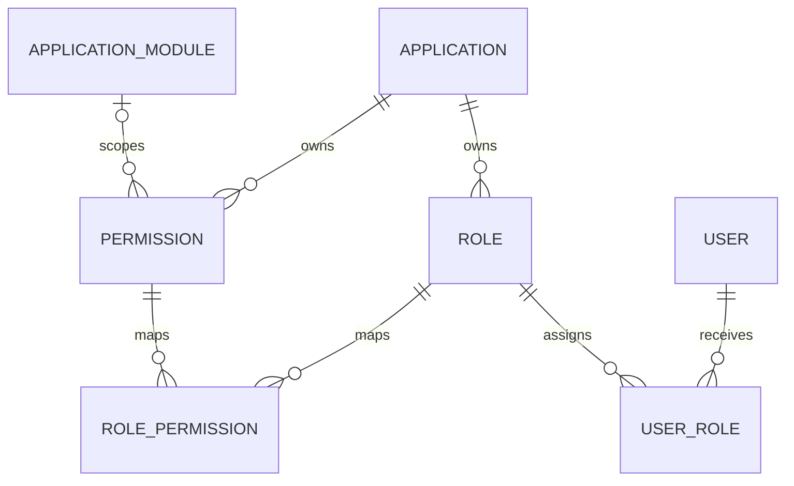

# Role-based access control

Porta uses role-based access control (RBAC) in two related contexts:

- Application RBAC describes authority inside an application that uses Porta for sign-in.
- Porta Admin RBAC controls who may operate Porta itself.

Both use roles and permissions, but application ownership prevents an external application's role
from becoming Porta Admin authority.

## Data model


```mermaid
erDiagram
    APPLICATION ||--o{ ROLE : owns
    APPLICATION ||--o{ PERMISSION : owns
    APPLICATION_MODULE o|--o{ PERMISSION : scopes
    ROLE ||--o{ ROLE_PERMISSION : maps
    PERMISSION ||--o{ ROLE_PERMISSION : maps
    USER ||--o{ USER_ROLE : receives
    ROLE ||--o{ USER_ROLE : assigns
```

A role and a permission each belong to exactly one application. A permission may additionally
belong to one module of that same application. Role-permission mappings cannot cross the
application boundary. User-role assignments are made for a user in one organization, while the
assigned role keeps its application owner.

This means two applications may both define `admin`, `viewer`, or any other role slug. Those values
remain independent.

## Roles, permissions, and assignments

A role groups authority under a stable slug such as `billing-admin`. A permission describes one
operation, normally with a three-or-more-part slug such as `billing:invoice:read`.

The common setup flow is:

1. Create roles and permissions beneath an application.
2. Map the required permissions to each role.
3. Assign roles directly to users in an organization.

Assignments and mappings are direct. Porta does not add role inheritance, nested groups, deny
rules, policy expressions, or a delegation engine.

## OIDC claims

An OIDC client belongs to one application. During token and UserInfo claim generation, Porta uses
that trusted ownership to include only role and permission slugs from the client's application.

```json
{
  "sub": "user-uuid",
  "email": "alice@example.com",
  "roles": ["billing-admin"],
  "permissions": ["billing:invoice:read", "billing:invoice:write"]
}
```

Porta never combines authority from all applications into one OIDC response. If the internal client
application context is absent or malformed, `roles` and `permissions` are empty arrays. The
internal application identifier itself is not exposed in tokens, UserInfo, introspection,
discovery, rendered authentication output, errors, or logs.

Your application should authorize against these application-scoped permission slugs. It does not
need to fetch a second global permission graph for every request.

## Porta Admin authority

Porta's own control plane is the canonical `porta-admin` application. Its built-in roles are:

| Role               | Slug                | Purpose                                       |
| ------------------ | ------------------- | --------------------------------------------- |
| Super Admin        | `porta-super-admin` | All Porta Admin capabilities                  |
| Organization Admin | `porta-org-admin`   | Organization lifecycle and statistics         |
| User Admin         | `porta-user-admin`  | Users, invitations, assignments, and sessions |
| Application Admin  | `porta-app-admin`   | Applications, clients, RBAC, and claims       |
| Auditor            | `porta-auditor`     | Read-only administration and audit access     |

The legacy canonical `porta-admin` role retains super-admin behavior. A role with the same slug in
another application does not grant Admin access.

Admin authorization uses the canonical application identity, static built-in capability sets, and
an assignment ceiling: an administrator cannot assign a canonical Admin role that grants
capabilities they do not have. Generic CRUD cannot alter the canonical built-in definitions;
initialization and reset own them.

## Authority changes

Adding a role or permission mapping invalidates the affected caches. Removing a user role,
role-permission mapping, role, or permission is an authority reduction. Porta commits the database
change in a short transaction, revokes affected database grants, and performs targeted Redis
cleanup for affected users. Unrelated users are not logged out.

Mutation responses report `reauthenticationRequired` when the authenticated administrator removed
authority from their own active session. The Admin UI then clears protected state and asks that
administrator to sign in again. If a client cannot determine whether a mutation completed, it must
reload authoritative state and must not replay the mutation automatically.

## Administration surfaces

The embedded `porta admin` application exposes Roles and Permissions tabs beneath Application
details. User details exposes one Roles dialog for direct assignment and removal. The conventional
CLI and SDK provide the same direct operations for scripts and agents.

See [Roles and Permissions API](/api/rbac) for endpoint shapes and result contracts.
