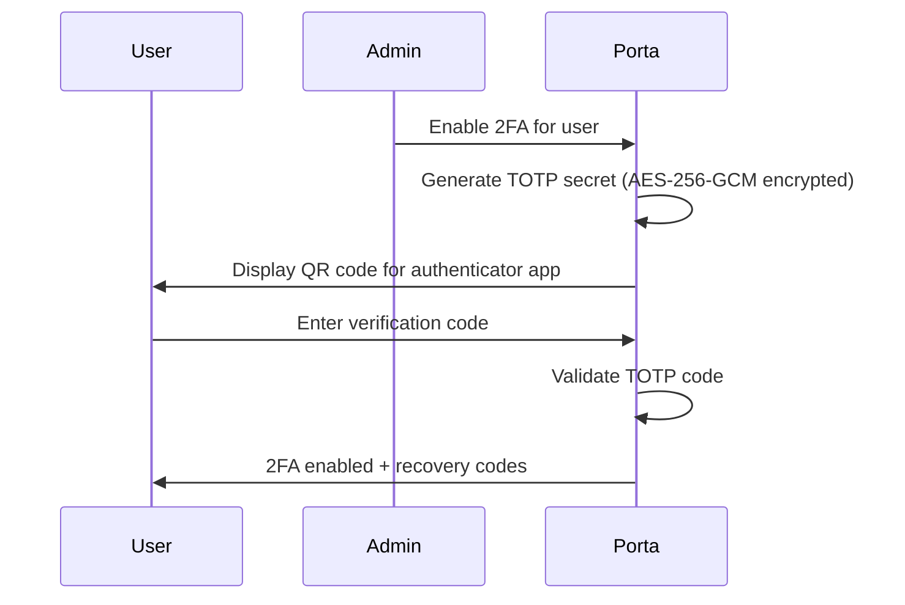
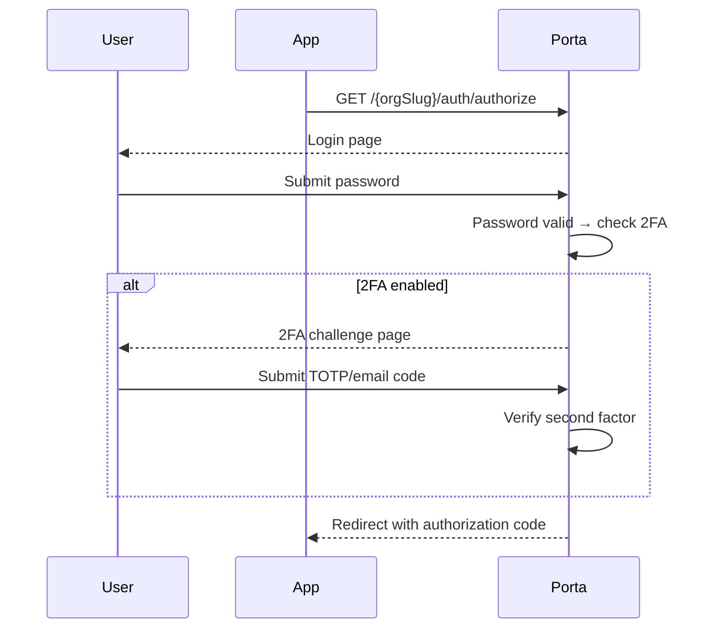

# Two-Factor Authentication

Porta supports **two-factor authentication (2FA)** to add an extra layer of security to user accounts. When enabled, users must provide a second verification factor after entering their password.

## Supported Methods

| Method | Description | Security Level |
|--------|-------------|----------------|
| **Email OTP** | A one-time code sent to the user's email address | Good |
| **TOTP** | Time-based codes from an authenticator app (Google Authenticator, Authy, etc.) | Better |
| **Recovery Codes** | One-time backup codes for account recovery | Emergency only |

## How It Works

### Enrollment Flow



### Login Flow with 2FA



## Per-Organization Policy

Two-factor authentication policies can be configured at the organization level:

| Policy | Behavior |
|--------|----------|
| `optional` | Users may choose to enable 2FA (default) |
| `required` | All users must enroll in 2FA before accessing resources |
| `disabled` | 2FA is not available for this organization |

## Security Details

### TOTP Secret Storage

TOTP secrets are encrypted at rest using **AES-256-GCM**. The encryption key is configured via the `TWO_FACTOR_ENCRYPTION_KEY` environment variable (64 hex characters = 256 bits).

### Recovery Codes

When a user enables 2FA, they receive a set of **recovery codes**. These codes:

- Are single-use (each code can only be used once)
- Are hashed with **Argon2id** before storage (just like passwords)
- Allow account access if the primary 2FA method is unavailable
- Should be stored securely by the user (e.g., printed or in a password manager)

### Rate Limiting

2FA verification attempts are rate-limited to prevent brute-force attacks on OTP codes.

## Managing 2FA

### Via Admin API

The 2FA interaction endpoints are available at `/interaction/:uid/two-factor/*` during the OIDC login flow.

### Via CLI

```bash
# Check 2FA status for a user
porta user 2fa status --org-id <id> --user-id <id>

# Disable 2FA for a user (admin override)
porta user 2fa disable --org-id <id> --user-id <id>

# Reset 2FA for a user (forces re-enrollment)
porta user 2fa reset --org-id <id> --user-id <id>
```

## Templates & i18n

The 2FA challenge pages are rendered using Handlebars templates and support internationalization. Each organization can customize the appearance through its branding settings, and translations are loaded from the `locales/` directory.
