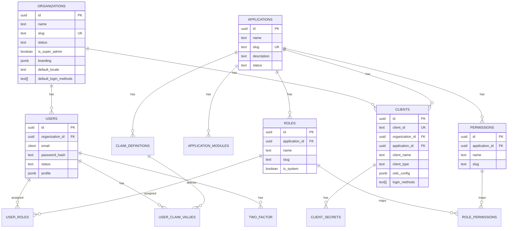

# Database Schema

Porta uses **PostgreSQL 16** as its primary data store. The schema is designed around multi-tenant isolation with organization-scoped data.

## Entity Relationship Diagram

## Tables

### `organizations`

The tenant table. Every user, client, and data point traces back to an organization.

| Column | Type | Description |
|--------|------|-------------|
| `id` | `uuid` | Primary key (generated) |
| `name` | `text` | Display name |
| `slug` | `text` | URL slug (unique) |
| `status` | `text` | `active`, `suspended`, or `archived` |
| `is_super_admin` | `boolean` | Whether this is the super-admin org |
| `logo_url` | `text` | Branding: logo URL |
| `favicon_url` | `text` | Branding: favicon URL |
| `primary_color` | `text` | Branding: primary color hex |
| `company_name` | `text` | Branding: display name |
| `custom_css` | `text` | Branding: CSS overrides |
| `default_locale` | `text` | Default locale |
| `default_login_methods` | `text[]` | Default login methods (NOT NULL) |
| `created_at` | `timestamptz` | Creation timestamp |
| `updated_at` | `timestamptz` | Last update (auto-trigger) |

**Constraints:**
- Partial unique index ensures at most one `is_super_admin = true` row

### `users`

End-user accounts scoped to an organization.

| Column | Type | Description |
|--------|------|-------------|
| `id` | `uuid` | Primary key |
| `organization_id` | `uuid` | FK → organizations |
| `email` | `citext` | Email (unique per org, case-insensitive) |
| `password_hash` | `text` | Argon2id hash |
| `status` | `text` | `active`, `invited`, `suspended`, `locked`, `archived` |
| `given_name` | `text` | First name |
| `family_name` | `text` | Last name |
| `nickname` | `text` | Nickname |
| `picture` | `text` | Profile picture URL |
| `phone_number` | `text` | Phone number |
| `phone_number_verified` | `boolean` | Phone verified |
| `email_verified` | `boolean` | Email verified |
| `locale` | `text` | User locale |
| `login_count` | `integer` | Total login count |
| `last_login_at` | `timestamptz` | Last successful login |
| `created_at` | `timestamptz` | Creation timestamp |
| `updated_at` | `timestamptz` | Last update |

**Constraints:**
- Unique: `(organization_id, email)`

### `applications`

SaaS product definitions that scope clients, roles, and claims.

| Column | Type | Description |
|--------|------|-------------|
| `id` | `uuid` | Primary key |
| `name` | `text` | Application name |
| `slug` | `text` | URL slug (unique) |
| `description` | `text` | Description |
| `status` | `text` | `active`, `inactive`, `archived` |
| `created_at` | `timestamptz` | Creation timestamp |
| `updated_at` | `timestamptz` | Last update |

### `application_modules`

Logical groupings within an application.

| Column | Type | Description |
|--------|------|-------------|
| `id` | `uuid` | Primary key |
| `application_id` | `uuid` | FK → applications |
| `name` | `text` | Module name |
| `slug` | `text` | Module slug |
| `description` | `text` | Description |
| `status` | `text` | `active` or `inactive` |

### `clients`

OIDC clients (public or confidential).

| Column | Type | Description |
|--------|------|-------------|
| `id` | `uuid` | Primary key |
| `client_id` | `text` | OIDC client_id (unique) |
| `organization_id` | `uuid` | FK → organizations |
| `application_id` | `uuid` | FK → applications |
| `client_name` | `text` | Display name |
| `client_type` | `text` | `confidential` or `public` |
| `application_type` | `text` | `web`, `native`, or `spa` |
| `redirect_uris` | `text[]` | Allowed redirect URIs |
| `grant_types` | `text[]` | Allowed grant types |
| `response_types` | `text[]` | Allowed response types |
| `scope` | `text` | Space-separated scopes |
| `token_endpoint_auth_method` | `text` | Auth method |
| `cors_origins` | `text[]` | CORS origins |
| `require_pkce` | `boolean` | Require PKCE |
| `login_methods` | `text[]` | Override login methods (NULL = inherit) |
| `status` | `text` | `active`, `inactive`, `revoked` |

### `client_secrets`

Client secrets with Argon2id hashing and SHA-256 pre-hash.

| Column | Type | Description |
|--------|------|-------------|
| `id` | `uuid` | Primary key |
| `client_id` | `uuid` | FK → clients |
| `secret_hash` | `text` | Argon2id hash |
| `sha256_hash` | `text` | SHA-256 hash for OIDC lookup |
| `label` | `text` | Optional label |
| `status` | `text` | `active` or `revoked` |
| `created_at` | `timestamptz` | Creation timestamp |
| `revoked_at` | `timestamptz` | Revocation timestamp |

### `roles`

RBAC roles scoped to an application.

| Column | Type | Description |
|--------|------|-------------|
| `id` | `uuid` | Primary key |
| `application_id` | `uuid` | FK → applications |
| `name` | `text` | Role name |
| `slug` | `text` | Role slug |
| `description` | `text` | Description |
| `is_system` | `boolean` | System role (cannot be deleted) |
| `status` | `text` | `active` or `archived` |

### `permissions`

Permissions scoped to an application.

| Column | Type | Description |
|--------|------|-------------|
| `id` | `uuid` | Primary key |
| `application_id` | `uuid` | FK → applications |
| `name` | `text` | Permission name |
| `slug` | `text` | Permission slug |
| `description` | `text` | Description |
| `status` | `text` | `active` or `archived` |

### `role_permissions`

Maps permissions to roles (many-to-many).

| Column | Type | Description |
|--------|------|-------------|
| `role_id` | `uuid` | FK → roles |
| `permission_id` | `uuid` | FK → permissions |

### `user_roles`

Maps roles to users (many-to-many).

| Column | Type | Description |
|--------|------|-------------|
| `user_id` | `uuid` | FK → users |
| `role_id` | `uuid` | FK → roles |

### `claim_definitions`

Custom claim definitions scoped to an application.

| Column | Type | Description |
|--------|------|-------------|
| `id` | `uuid` | Primary key |
| `application_id` | `uuid` | FK → applications |
| `name` | `text` | Claim name |
| `slug` | `text` | Claim slug |
| `claim_type` | `text` | `string`, `number`, `boolean`, `json` |
| `validation_rules` | `jsonb` | Type-specific validation rules |
| `description` | `text` | Description |
| `status` | `text` | `active` or `archived` |

### `user_claim_values`

Custom claim values assigned to users.

| Column | Type | Description |
|--------|------|-------------|
| `id` | `uuid` | Primary key |
| `claim_definition_id` | `uuid` | FK → claim_definitions |
| `user_id` | `uuid` | FK → users |
| `value` | `jsonb` | The claim value |

### `system_config`

System configuration key-value store with 60s in-memory cache.

| Column | Type | Description |
|--------|------|-------------|
| `key` | `text` | Configuration key (PK) |
| `value` | `text` | Configuration value |
| `description` | `text` | Description |
| `updated_at` | `timestamptz` | Last update |

### `audit_log`

Immutable audit trail of all administrative and security events.

| Column | Type | Description |
|--------|------|-------------|
| `id` | `uuid` | Primary key |
| `action` | `text` | Event type (e.g., `organization.created`) |
| `entity_type` | `text` | Entity type |
| `entity_id` | `uuid` | Entity ID |
| `actor_id` | `uuid` | Who performed the action |
| `actor_email` | `text` | Actor's email |
| `organization_id` | `uuid` | Organization context |
| `metadata` | `jsonb` | Additional event data |
| `created_at` | `timestamptz` | Event timestamp |

### `oidc_payloads`

PostgreSQL storage for long-lived OIDC artifacts (access tokens, refresh tokens, grants).

| Column | Type | Description |
|--------|------|-------------|
| `id` | `text` | Artifact ID |
| `type` | `text` | Model type |
| `payload` | `jsonb` | Full OIDC payload |
| `grant_id` | `text` | Associated grant ID |
| `user_code` | `text` | Device code (if applicable) |
| `uid` | `text` | Unique identifier |
| `expires_at` | `timestamptz` | Expiration |
| `consumed_at` | `timestamptz` | Consumption timestamp |

### `two_factor_*`

Two-factor authentication tables for TOTP secrets (AES-256-GCM encrypted), email OTP codes, and recovery codes (Argon2id hashed).

## Extensions

Porta uses two PostgreSQL extensions:

- **`pgcrypto`** — UUID generation via `gen_random_uuid()`
- **`citext`** — Case-insensitive text type for email addresses

## Auto-Updated Timestamps

All tables with an `updated_at` column use a database trigger (`trigger_set_updated_at`) that automatically sets `updated_at = NOW()` on every `UPDATE`.
