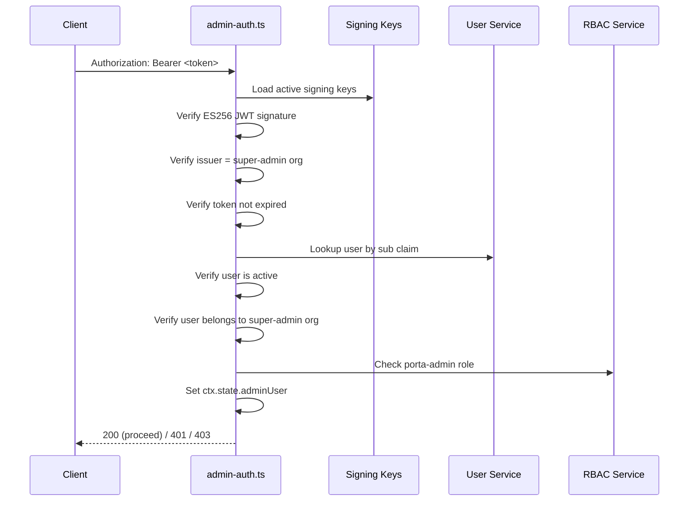
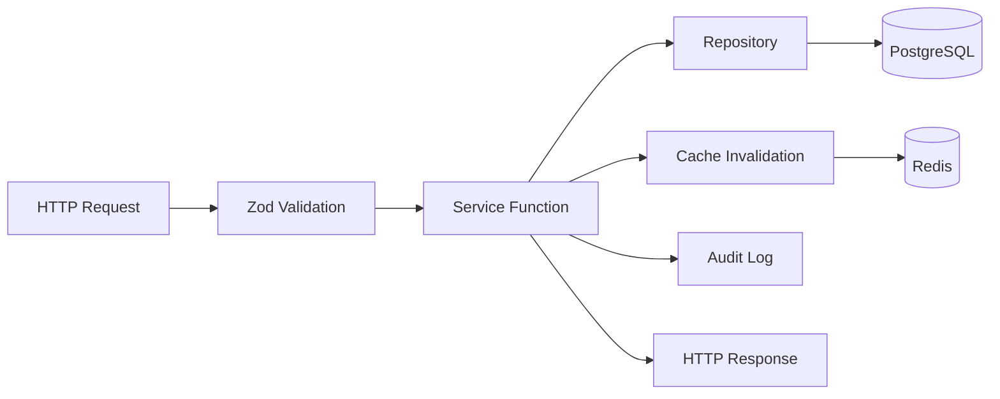

# API Design

> **Last Updated**: 2026-04-25

## Overview

Porta exposes three distinct API surfaces:

1. **Admin API** (`/api/admin/*`) — RESTful management API for organizations, applications, clients, users, RBAC, and system configuration
2. **OIDC Endpoints** (`/:orgSlug/*`) — OpenID Connect protocol endpoints powered by node-oidc-provider
3. **Admin GUI BFF** (`/api/*`, `/auth/*`) — Backend-for-frontend proxy that wraps the Admin API with session-based auth, CSRF, and security headers (see [Admin GUI architecture](/implementation-details/architecture/system-overview#admin-gui-module))

This document covers the design principles, conventions, and patterns used in the Admin API. For OIDC protocol details, see the [node-oidc-provider documentation](https://github.com/panva/node-oidc-provider). For BFF details, see the [Security Architecture](/implementation-details/architecture/security#admin-gui-bff-security).

## REST Conventions

### URL Structure

All admin endpoints follow a consistent RESTful pattern:

```
/api/admin/{resource}                    # Collection
/api/admin/{resource}/:id                # Single resource
/api/admin/{resource}/:id/{sub-resource} # Nested resource
```

**Nested resources** are used for tenant-scoped or application-scoped entities:

```
/api/admin/organizations/:orgId/users           # Users within an org
/api/admin/organizations/:orgId/users/:userId/roles  # User's role assignments
/api/admin/applications/:appId/roles            # Roles within an app
/api/admin/applications/:appId/permissions      # Permissions within an app
/api/admin/applications/:appId/claims           # Claim definitions within an app
```

### HTTP Methods

| Method | Purpose | Idempotent | Response |
|--------|---------|-----------|----------|
| `GET` | Retrieve resource(s) | Yes | 200 + body |
| `POST` | Create resource | No | 201 + body |
| `PUT` | Full update | Yes | 200 + body |
| `PATCH` | Partial update / status change | Yes | 200 + body |
| `DELETE` | Remove resource | Yes | 204 (no body) |

### Endpoint Inventory

| Route File | Base Path | Endpoints | Description |
|-----------|-----------|-----------|-------------|
| `organizations.ts` | `/api/admin/organizations` | 10 | Org CRUD + status lifecycle + branding |
| `applications.ts` | `/api/admin/applications` | 11 | App CRUD + status + modules |
| `clients.ts` | `/api/admin/clients` | 10 | Client CRUD + status + secrets |
| `users.ts` | `/api/admin/organizations/:orgId/users` | 13 | User CRUD + status + password + login tracking |
| `roles.ts` | `/api/admin/applications/:appId/roles` | 9 | Role CRUD + permission assignment |
| `permissions.ts` | `/api/admin/applications/:appId/permissions` | 6 | Permission CRUD |
| `user-roles.ts` | `/api/admin/organizations/:orgId/users/:userId/roles` | 4 | User-role assignment |
| `custom-claims.ts` | `/api/admin/applications/:appId/claims` | 9 | Claim definitions + user values |
| `config.ts` | `/api/admin/config` | — | System configuration management |
| `keys.ts` | `/api/admin/keys` | — | Signing key management |
| `audit.ts` | `/api/admin/audit` | — | Audit log viewer with filters |
| `stats.ts` | `/api/admin/stats` | — | Dashboard statistics (6 aggregate queries) |
| `sessions.ts` | `/api/admin/sessions` | — | Session management + revocation |
| `bulk.ts` | `/api/admin/bulk` | — | Bulk status operations |
| `branding.ts` | `/api/admin/organizations/:orgId/branding` | — | Logo/favicon upload (bytea) |
| `exports.ts` | `/api/admin/export/:entityType` | — | CSV/JSON data export |

## Authentication

### Admin API Authentication

All `/api/admin/*` routes (except the metadata endpoint) are protected by the `admin-auth` middleware (`src/middleware/admin-auth.ts`):



**Key properties:**
- **Self-authentication** — Porta validates tokens signed by its own keys
- **ES256 only** — No algorithm negotiation; ECDSA P-256 is enforced
- **Role-based** — Requires `porta-admin` role in the super-admin organization
- **Metadata endpoint** — `GET /api/admin/metadata` is unauthenticated (for CLI login discovery)

### OIDC Authentication

OIDC endpoints use standard OpenID Connect mechanisms:
- **Authorization Code + PKCE** for public clients (SPAs, CLI)
- **Client Secret Post** for confidential clients (with SHA-256 pre-hash)
- **Client Credentials** for machine-to-machine

## Request Validation

All request bodies are validated using **Zod schemas** defined inline in route handlers:

```typescript
// Example: Create organization
const schema = z.object({
  name: z.string().min(1).max(255),
  slug: z.string().min(2).max(63).regex(/^[a-z0-9-]+$/).optional(),
  defaultLocale: z.string().max(10).optional(),
});

const body = schema.parse(ctx.request.body);
```

**Validation principles:**
- Every request body field is validated before reaching the service layer
- Zod parse errors are caught by the error handler and returned as 400 responses
- Path parameters (UUIDs) are validated with `z.string().uuid()`
- Query parameters for pagination/filtering are validated with optional schemas

## Pagination

### Offset-Based Pagination (Legacy)

Used on some list endpoints:

```
GET /api/admin/organizations?page=1&limit=20
```

Response includes pagination metadata:

```json
{
  "data": [...],
  "pagination": {
    "page": 1,
    "limit": 20,
    "total": 150,
    "totalPages": 8
  }
}
```

### Cursor-Based Keyset Pagination (Preferred)

All entity repositories support cursor-based pagination for consistent performance on large datasets:

```
GET /api/admin/organizations?cursor=<opaque>&limit=20&sort=name&order=asc
```

Response:

```json
{
  "data": [...],
  "pagination": {
    "hasMore": true,
    "nextCursor": "<opaque>",
    "limit": 20
  }
}
```

**Implementation**: Keyset pagination uses `WHERE (sort_column, id) > (last_value, last_id)` for O(1) page access regardless of offset.

## Optimistic Concurrency (ETag)

Entity updates support optimistic concurrency via ETag/If-Match headers:

```
GET /api/admin/organizations/:id
→ ETag: "abc123"

PUT /api/admin/organizations/:id
If-Match: "abc123"
→ 200 OK (if unchanged)
→ 412 Precondition Failed (if modified by another client)
```

ETags are computed from the entity's `updated_at` timestamp.

## Error Handling

### Error Response Format

All errors follow a consistent JSON format:

```json
{
  "error": "Human-readable error message",
  "status": 400
}
```

### HTTP Status Codes

| Code | Meaning | When Used |
|------|---------|-----------|
| 200 | OK | Successful read or update |
| 201 | Created | Successful resource creation |
| 204 | No Content | Successful deletion |
| 400 | Bad Request | Validation failure (Zod parse error) |
| 401 | Unauthorized | Missing or invalid authentication |
| 403 | Forbidden | Insufficient permissions or suspended tenant |
| 404 | Not Found | Resource does not exist |
| 409 | Conflict | Duplicate slug, email uniqueness violation |
| 410 | Gone | Archived tenant |
| 412 | Precondition Failed | ETag mismatch |
| 429 | Too Many Requests | Rate limit exceeded |
| 500 | Internal Server Error | Unhandled error (details hidden) |

### Domain Error Classes

Each module defines typed error classes that the error handler maps to HTTP status codes:

```
OrganizationNotFoundError  → 404
OrganizationValidationError → 400
UserNotFoundError          → 404
UserValidationError        → 400
ClientNotFoundError        → 404
RoleNotFoundError          → 404
ClaimNotFoundError         → 404
RbacValidationError        → 400
```

## Service Layer Pattern

All route handlers follow a consistent pattern:



1. **Route handler** validates input with Zod
2. **Service function** orchestrates business logic
3. **Repository** executes parameterized SQL queries
4. **Cache** is invalidated after writes
5. **Audit log** records the action (fire-and-forget)
6. **Response** is returned as JSON

### Functional Style

Porta uses **standalone exported functions** rather than classes for services:

```typescript
// ✅ Porta's style
export async function createOrganization(input: CreateOrganizationInput): Promise<Organization> { ... }

// ❌ Not used
class OrganizationService { create(input) { ... } }
```

## Data Export

The export API supports bulk data extraction:

```
GET /api/admin/export/organizations?format=csv
GET /api/admin/export/users?format=json&orgId=<uuid>
```

Supported entity types: organizations, applications, clients, users.
Supported formats: CSV, JSON.

## Related Documentation

- [System Overview](/implementation-details/architecture/system-overview) — Architecture and middleware stack
- [Data Model](/implementation-details/architecture/data-model) — Database schema
- [Security](/implementation-details/architecture/security) — Authentication and authorization details
- [Admin API Reference](/api/overview) — Product documentation for API consumers
