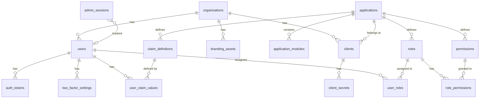

# Data Model

> **Last Updated**: 2026-04-25

## Overview

Porta's data model is defined across 19 PostgreSQL migrations in `migrations/`. The schema implements multi-tenant isolation at the database level through foreign key relationships to the `organizations` table. All tables use UUIDs as primary keys and include `created_at`/`updated_at` timestamps.

## Entity Relationship Diagram

## Core Entities

### Organizations

The root tenant entity. Every user, client, and data record is scoped to an organization.

| Column | Type | Description |
|--------|------|-------------|
| `id` | UUID | Primary key |
| `name` | VARCHAR(255) | Display name |
| `slug` | CITEXT | URL-safe identifier, unique, used in OIDC issuer path |
| `status` | VARCHAR(20) | `active`, `suspended`, `archived` |
| `is_super_admin` | BOOLEAN | Only one org can be super-admin (partial unique index) |
| `default_locale` | VARCHAR(10) | Default locale for auth UI |
| `two_factor_policy` | VARCHAR(20) | `disabled`, `optional`, `required` |
| `default_login_methods` | TEXT[] | `{password,magic_link}` — NOT NULL with DB default |
| `branding_*` | Various | Logo URL, favicon URL, primary color, company name, custom CSS |
| `created_at` / `updated_at` | TIMESTAMPTZ | Auto-managed timestamps |

**Key constraint**: Partial unique index on `is_super_admin WHERE is_super_admin = TRUE` — ensures exactly one super-admin organization.

### Applications

SaaS product definitions. Applications group roles, permissions, and claim definitions.

| Column | Type | Description |
|--------|------|-------------|
| `id` | UUID | Primary key |
| `name` | VARCHAR(255) | Display name |
| `slug` | CITEXT | Unique identifier |
| `description` | TEXT | Optional description |
| `status` | VARCHAR(20) | `active`, `inactive`, `archived` |

**Application Modules** (`application_modules`): Logical groupings within an application. Composite unique key `(application_id, slug)`.

### Clients

OIDC client registrations, scoped to an organization and optionally to an application.

| Column | Type | Description |
|--------|------|-------------|
| `id` | UUID | Primary key |
| `client_id` | VARCHAR(64) | OIDC client identifier, unique |
| `organization_id` | UUID | FK → organizations |
| `application_id` | UUID | FK → applications (nullable) |
| `name` | VARCHAR(255) | Display name |
| `status` | VARCHAR(20) | `active`, `suspended`, `revoked` |
| `grant_types` | TEXT[] | Allowed OIDC grant types |
| `response_types` | TEXT[] | Allowed response types |
| `redirect_uris` | TEXT[] | Registered redirect URIs |
| `post_logout_redirect_uris` | TEXT[] | Post-logout redirect URIs |
| `token_endpoint_auth_method` | VARCHAR(50) | `client_secret_post`, `none`, etc. |
| `login_methods` | TEXT[] | Per-client login method override (NULL = inherit from org) |
| `id_token_signed_response_alg` | VARCHAR(10) | Default `ES256` |
| `scope` | TEXT | Allowed scopes |
| `require_pkce` | BOOLEAN | PKCE enforcement |

### Client Secrets

Hashed client secrets with lifecycle management.

| Column | Type | Description |
|--------|------|-------------|
| `id` | UUID | Primary key |
| `client_id` | UUID | FK → clients |
| `secret_hash` | TEXT | Argon2id hash of the secret |
| `secret_prefix` | VARCHAR(8) | First 8 chars for identification |
| `secret_sha256` | VARCHAR(64) | SHA-256 pre-hash for `client_secret_post` |
| `label` | VARCHAR(255) | Human-readable label |
| `status` | VARCHAR(20) | `active`, `revoked` |
| `expires_at` | TIMESTAMPTZ | Optional expiry |
| `last_used_at` | TIMESTAMPTZ | Usage tracking |

### Users

User accounts, scoped to an organization.

| Column | Type | Description |
|--------|------|-------------|
| `id` | UUID | Primary key |
| `organization_id` | UUID | FK → organizations |
| `email` | CITEXT | Unique within organization (composite unique index) |
| `email_verified` | BOOLEAN | Email verification status |
| `password_hash` | TEXT | Argon2id hash (nullable for passwordless users) |
| `name` | VARCHAR(255) | Display name |
| `given_name` / `family_name` | VARCHAR(255) | Name components |
| `status` | VARCHAR(20) | `active`, `inactive`, `suspended`, `locked`, `archived`, `invited` |
| `failed_login_count` | INTEGER | Brute-force tracking |
| `last_login_at` | TIMESTAMPTZ | Login tracking |
| `locale` | VARCHAR(10) | User's preferred locale |
| `metadata` | JSONB | Extensible metadata |

**Key constraint**: Composite unique index on `(organization_id, email)` — ensures email uniqueness per tenant.

**Status lifecycle**: `invited` → `active` → `suspended` → `active`, `active` → `locked` → `active`, `active|suspended` → `archived` → `active`, `active` → `inactive` → `active`.

## RBAC Entities

### Roles

Application-scoped role definitions.

| Column | Type | Description |
|--------|------|-------------|
| `id` | UUID | Primary key |
| `application_id` | UUID | FK → applications |
| `name` | VARCHAR(255) | Display name |
| `slug` | CITEXT | Unique within application |
| `description` | TEXT | Optional description |
| `status` | VARCHAR(20) | `active`, `archived` |
| `is_system` | BOOLEAN | System roles cannot be deleted |

### Permissions

Application-scoped permission definitions.

| Column | Type | Description |
|--------|------|-------------|
| `id` | UUID | Primary key |
| `application_id` | UUID | FK → applications |
| `name` | VARCHAR(255) | Display name |
| `slug` | CITEXT | Unique within application |
| `description` | TEXT | Optional description |
| `status` | VARCHAR(20) | `active`, `archived` |

### Role-Permission Mappings

Many-to-many relationship between roles and permissions.

| Column | Type | Description |
|--------|------|-------------|
| `role_id` | UUID | FK → roles |
| `permission_id` | UUID | FK → permissions |

Composite primary key `(role_id, permission_id)`.

### User-Role Assignments

Many-to-many relationship between users and roles, scoped to an organization.

| Column | Type | Description |
|--------|------|-------------|
| `user_id` | UUID | FK → users |
| `role_id` | UUID | FK → roles |
| `organization_id` | UUID | FK → organizations |

Composite primary key `(user_id, role_id, organization_id)`.

## Custom Claims

### Claim Definitions

Application-scoped claim type definitions.

| Column | Type | Description |
|--------|------|-------------|
| `id` | UUID | Primary key |
| `application_id` | UUID | FK → applications |
| `name` | VARCHAR(255) | Claim name (unique per app) |
| `slug` | CITEXT | URL-safe identifier |
| `description` | TEXT | Optional description |
| `value_type` | VARCHAR(20) | `string`, `number`, `boolean`, `json` |
| `validation_rules` | JSONB | Optional validation constraints |
| `status` | VARCHAR(20) | `active`, `archived` |

### User Claim Values

Per-user claim values, referencing a claim definition.

| Column | Type | Description |
|--------|------|-------------|
| `id` | UUID | Primary key |
| `user_id` | UUID | FK → users |
| `claim_definition_id` | UUID | FK → claim_definitions |
| `value` | TEXT | Stored value (validated against definition rules) |

Composite unique index `(user_id, claim_definition_id)`.

## Two-Factor Authentication

### Two-Factor Settings

Per-user 2FA configuration, scoped to an organization.

| Column | Type | Description |
|--------|------|-------------|
| `id` | UUID | Primary key |
| `user_id` | UUID | FK → users |
| `organization_id` | UUID | FK → organizations |
| `method` | VARCHAR(20) | `totp`, `email` |
| `is_enabled` | BOOLEAN | Whether 2FA is active |
| `totp_secret` | TEXT | AES-256-GCM encrypted TOTP secret |
| `totp_verified` | BOOLEAN | Whether TOTP setup is confirmed |
| `recovery_codes` | TEXT[] | Argon2id-hashed recovery codes |
| `email_otp_last_sent_at` | TIMESTAMPTZ | Rate limiting for email OTP |

Composite unique index `(user_id, organization_id)`.

## Authentication & Token Tables

### Auth Tokens

Secure tokens for magic links, password resets, and invitations.

| Column | Type | Description |
|--------|------|-------------|
| `id` | UUID | Primary key |
| `token_hash` | VARCHAR(128) | SHA-256 hash of the token |
| `type` | VARCHAR(30) | `magic_link`, `password_reset`, `invitation` |
| `user_id` | UUID | FK → users |
| `organization_id` | UUID | FK → organizations |
| `expires_at` | TIMESTAMPTZ | Token expiry |
| `used_at` | TIMESTAMPTZ | Single-use enforcement |
| `metadata` | JSONB | Additional context (e.g., invitation details) |

## OIDC Adapter Tables

### `oidc_payloads` (PostgreSQL — long-lived)

Stores AccessToken, RefreshToken, and Grant data in PostgreSQL for durability.

| Column | Type | Description |
|--------|------|-------------|
| `id` | VARCHAR(255) | Composite: `model_name:uid` |
| `model_name` | VARCHAR(50) | `AccessToken`, `RefreshToken`, `Grant` |
| `payload` | JSONB | Full OIDC artifact data |
| `uid` | VARCHAR(255) | Unique identifier |
| `grant_id` | VARCHAR(255) | Associated grant (indexed for cascade deletion) |
| `user_code` | VARCHAR(255) | Device flow user code |
| `expires_at` | TIMESTAMPTZ | Artifact expiry |
| `consumed_at` | TIMESTAMPTZ | Rotation tracking |

**Short-lived artifacts** (Session, Interaction, AuthorizationCode, ReplayDetection, ClientCredentials, PushedAuthorizationRequest) are stored in **Redis** for performance.

## Infrastructure Tables

### System Config

Key-value configuration store with 60-second in-memory cache.

| Column | Type | Description |
|--------|------|-------------|
| `key` | VARCHAR(255) | Config key (primary key) |
| `value` | JSONB | Config value |
| `description` | TEXT | Human-readable description |

### Signing Keys

ES256 (ECDSA P-256) signing key pairs for JWT tokens.

| Column | Type | Description |
|--------|------|-------------|
| `id` | UUID | Primary key |
| `kid` | VARCHAR(255) | Key ID (for JWKS) |
| `public_key` | TEXT | PEM-encoded public key |
| `private_key` | TEXT | PEM-encoded private key (encrypted at rest) |
| `status` | VARCHAR(20) | `active`, `rotated`, `revoked` |
| `created_at` | TIMESTAMPTZ | Key creation time |

### Audit Log

Immutable audit trail for all administrative actions.

| Column | Type | Description |
|--------|------|-------------|
| `id` | UUID | Primary key |
| `action` | VARCHAR(100) | Action identifier (e.g., `organization.created`) |
| `actor_id` | UUID | Who performed the action |
| `actor_type` | VARCHAR(50) | `user`, `system`, `cli` |
| `resource_type` | VARCHAR(50) | Entity type |
| `resource_id` | UUID | Entity ID |
| `organization_id` | UUID | Tenant context |
| `details` | JSONB | Action-specific details |
| `created_at` | TIMESTAMPTZ | Event timestamp |

Includes an **automated retention policy** (migration 017) with a cleanup function triggered by a cron-like mechanism.

### Branding Assets (Migration 018)

Binary storage for organization logos and favicons.

| Column | Type | Description |
|--------|------|-------------|
| `id` | UUID | Primary key |
| `organization_id` | UUID | FK → organizations |
| `asset_type` | VARCHAR(20) | `logo` or `favicon` |
| `data` | BYTEA | Binary image data (max 512 KB) |
| `mime_type` | VARCHAR(100) | Image MIME type |
| `created_at` / `updated_at` | TIMESTAMPTZ | Auto-managed timestamps |

**Key constraint**: Unique index on `(organization_id, asset_type)` — one logo and one favicon per organization.

### Admin Sessions (Migration 018)

OIDC session tracking for the admin session viewer and revocation UI.

| Column | Type | Description |
|--------|------|-------------|
| `id` | UUID | Primary key |
| `session_uid` | VARCHAR(255) | OIDC session unique identifier |
| `user_id` | UUID | FK → users (nullable) |
| `organization_id` | UUID | FK → organizations (nullable) |
| `client_id` | VARCHAR(64) | OIDC client identifier |
| `ip_address` | INET | Client IP address |
| `user_agent` | TEXT | Client user-agent string |
| `last_activity_at` | TIMESTAMPTZ | Last session activity |
| `expires_at` | TIMESTAMPTZ | Session expiry time |
| `created_at` | TIMESTAMPTZ | Session creation time |

Mirrors Redis session data to PostgreSQL for admin viewing and revocation.

### Invitation Details (Migration 019)

Adds invitation metadata to the `auth_tokens` table:

| Column | Type | Description |
|--------|------|-------------|
| `details` | JSONB | Pre-assignment metadata: roles, claims, personalMessage, inviterName |
| `invited_by` | UUID | FK → users — the admin who created the invitation |

These columns are added to the existing `auth_tokens` table (not a new table).

## Migration Strategy

Migrations are managed programmatically via `src/lib/migrator.ts` using `node-pg-migrate`:

- **Forward-only in production** — Migrations run automatically on startup
- **CLI management** — `porta migrate up/down/status` for manual control
- **Numbered sequencing** — `001_` through `019_` prefix ensures deterministic order
- **Idempotent patterns** — `IF NOT EXISTS` used where possible

## Related Documentation

- [System Overview](/implementation-details/architecture/system-overview) — High-level architecture
- [API Design](/implementation-details/architecture/api-design) — REST endpoint conventions
- [Security](/implementation-details/architecture/security) — Data protection and isolation
- [Configuration Reference](/implementation-details/reference/configuration) — Database connection settings
