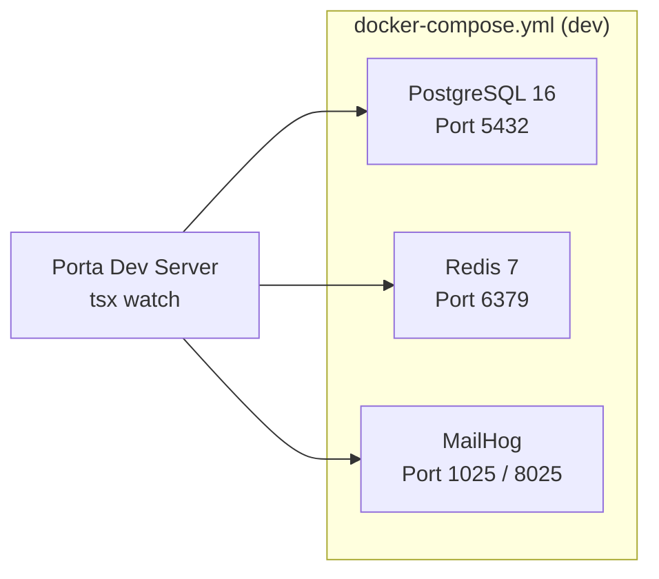
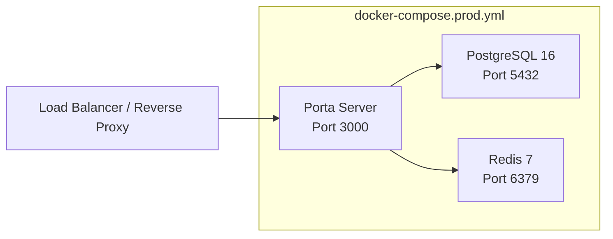
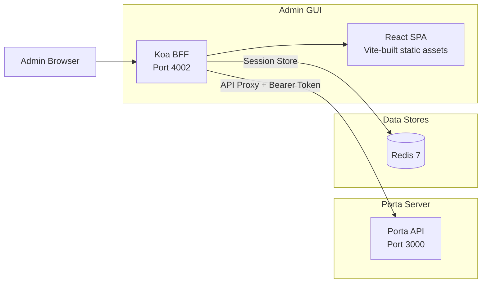
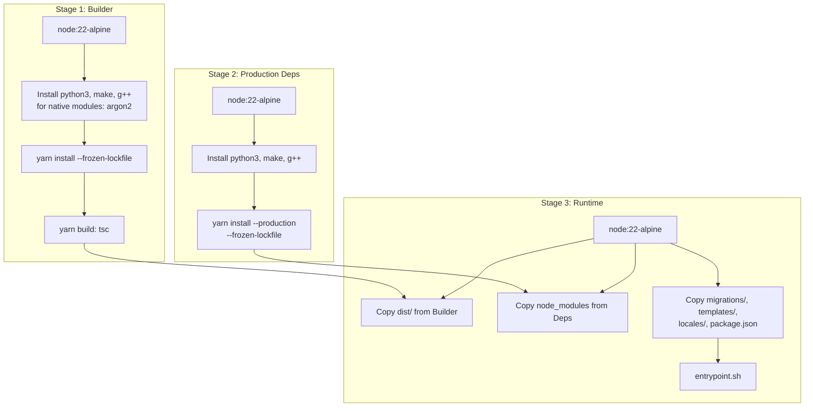
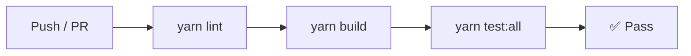
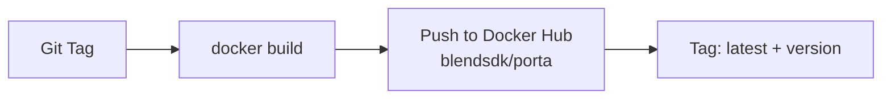

# Infrastructure

> **Last Updated**: 2026-04-25

## Overview

Porta's infrastructure is designed around Docker containers with PostgreSQL and Redis as backing services. The build pipeline produces a minimal Alpine-based container image (~200MB) suitable for production deployment.

## Docker Architecture

### Development Stack

The development Docker Compose (`docker/docker-compose.yml`) provides three services:



| Service | Image | Port | Purpose |
|---------|-------|------|---------|
| PostgreSQL | `postgres:16-alpine` | 5432 | Primary data store |
| Redis | `redis:7-alpine` | 6379 | Cache, sessions, rate limiting |
| MailHog | `mailhog/mailhog` | 1025 (SMTP) / 8025 (UI) | Email capture for development |

The dev server runs on the host via `tsx watch` (not in Docker).

### Production Stack

The production Docker Compose (`docker/docker-compose.prod.yml`) adds Porta as a containerized service:



| Service | Image | Port | Notes |
|---------|-------|------|-------|
| Porta | `blendsdk/porta:latest` | 3000 | Multi-stage Alpine build |
| PostgreSQL | `postgres:16-alpine` | 5432 | With `init-test-db.sql` for test DB |
| Redis | `redis:7-alpine` | 6379 | Ephemeral (appendonly off) |

### Admin GUI Service

The Admin GUI runs as a separate Koa BFF process, deployable alongside or independently from the Porta server:



| Component | Technology | Port | Purpose |
|-----------|-----------|------|---------|
| BFF Server | Koa + koa-session | 4002 | OIDC auth, session management, CSRF, API proxy |
| React SPA | React 19 + FluentUI v9 | Served by BFF | Browser-based admin dashboard |
| Session Store | Redis (ioredis) | 6379 (DB 1) | BFF session persistence |

**Docker deployment**: The Admin GUI shares the same Docker image as Porta. Set `PORTA_SERVICE=admin` to start the BFF instead of the OIDC server. This is configured in the production Docker Compose:

```yaml
admin-gui:
  image: blendsdk/porta:latest
  environment:
    PORTA_SERVICE: admin
    PORTA_ADMIN_PORTA_URL: http://porta:3000
    PORTA_ADMIN_CLIENT_ID: <from-porta-init>
    PORTA_ADMIN_CLIENT_SECRET: <from-porta-init>
    PORTA_ADMIN_SESSION_SECRET: <generate-random>
    REDIS_URL: redis://redis:6379/1
  ports:
    - '4002:4002'
```

## Container Build

### Multi-Stage Dockerfile

The Dockerfile (`docker/Dockerfile`) uses a **3-stage multi-architecture build**:



**Key decisions:**
- Native modules (argon2) require build tools in stages 1 and 2
- Stage 3 has NO build tools — minimal attack surface
- Final image runs as non-root user (`node:node`, UID 1000)
- Health check: `wget --spider http://localhost:3000/health`
- Target size: <200MB

### Entrypoint Script

`docker/entrypoint.sh` handles container startup:

1. Run database migrations automatically (`node dist/lib/migrator.js up`)
2. Start the Porta server (`node dist/index.js`)

### Helper Script

`docker/porta.sh` provides a convenient wrapper for running CLI commands inside the container:

```bash
docker exec -it porta porta <command>
```

## CI/CD Pipeline

### GitHub Actions Workflows

Three workflow files in `.github/workflows/`:

| Workflow | Trigger | Purpose |
|----------|---------|---------|
| `build-and-test.yml` | Push/PR to `main` | Lint, build, test (unit + integration) |
| `docker.yml` | Release tags | Build + push Docker image to Docker Hub |
| `docs.yml` | Push to `main` (docs changes) | Build + deploy VitePress docs to GitHub Pages |

### Build & Test Pipeline



### Docker Release Pipeline



## Network Architecture

### Port Mapping

| Port | Service | Protocol |
|------|---------|----------|
| 3000 | Porta HTTP server | HTTP/1.1 |
| 4002 | Admin GUI BFF server | HTTP/1.1 |
| 5432 | PostgreSQL | PostgreSQL wire protocol |
| 6379 | Redis | RESP (Redis Serialization Protocol) |
| 1025 | MailHog SMTP (dev only) | SMTP |
| 8025 | MailHog UI (dev only) | HTTP |

### TLS Termination

Porta itself serves HTTP on port 3000. **TLS termination is handled by a reverse proxy** (nginx, Caddy, cloud load balancer) in front of Porta. The `ISSUER_BASE_URL` configuration must use `https://` for production.

## Health Monitoring

### Health Check Endpoint

`GET /health` returns the status of both backing services:

```json
{
  "status": "healthy",
  "checks": {
    "database": "ok",
    "redis": "ok"
  }
}
```

- **200** — Both services healthy
- **503** — One or more services unhealthy

### Docker Health Check

The Dockerfile includes a built-in health check:

```dockerfile
HEALTHCHECK --interval=30s --timeout=5s --start-period=10s --retries=3 \
  CMD wget --spider --quiet http://localhost:3000/health || exit 1
```

## Backup & Data Persistence

### PostgreSQL

- All persistent data is in PostgreSQL
- Docker volume `porta_postgres_data` stores data files
- Standard `pg_dump`/`pg_restore` for backups
- Migrations are forward-only in production

### Redis

- Redis stores ephemeral data (sessions, cache, rate limit counters)
- Data loss is tolerable — cache rebuilds from PostgreSQL on miss
- No persistence configuration needed (appendonly off)

## Scaling Considerations

| Component | Scaling Strategy |
|-----------|-----------------|
| Porta Server | Horizontal (multiple containers behind load balancer) |
| PostgreSQL | Vertical (single primary), read replicas possible |
| Redis | Vertical (single instance), Redis Cluster for high availability |

**Stateless server**: Porta stores no in-memory state between requests (except the 60-second system config cache). Multiple instances can run behind a load balancer.

**Session affinity**: Not required. OIDC sessions are stored in Redis, accessible from any Porta instance.

## Related Documentation

- [System Overview](/implementation-details/architecture/system-overview) — Application architecture
- [Deployment Guide](/implementation-details/guides/deployment) — Step-by-step deployment instructions
- [Configuration Reference](/implementation-details/reference/configuration) — Environment variables
- [Integrations](/implementation-details/reference/integrations) — PostgreSQL, Redis, SMTP details
