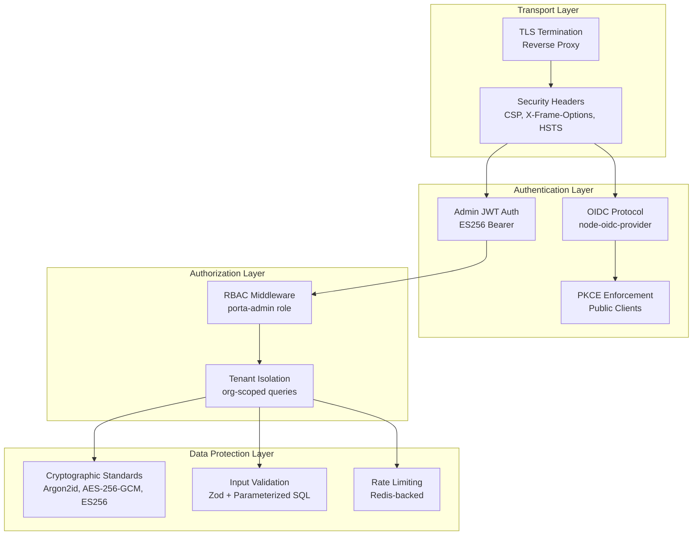
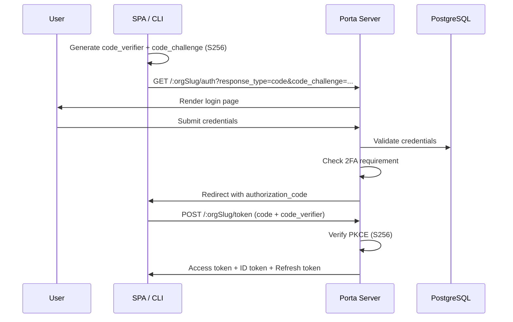
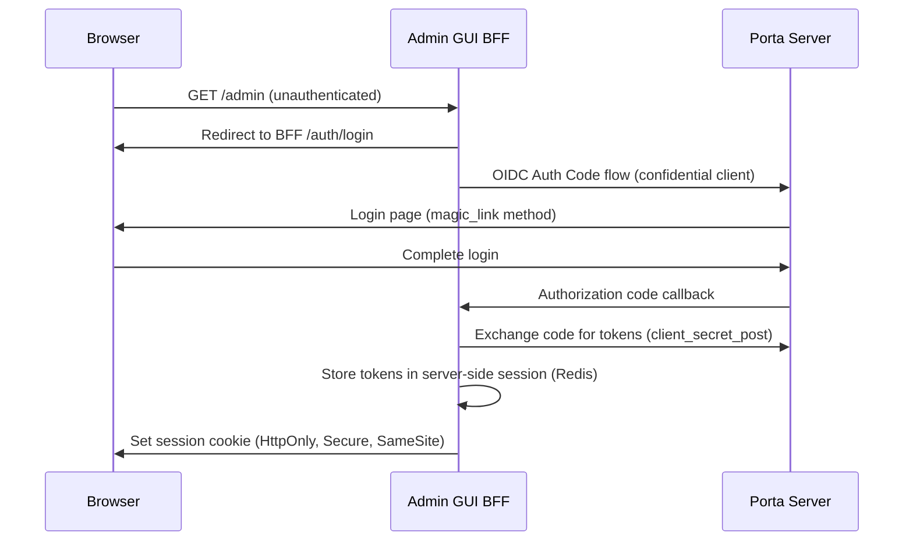

# Security Architecture

> **Last Updated**: 2026-04-25

## Overview

Porta is an OIDC identity provider — **security is the product**. This document describes the security architecture, cryptographic standards, threat mitigations, and multi-tenant isolation mechanisms that protect user identities and authentication flows.

## Security Layers



## Cryptographic Standards

### Token Signing: ES256 (ECDSA P-256)

All JWTs are signed using ECDSA P-256 (ES256). This is a non-negotiable standard — no algorithm downgrade is possible.

| Property | Value |
|----------|-------|
| Algorithm | ES256 (ECDSA with P-256 curve) |
| Key Storage | PEM-encoded in PostgreSQL, encrypted at rest |
| Key Rotation | Supported via `porta keys rotate` CLI command |
| JWKS Endpoint | `/:orgSlug/.well-known/jwks` (auto-served by node-oidc-provider) |

**Key lifecycle**: Keys are stored in the `signing_keys` table with status `active`, `rotated`, or `revoked`. The OIDC provider loads active keys on startup and serves them via the JWKS endpoint.

### Password Hashing: Argon2id

All passwords are hashed using Argon2id with NIST SP 800-63B compliant parameters.

| Property | Value |
|----------|-------|
| Algorithm | Argon2id |
| Implementation | `argon2` npm package (native C binding) |
| Validation | NIST SP 800-63B password rules |
| Rehashing | On login if params change |

**Password validation rules** (enforced at the service layer):
- Minimum 8 characters
- No maximum length restriction beyond reasonable limits
- Checked against common password lists

### Client Secret Hashing: SHA-256 + Argon2id

Client secrets use a two-layer hashing strategy:

1. **SHA-256 pre-hash** — Computed at registration, stored in `secret_sha256` column for `client_secret_post` authentication (node-oidc-provider uses SHA-256 for comparison)
2. **Argon2id full hash** — Stored in `secret_hash` column for offline verification

### 2FA Secret Encryption: AES-256-GCM

TOTP secrets are encrypted at rest using AES-256-GCM:

| Property | Value |
|----------|-------|
| Algorithm | AES-256-GCM |
| Key Derivation | From `COOKIE_KEYS` environment variable |
| IV | Random 12 bytes per encryption |
| Auth Tag | 16 bytes, stored alongside ciphertext |

Recovery codes are hashed with Argon2id — never stored in plaintext.

## Authentication Flows

### OIDC Authorization Code + PKCE

The primary authentication flow for SPAs and the CLI:



**PKCE is mandatory** for public clients (`token_endpoint_auth_method: 'none'`).

### Admin API Self-Authentication

The admin API authenticates against Porta's own OIDC tokens:

1. Admin user logs in via OIDC to the **super-admin organization**
2. Token is signed with Porta's own ES256 keys
3. Admin auth middleware validates the token against those same keys
4. Middleware verifies issuer matches the super-admin org URL
5. Middleware checks user has `porta-admin` RBAC role

This self-authentication pattern means Porta has **no external auth dependency** for its admin API.

### Magic Link Authentication

Passwordless authentication via email:

1. User requests magic link → token generated with `crypto.randomBytes(32)`
2. Token SHA-256 hash stored in DB, raw token sent via email
3. User clicks link → token validated (hash match, not expired, not used)
4. Token marked as used (single-use enforcement)
5. Session created, OIDC flow continues

**Security properties**: Tokens are time-limited (configurable TTL), single-use, and unpredictable (256-bit random).

### Login Methods Enforcement

Per-organization and per-client login method control:

- **Organization level**: `default_login_methods` — NOT NULL, DB default `{password,magic_link}`
- **Client level**: `login_methods` — NULL means inherit from org
- **Resolution**: `resolveLoginMethods(org, client)` returns the effective methods
- **Enforcement**: Checked on 5 endpoints before CSRF/rate-limit/user-lookup
- **Disabled method response**: 403 + audit event `security.login_method_disabled`

## Multi-Tenant Isolation

### Database-Level Isolation

All database queries are scoped to the tenant context:

```sql
-- ✅ All user queries include org scope
SELECT * FROM users WHERE organization_id = $1 AND id = $2;

-- ❌ Never happens — unscoped queries are prohibited
SELECT * FROM users WHERE id = $1;
```

**Enforcement mechanisms:**
- Composite unique indexes (e.g., `(organization_id, email)`)
- Foreign keys to `organizations` table
- Service-layer validation of org context before any data access

### Cache Isolation

Redis cache keys include tenant context to prevent cross-tenant cache poisoning:

```
org:slug:{slug}     # Organization lookup by slug
org:id:{orgId}      # Organization lookup by ID
user:{orgId}:{userId}  # User within an org
client:{clientId}   # Client lookup (client_id is globally unique)
```

### URL-Based Tenant Resolution

The tenant resolver middleware validates the organization from the URL path:

1. Extract `orgSlug` from `/:orgSlug/*` route parameter
2. Lookup organization (cache-first, DB fallback)
3. Verify organization status: `active` → proceed, `suspended` → 403, `archived` → 410
4. Set `ctx.state.organization` for downstream handlers

Cross-tenant requests are impossible because:
- OIDC issuer URL includes the org slug
- Token audience is org-specific
- All data queries are org-scoped

## Rate Limiting & Brute-Force Protection

### Redis-Backed Rate Limiter

Authentication endpoints are protected by sliding-window rate limiting:

| Endpoint | Rate Limit | Window |
|----------|-----------|--------|
| Login (password) | Configurable | Sliding window |
| Magic link request | Configurable | Sliding window |
| Password reset | Configurable | Sliding window |
| 2FA verification | Configurable | Sliding window |
| Email OTP | Configurable | Per-user cooldown |

**Implementation** (`src/auth/rate-limiter.ts`):
- Redis `INCR` + `EXPIRE` for sliding window counters
- Keys include IP address and/or email for targeted limiting
- Rate limit headers returned in responses (X-RateLimit-*)

### Failed Login Tracking

The `failed_login_count` column on users tracks consecutive failed attempts. After a configurable threshold, the account is automatically locked (`status → locked`).

## Admin GUI (BFF) Security

The Admin GUI uses a **Backend-for-Frontend** (BFF) pattern that keeps all security-sensitive operations server-side:

### BFF Authentication Flow



**Key security properties:**

| Property | Implementation |
|----------|---------------|
| **Token storage** | Access/refresh tokens stored server-side in Redis session — never exposed to browser |
| **Session cookies** | `HttpOnly`, `Secure`, `SameSite=Lax` — immune to XSS token theft |
| **CSRF protection** | Double-submit cookie pattern: `X-CSRF-Token` header validated on state-changing requests |
| **Confidential client** | BFF authenticates with `client_secret_post` — secret never leaves server |
| **API proxy** | BFF injects Bearer token into API requests — SPA never sees admin tokens |
| **Token refresh** | BFF handles automatic token refresh transparently |
| **Login method** | Uses `magic_link` login method (no password stored in browser) |

### CSRF Double-Submit Cookie

The BFF implements CSRF protection using the double-submit cookie pattern:

1. Server sets a CSRF token in a cookie (readable by JavaScript)
2. SPA reads the cookie value and sends it as `X-CSRF-Token` header on mutations
3. BFF validates that header value matches cookie value on POST/PUT/PATCH/DELETE
4. Prevents cross-site request forgery even if session cookie is automatically sent

### BFF Security Headers

The BFF applies its own security headers appropriate for serving a React SPA:

- `Content-Security-Policy` — Allows `self` for scripts/styles (Vite-built assets)
- `X-Frame-Options: DENY` — Prevents clickjacking
- `X-Content-Type-Options: nosniff` — Prevents MIME sniffing
- `Referrer-Policy: strict-origin-when-cross-origin` — Limits referrer leakage

## Security Headers

Applied to all responses via middleware in `src/middleware/security-headers.ts`:

| Header | Value | Purpose |
|--------|-------|---------|
| `Content-Security-Policy` | `default-src 'none'` | Prevent XSS, data injection |
| `X-Content-Type-Options` | `nosniff` | Prevent MIME-type sniffing |
| `X-Frame-Options` | `DENY` | Prevent clickjacking |
| `Referrer-Policy` | `no-referrer` | Prevent referrer leakage |
| `X-Request-Id` | UUID | Request tracing |

### Root Page No-Leakage Policy

`GET /`, `/robots.txt`, and `/favicon.ico` are served by `src/middleware/root-page.ts` with a neutral response that reveals no product identity:

- No product name, version, or vendor information
- `X-Robots-Tag: noindex, nofollow`
- CSP `default-src 'none'`
- Generic response body with no identifying strings

## Input Validation

### Zod Schemas

Every API endpoint validates input with Zod before processing:

- Request bodies → Zod object schemas
- Path parameters → `z.string().uuid()`
- Query parameters → Optional Zod schemas with defaults
- Zod parse errors → 400 Bad Request with structured error messages

### Parameterized SQL

**All database queries use parameterized SQL** — no raw string interpolation:

```typescript
// ✅ Always parameterized
const result = await pool.query(
  'SELECT * FROM users WHERE organization_id = $1 AND email = $2',
  [orgId, email]
);

// ❌ Never — raw interpolation is prohibited
const result = await pool.query(`SELECT * FROM users WHERE email = '${email}'`);
```

### Redirect URI Validation

OIDC redirect URIs are validated with strict exact-match rules:
- No wildcard matching
- No open redirects
- Must match registered URIs character-for-character

## Session Security

### Cookie Configuration

OIDC session cookies use secure attributes:

| Attribute | Production Value | Purpose |
|-----------|-----------------|---------|
| `Secure` | `true` | HTTPS only |
| `HttpOnly` | `true` | No JavaScript access |
| `SameSite` | `Lax` or `Strict` | CSRF protection |
| `Path` | Scoped to org | Tenant isolation |

### CSRF Protection

State-changing interaction endpoints (login, consent) use CSRF tokens:
- Token generated with `crypto.randomBytes(32)`
- Embedded in HTML forms as hidden field
- Validated on POST submission
- Single-use to prevent replay

### Session Lifecycle

- **New session on authentication** — prevents session fixation
- **Configurable TTLs** — stored in `system_config` table
- **Explicit logout** — destroys session and cascades grant/token deletion across Redis and PostgreSQL
- **Natural expiry** — preserves tokens for refresh flows (no cascade)

## Audit Trail

All security-relevant actions are logged to the `audit_log` table:

| Event Category | Examples |
|---------------|----------|
| Authentication | `user.login_success`, `user.login_failed`, `user.magic_link_used` |
| Account | `user.created`, `user.suspended`, `user.password_changed` |
| Security | `security.login_method_disabled`, `security.rate_limited` |
| Admin | `organization.created`, `client.secret_rotated`, `role.assigned` |
| System | `system.config_changed`, `system.key_rotated` |

Audit writes are **fire-and-forget** — they do not block the main request flow and cannot cause request failures.

## Penetration Test Coverage

The `tests/pentest/` directory contains 32+ test files across 11 categories covering:

| Category | What's Tested |
|----------|--------------|
| Auth Bypass | SQL injection, brute force, timing attacks, session fixation |
| Magic Link | Token prediction, replay, host injection, enumeration |
| Injection | SQL, XSS, CRLF, SSTI |
| Crypto | JWT algorithm confusion, key confusion, token manipulation |
| Admin Security | Unauthorized access, privilege escalation, IDOR, mass assignment |
| Multi-Tenant | Cross-tenant auth, enumeration, slug injection |
| Infrastructure | HTTP headers, CORS, method tampering, info disclosure |

The pentest suite serves as a **codified security baseline** — all tests must pass on every build.

## Related Documentation

- [System Overview](/implementation-details/architecture/system-overview) — Architecture and middleware stack
- [Data Model](/implementation-details/architecture/data-model) — Database schema including security tables
- [API Design](/implementation-details/architecture/api-design) — Authentication and error handling conventions
- [Configuration Reference](/implementation-details/reference/configuration) — Security-related environment variables
