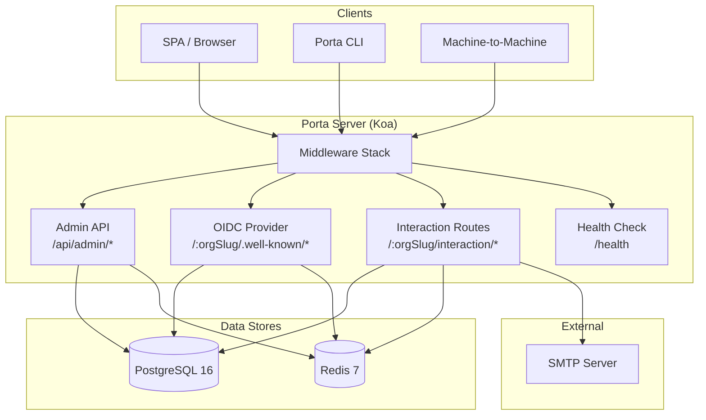
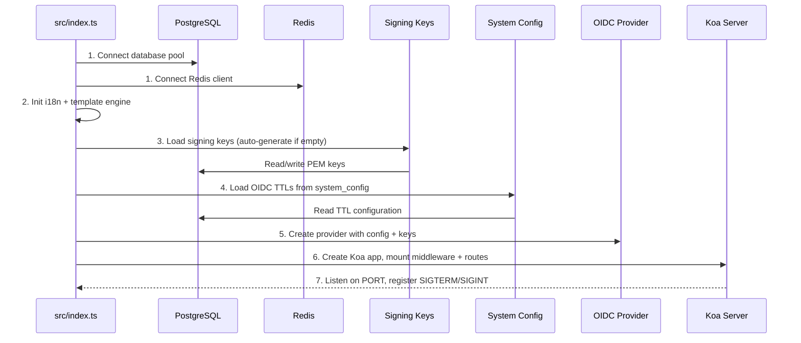
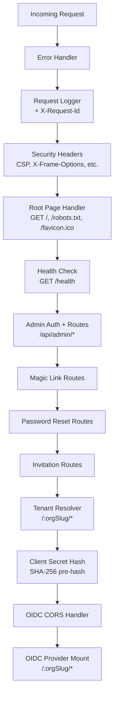

# System Overview

> **Last Updated**: 2026-04-24

## High-Level Architecture

Porta is a multi-tenant OIDC identity provider built on **Koa** + **node-oidc-provider** + **TypeScript**. It serves as a complete authentication and user management platform with organization-scoped tenancy, RBAC, custom claims, and two-factor authentication.



## Component Overview

### Core Runtime

| Component | Technology | Purpose |
|-----------|-----------|---------|
| HTTP Server | Koa 2.x | Request handling, middleware pipeline |
| OIDC Engine | node-oidc-provider 9.x | OpenID Connect protocol implementation |
| Database | PostgreSQL 16 (pg) | Persistent storage, long-lived OIDC artifacts |
| Cache/Sessions | Redis 7 (ioredis) | Short-lived OIDC artifacts, tenant cache, rate limits |
| Logger | pino | Structured logging (JSON in prod, pretty in dev) |
| Config | zod | Environment validation with fail-fast semantics |
| Signing | jose + crypto | ES256 (ECDSA P-256) token signing |
| CLI | yargs | Admin command-line interface |

### Domain Modules

Porta follows a **modular domain architecture** where each business domain is encapsulated in its own directory under `src/`:

| Module | Directory | Responsibility |
|--------|-----------|---------------|
| Organizations | `src/organizations/` | Tenant management, status lifecycle, branding |
| Applications | `src/applications/` | SaaS product definitions, module grouping |
| Clients | `src/clients/` | OIDC client registration, secret management |
| Users | `src/users/` | User accounts, passwords, status lifecycle |
| Auth | `src/auth/` | Authentication workflows, magic links, email, templates |
| RBAC | `src/rbac/` | Roles, permissions, user-role assignments |
| Custom Claims | `src/custom-claims/` | Claim definitions, user claim values |
| Two-Factor | `src/two-factor/` | TOTP, email OTP, recovery codes |
| CLI | `src/cli/` | Admin CLI with dual-mode bootstrap |

Each domain module follows a consistent internal structure:

```
src/<module>/
├── index.ts          # Barrel export (public API)
├── types.ts          # Domain types, interfaces, row mapping
├── errors.ts         # Domain-specific error classes
├── repository.ts     # PostgreSQL CRUD operations
├── cache.ts          # Redis caching layer
├── service.ts        # Business logic, validation, orchestration
├── slugs.ts          # Slug generation and validation (where applicable)
└── validators.ts     # Input validation (where applicable)
```

## Application Startup Sequence

The application starts via `src/index.ts` in a strict 7-step sequence:



**Fail-fast principle**: If any startup step fails (DB connection, Redis connection, config validation), the process logs a `fatal` error and calls `process.exit(1)`.

## Middleware Stack

The Koa middleware stack is assembled in `src/server.ts` in this precise order:



### Key Middleware Details

| Middleware | File | Purpose |
|-----------|------|---------|
| Error Handler | `error-handler.ts` | Global try/catch, hides internal details for 5xx |
| Request Logger | `request-logger.ts` | UUID request ID, logs method/url/status/duration |
| Security Headers | `server.ts` (inline) | CSP `default-src 'none'`, X-Frame-Options, etc. |
| Root Page | `root-page.ts` | Neutral `/`, `/robots.txt`, `/favicon.ico` (no product leakage) |
| Health Check | `health.ts` | DB + Redis connectivity check at `/health` |
| Admin Auth | `admin-auth.ts` | JWT Bearer validation for `/api/admin/*` routes |
| Tenant Resolver | `tenant-resolver.ts` | Cache-first org lookup from URL slug |
| Client Secret Hash | `client-secret-hash.ts` | SHA-256 pre-hash for `client_secret_post` |
| OIDC CORS | `oidc-cors.ts` | CORS handling for OIDC endpoints |

## Multi-Tenancy Model

Porta uses **path-based multi-tenancy** where each organization gets its own OIDC issuer URL:

```
https://auth.example.com/{orgSlug}/.well-known/openid-configuration
https://auth.example.com/{orgSlug}/auth
https://auth.example.com/{orgSlug}/token
```

The tenant resolver middleware (`src/middleware/tenant-resolver.ts`) uses a **cache-first strategy**:

1. Check Redis cache for org by slug
2. On miss → query PostgreSQL
3. Cache the result in Redis
4. Set `ctx.state.organization` for downstream handlers
5. Return appropriate HTTP status based on org status:
   - `active` → proceed
   - `suspended` → 403
   - `archived` → 410
   - Not found → pass through (no match)

## Graceful Shutdown

On `SIGTERM` or `SIGINT`:

1. Stop accepting new connections
2. Close the HTTP server
3. Disconnect Redis
4. Close the PostgreSQL pool
5. Force exit after 10 seconds if still hanging

## Related Documentation

- [Data Model](/implementation-details/architecture/data-model) — Database schema and entity relationships
- [API Design](/implementation-details/architecture/api-design) — REST conventions and endpoint structure
- [Security](/implementation-details/architecture/security) — Authentication, crypto, and isolation
- [Configuration Reference](/implementation-details/reference/configuration) — All environment variables
