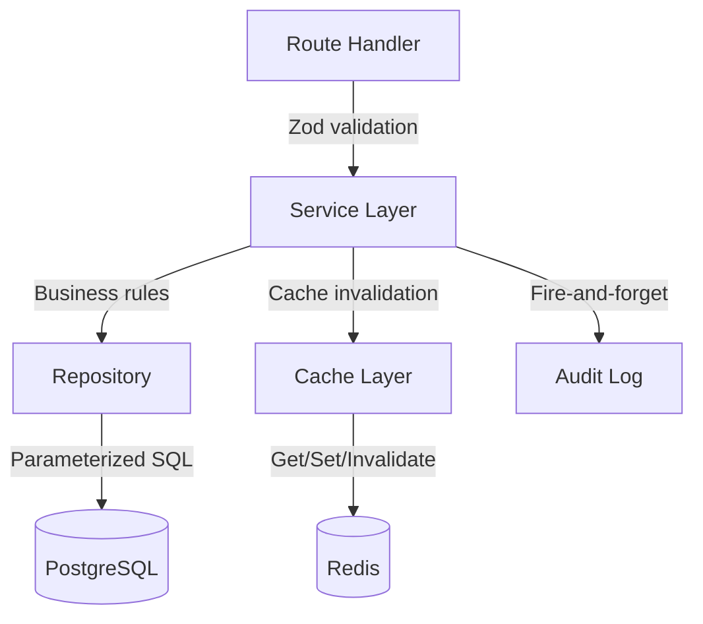

# Development Workflow

> **Last Updated**: 2026-05-07

## Coding Conventions

### File Naming

- **Source files**: kebab-case — `error-handler.ts`, `request-logger.ts`, `token-repository.ts`
- **Test files**: `<source-name>.test.ts` in the corresponding `tests/` subdirectory
- **Migration files**: `NNN_description.sql` — numbered sequentially

### Naming Conventions

| Element | Convention | Example |
|---------|-----------|---------|
| Files | kebab-case | `tenant-resolver.ts` |
| Functions | camelCase | `createOrganization()` |
| Types / Interfaces | PascalCase | `Organization`, `CreateOrganizationInput` |
| Constants (true) | UPPER_SNAKE_CASE | `MAX_RETRY_COUNT` |
| Constants (config) | camelCase | `defaultLocale` |
| Classes | PascalCase | `OrganizationNotFoundError` |

### Import Style

```typescript
// Named imports with .js extension (NodeNext module resolution)
import { getPool } from '../lib/database.js';
import { getRedis } from '../lib/redis.js';

// Type-only imports
import type { Middleware } from 'koa';
import type { Organization } from './types.js';
```

::: warning .js Extensions Required
All relative imports must use `.js` extensions, even for `.ts` files. This is required by Node.js ESM with `NodeNext` module resolution.
:::

### Functional Style

Porta uses **standalone exported functions**, not classes:

```typescript
// ✅ Correct — standalone function
export async function createOrganization(
  input: CreateOrganizationInput,
): Promise<Organization> {
  // validate → repository.insert → cache.invalidate → audit.log
  return org;
}

// ❌ Incorrect — class-based service
export class OrganizationService {
  async create(input: CreateOrganizationInput): Promise<Organization> { ... }
}
```

### Error Handling

Each domain module defines its own error classes:

```typescript
// src/organizations/errors.ts
export class OrganizationNotFoundError extends Error {
  constructor(identifier: string) {
    super(`Organization not found: ${identifier}`);
    this.name = 'OrganizationNotFoundError';
  }
}

export class OrganizationValidationError extends Error {
  constructor(message: string) {
    super(message);
    this.name = 'OrganizationValidationError';
  }
}
```

The global error handler (`src/middleware/error-handler.ts`) catches these and maps them to HTTP status codes.

## Module Development Pattern

### Creating a New Domain Module

When adding a new domain module, follow the established pattern:

```
src/<module>/
├── index.ts          # Barrel export — controls public API
├── types.ts          # Domain types, interfaces, DB row mapping
├── errors.ts         # Domain-specific error classes
├── repository.ts     # PostgreSQL CRUD (parameterized queries only)
├── cache.ts          # Redis cache (get/set/invalidate, graceful degradation)
├── service.ts        # Business logic orchestration
├── slugs.ts          # Slug generation and validation (if applicable)
└── validators.ts     # Additional validation logic (if applicable)
```

### Layer Responsibilities



| Layer | Responsibility | Rules |
|-------|---------------|-------|
| **Route** | HTTP concerns, request/response | Validate with Zod, call service, return JSON |
| **Service** | Business logic, orchestration | No HTTP awareness, no SQL, coordinate repo+cache+audit |
| **Repository** | Data access | Parameterized SQL only, return domain types (not rows) |
| **Cache** | Performance optimization | Graceful degradation (cache miss = DB fallback), never block |
| **Types** | Domain model | Immutable interfaces, row-to-domain mapping functions |

### Barrel Export Pattern

Every module's `index.ts` controls what's accessible to other modules:

```typescript
// src/organizations/index.ts
export type {
  Organization,
  CreateOrganizationInput,
  UpdateOrganizationInput,
} from './types.js';
export {
  OrganizationNotFoundError,
  OrganizationValidationError,
} from './errors.js';
export {
  createOrganization,
  getOrganizationById,
  listOrganizations,
  // ... etc
} from './service.js';
```

Other modules import from the barrel — never from internal files:

```typescript
// ✅ Import from barrel
import { createOrganization } from '../organizations/index.js';

// ❌ Never import internal files
import { insertOrganization } from '../organizations/repository.js';
```

## Testing

### Test Structure

Tests mirror the source structure under `tests/`:

```
tests/
├── unit/                    # Fast, no external deps
│   ├── organizations/       # Module-specific tests
│   │   ├── service.test.ts
│   │   ├── repository.test.ts
│   │   ├── cache.test.ts
│   │   └── slugs.test.ts
│   ├── middleware/
│   ├── cli/
│   └── ...
├── integration/             # Require Docker services
├── e2e/                     # Full flow tests
├── pentest/                 # Security tests
├── ui/                      # Playwright browser tests
├── fixtures/                # Shared test data
└── helpers/                 # Shared test utilities
```

### Test Commands

```bash
# Unit + integration (default)
yarn test

# All suites (unit + integration + e2e + pentest)
yarn test:all

# Specific suites
yarn test:unit
yarn test:integration
yarn test:e2e
yarn test:pentest
yarn test:ui

# Full verification (lint + build + test:all)
yarn verify
```

### Testing Conventions

**Unit tests** (no external dependencies):
- Mock database and Redis at the module boundary
- Test service logic, validation rules, and error handling
- One `describe` block per function, `it` blocks per behavior

**Integration tests** (require Docker):
- Test actual database queries and Redis operations
- Use test database (`porta_test`)
- Clean up test data between runs

**Pentest tests** (security baseline):
- Test security properties: injection prevention, auth bypass, header security
- Must always pass — failures indicate security regression
- Never weaken or skip these tests

### Test Count

Current coverage:

| Suite | Tests | Files |
|-------|-------|-------|
| **Porta unit tests** | 3,100+ | 150+ |
| **Admin GUI Vitest** | 145 | 16 |
| **Admin GUI Playwright E2E** | 204 | 23 |
| **Integration** | 9 suites | — |
| **E2E** | 20+ files | — |
| **Pentest** | 32+ files | 11 categories |
| **UI (Playwright)** | 20+ specs | — |

### Admin GUI Testing

The Admin GUI (`packages/porta-admin-gui/`) has its own test suite:

```bash
# Run Admin GUI tests from root
yarn workspace @portaidentity/admin-gui test
```

The standalone Admin GUI package includes 8 unit test files (~60 tests) and 1 integration test.

## Database Migrations

### Creating a Migration

```bash
yarn migrate:create <description>
```

This creates a new numbered SQL file in `migrations/`.

### Migration Conventions

```sql
-- migrations/020_description.sql

-- Use IF NOT EXISTS for idempotency
CREATE TABLE IF NOT EXISTS my_table (
    id UUID PRIMARY KEY DEFAULT gen_random_uuid(),
    -- always include timestamps
    created_at TIMESTAMPTZ NOT NULL DEFAULT NOW(),
    updated_at TIMESTAMPTZ NOT NULL DEFAULT NOW()
);

-- Create trigger for auto-updating updated_at
CREATE TRIGGER set_updated_at
    BEFORE UPDATE ON my_table
    FOR EACH ROW EXECUTE FUNCTION trigger_set_updated_at();

-- Always add appropriate indexes
CREATE INDEX IF NOT EXISTS idx_my_table_org_id ON my_table(organization_id);
```

**Rules:**
- Always include `created_at` / `updated_at` timestamps
- Always add `set_updated_at` trigger
- Always use UUID primary keys
- Always add foreign keys to `organizations` for tenant-scoped tables
- Always create indexes for frequently queried columns
- Use `IF NOT EXISTS` for idempotency where possible

### Running Migrations

```bash
# Via CLI (with Docker services running)
yarn porta migrate up       # Run pending migrations
yarn porta migrate down     # Rollback last migration
yarn porta migrate status   # Check migration state
```

## Git Workflow

### Branch Strategy

- **Main branch**: `main`
- **Feature branches**: `feature/<description>`

### Commit Convention

```
type(scope): description

# Types: feat, fix, refactor, test, docs, chore
# Scopes: organizations, users, auth, rbac, cli, oidc, etc.

# Examples:
feat(organizations): add branding asset upload
fix(auth): handle expired magic link gracefully
test(rbac): add permission inheritance tests
docs(api): update organizations endpoint docs
```

### Pre-Commit Verification

Always run the full verification before committing:

```bash
yarn verify
```

This runs lint → build → test:all. All checks must pass.

## Environment Modes

| Mode | `NODE_ENV` | Logger | Config |
|------|-----------|--------|--------|
| Development | `development` | pino-pretty (human-readable) | `.env` file |
| Test | `test` | Silent | Test-specific `.env` |
| Production | `production` | JSON structured | Environment variables |

## Admin GUI Development

The Admin GUI is a standalone package at `packages/porta-admin-gui/` (`@portaidentity/admin-gui`). It uses a Koa BFF + React/Vite SPA architecture with OIDC Authorization Code + PKCE (public client) and in-memory sessions.

### Technology Stack

| Concern | Technology |
|---------|-----------|
| **UI Framework** | React 19 |
| **Component Library** | FluentUI v9 (`@fluentui/react-components`) |
| **BFF Framework** | Koa 3.x |
| **Auth** | OIDC Authorization Code + PKCE (public client, openid-client v6) |
| **Sessions** | In-memory (no Redis) |
| **Build Tool** | Vite |
| **Test Runner** | Vitest |

### Development Mode

`yarn dev` from the project root starts both the Porta server and Admin GUI concurrently. To work on the Admin GUI alone:

```bash
yarn workspace @portaidentity/admin-gui dev
```

### Key Patterns

- **7 foundational components** — ErrorBoundary, StatusBadge, ConfirmDialog, CopyButton, EmptyState, LoadingSkeleton, ToastProvider
- **4 hooks** — useAuth, useTheme, useToast, useCopyToClipboard
- **Typed API client** — With ETag support and Bearer token injection
- **Security headers middleware** — CSP, X-Frame-Options, etc.
- **API proxy middleware** — Proxies `/api/*` to Porta server with Bearer token injection
- **SPA fallback middleware** — Serves the Vite-built SPA for client-side routing

### BFF Architecture

The BFF (`packages/porta-admin-gui/src/`) key files:

- `server.ts` — Koa app factory with middleware stack
- `auth/` — OIDC Auth Code + PKCE login flow, callback server, metadata
- `session.ts` — In-memory session store (no Redis dependency)
- `middleware/` — Security headers, error handler, API proxy, SPA fallback
- `config.ts` — Server URL resolution (flag > env > credentials)

## Related Documentation

- [Getting Started](/implementation-details/guides/getting-started) — Initial setup
- [Deployment](/implementation-details/guides/deployment) — Production deployment
- [Architecture Decisions](/implementation-details/decisions/) — Why things are the way they are
- [Configuration Reference](/implementation-details/reference/configuration) — All environment variables
