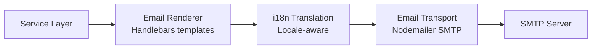
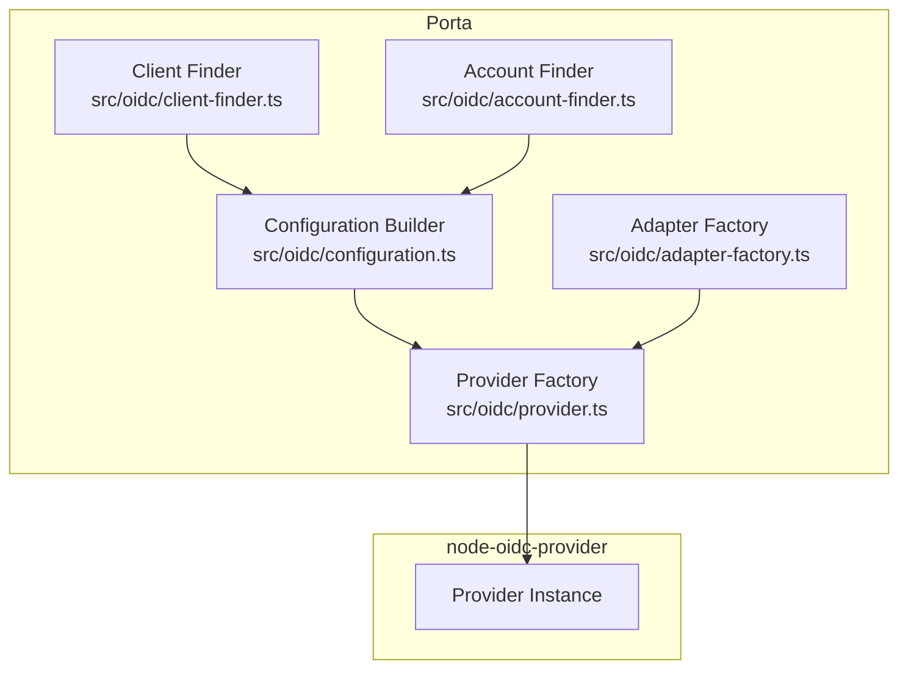
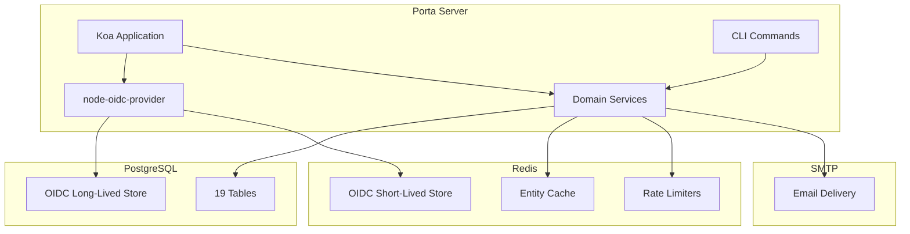

# Integrations Reference

> **Last Updated**: 2026-04-24

## Overview

Porta integrates with four external systems: PostgreSQL, Redis, SMTP, and node-oidc-provider. This document describes each integration's configuration, usage patterns, and operational characteristics.

## PostgreSQL 16

### Purpose

Primary persistent data store for all Porta data:
- Organization, application, client, user records
- RBAC roles, permissions, and assignments
- Custom claim definitions and values
- Two-factor authentication settings
- Auth tokens (magic links, password resets, invitations)
- Audit log entries
- System configuration
- Signing keys (encrypted at rest)
- Long-lived OIDC artifacts (AccessToken, RefreshToken, Grant)

### Connection

| Parameter | Source | Description |
|-----------|--------|-------------|
| Connection string | `DATABASE_URL` env var | Full PostgreSQL connection URL |
| Driver | `pg` (node-postgres) | Native PostgreSQL client |
| Pool size | Default (pg default: 10) | Connection pool managed by `pg.Pool` |

**Connection module**: `src/lib/database.ts`

```typescript
import { getPool } from '../lib/database.js';

const pool = getPool();
const result = await pool.query('SELECT $1::text AS message', ['hello']);
```

### Query Patterns

All queries use **parameterized SQL** — no raw string interpolation:

```typescript
// Standard CRUD
await pool.query(
  'INSERT INTO organizations (id, name, slug, status) VALUES ($1, $2, $3, $4)',
  [id, name, slug, 'active']
);

// Dynamic UPDATE (service layer builds SET clause safely)
const setClauses = ['name = $2', 'updated_at = NOW()'];
await pool.query(
  `UPDATE organizations SET ${setClauses.join(', ')} WHERE id = $1`,
  [id, name]
);

// Cursor-based pagination
await pool.query(
  `SELECT * FROM organizations 
   WHERE (name, id) > ($1, $2) 
   ORDER BY name ASC, id ASC 
   LIMIT $3`,
  [lastValue, lastId, limit]
);
```

### Extensions

| Extension | Migration | Purpose |
|-----------|-----------|---------|
| `pgcrypto` | 001 | `gen_random_uuid()` for UUID primary keys |
| `citext` | 001 | Case-insensitive text for emails and slugs |

### Connection Lifecycle

1. **Startup**: Pool created in `src/index.ts`, validated with `SELECT 1`
2. **Runtime**: Queries use pool.query() (auto-acquire/release connections)
3. **Health check**: `GET /health` runs `SELECT 1` to verify connectivity
4. **Shutdown**: Pool closed gracefully on `SIGTERM`/`SIGINT`

### Migrations

- **Tool**: `node-pg-migrate` (programmatic runner in `src/lib/migrator.ts`)
- **Files**: 19 SQL migrations in `migrations/` directory
- **Auto-run**: Entrypoint script runs migrations on container start
- **CLI**: `porta migrate up/down/status` for manual control

## Redis 7

### Purpose

In-memory data store for performance-sensitive and ephemeral data:
- **OIDC sessions** — Short-lived artifacts (Session, Interaction, AuthorizationCode, etc.)
- **Tenant cache** — Organization lookup by slug/ID
- **Entity cache** — User, client, role, permission lookups
- **Rate limiting** — Sliding window counters for auth endpoints
- **Claim cache** — Custom claim definitions and user values

### Connection

| Parameter | Source | Description |
|-----------|--------|-------------|
| Connection string | `REDIS_URL` env var | Full Redis connection URL |
| Driver | `ioredis` | Full-featured Redis client |
| Reconnection | Auto-reconnect | Built-in exponential backoff |

**Connection module**: `src/lib/redis.ts`

```typescript
import { getRedis } from '../lib/redis.js';

const redis = getRedis();
await redis.set('key', 'value', 'EX', 300); // 5-minute TTL
const value = await redis.get('key');
```

### Data Patterns

#### OIDC Adapter (Short-Lived Artifacts)

```
oidc:{model}:{uid}           → JSON payload with TTL
oidc:{model}:{uid}:grant     → Grant ID lookup
oidc:grant:{grantId}         → Set of artifact UIDs (for cascade deletion)
oidc:user_code:{userCode}    → UID lookup (device flow)
```

Models stored in Redis: `Session`, `Interaction`, `AuthorizationCode`, `ReplayDetection`, `ClientCredentials`, `PushedAuthorizationRequest`.

#### Tenant Cache

```
org:slug:{slug}    → JSON Organization object (TTL: configurable)
org:id:{orgId}     → JSON Organization object (TTL: configurable)
```

Cache-first strategy: Redis check → PostgreSQL fallback → cache on miss.

#### Rate Limiting

```
rate:{endpoint}:{identifier}  → Counter (INCR + EXPIRE)
```

Sliding window implementation using Redis `INCR` and `EXPIRE`.

### Cache Invalidation

- **On write**: Service layer invalidates cache after successful DB writes
- **Graceful degradation**: Cache miss falls through to PostgreSQL
- **Never block**: Cache operations don't fail requests

### Data Persistence

Redis data is **ephemeral** — no persistence configuration needed:
- Cache data rebuilds from PostgreSQL on miss
- OIDC sessions have natural TTLs
- Rate limit counters expire automatically
- Redis restart causes temporary cache misses (not data loss)

### Connection Lifecycle

1. **Startup**: Client created in `src/index.ts`, validated with `ping`
2. **Runtime**: All Redis operations use the shared client
3. **Health check**: `GET /health` runs `ping` to verify connectivity
4. **Shutdown**: Client disconnected gracefully on `SIGTERM`/`SIGINT`

## SMTP (Email)

### Purpose

Email delivery for authentication workflows:
- **Magic link** emails (passwordless login)
- **Password reset** emails
- **User invitation** emails
- **Email OTP** for two-factor authentication

### Connection

| Parameter | Source | Description |
|-----------|--------|-------------|
| Host | `SMTP_HOST` env var | SMTP server hostname |
| Port | `SMTP_PORT` env var (default: 587) | SMTP server port |
| Username | `SMTP_USER` env var (optional) | SMTP auth username |
| Password | `SMTP_PASS` env var (optional) | SMTP auth password |
| From | `SMTP_FROM` env var | Sender email address |
| Driver | Nodemailer | Standard Node.js SMTP transport |

**Module**: `src/auth/email-transport.ts` (transport abstraction), `src/auth/email-service.ts` (high-level API)

### Email Flow



1. **Service** triggers email (e.g., magic link requested)
2. **Renderer** (`src/auth/email-renderer.ts`) renders Handlebars template with i18n
3. **Transport** (`src/auth/email-transport.ts`) sends via Nodemailer
4. **SMTP server** delivers the email

### Templates

Email templates live in `templates/default/` with locale-specific translations in `locales/default/{locale}/`.

### Development

In development, MailHog captures all emails:
- SMTP: `localhost:1025`
- Web UI: `http://localhost:8025` (view captured emails in browser)

## node-oidc-provider 9.x

### Purpose

OpenID Connect protocol engine — handles all OIDC-compliant authentication flows:
- Authorization Code (with PKCE)
- Client Credentials
- Refresh Token
- Discovery (`/.well-known/openid-configuration`)
- JWKS (`/.well-known/jwks`)
- Token introspection and revocation

### Integration Architecture



### Configuration

The OIDC provider is configured in `src/oidc/configuration.ts`:

| Feature | Configuration |
|---------|--------------|
| **Signing algorithm** | ES256 (ECDSA P-256) only |
| **PKCE** | Enforced for public clients (S256 method) |
| **Scopes** | `openid`, `profile`, `email`, `offline_access` + custom |
| **Claims** | Standard OIDC claims + RBAC roles + custom claims |
| **Grant types** | `authorization_code`, `refresh_token`, `client_credentials` |
| **Token format** | JWT (signed with ES256) |
| **Interactions** | Custom login/consent pages |
| **TTLs** | Loaded from `system_config` table at startup |

### Adapter Strategy

The adapter factory (`src/oidc/adapter-factory.ts`) routes OIDC models to the appropriate storage backend:

| Model | Adapter | Storage |
|-------|---------|---------|
| Session | Redis | `src/oidc/redis-adapter.ts` |
| Interaction | Redis | `src/oidc/redis-adapter.ts` |
| AuthorizationCode | Redis | `src/oidc/redis-adapter.ts` |
| ReplayDetection | Redis | `src/oidc/redis-adapter.ts` |
| ClientCredentials | Redis | `src/oidc/redis-adapter.ts` |
| PushedAuthorizationRequest | Redis | `src/oidc/redis-adapter.ts` |
| AccessToken | PostgreSQL | `src/oidc/postgres-adapter.ts` |
| RefreshToken | PostgreSQL | `src/oidc/postgres-adapter.ts` |
| Grant | PostgreSQL | `src/oidc/postgres-adapter.ts` |

### Client Discovery

`src/oidc/client-finder.ts` — Called by node-oidc-provider when it needs client metadata:

1. Query clients table by `client_id`
2. Load active secrets for the client
3. Map to node-oidc-provider's expected client metadata format
4. Include `client_secret` (SHA-256 pre-hash) for secret comparison

### Account Claims

`src/oidc/account-finder.ts` — Called by node-oidc-provider when building ID tokens:

1. Load user by ID from the users service
2. Build standard OIDC claims (profile, email)
3. Load RBAC roles for the user
4. Load custom claim values for the user
5. Return scope-filtered claims

### Interaction Handling

Custom login and consent pages are implemented as Koa routes (`src/routes/interactions.ts`) that integrate with node-oidc-provider's interaction system:

1. Provider redirects to `/interaction/:uid` for login/consent
2. Custom Handlebars templates render the UI
3. User submits credentials → validated against user service
4. 2FA checked if required by org policy
5. Provider resumes the OIDC flow

### Mounting

The provider is mounted as Koa middleware under `/:orgSlug/*` prefix in `src/server.ts`, after the tenant resolver middleware sets the organization context.

## Integration Summary



## Related Documentation

- [System Overview](/implementation-details/architecture/system-overview) — How integrations fit into the architecture
- [Data Model](/implementation-details/architecture/data-model) — PostgreSQL schema details
- [Configuration Reference](/implementation-details/reference/configuration) — Connection strings and settings
- [Infrastructure](/implementation-details/architecture/infrastructure) — Docker setup for all services
