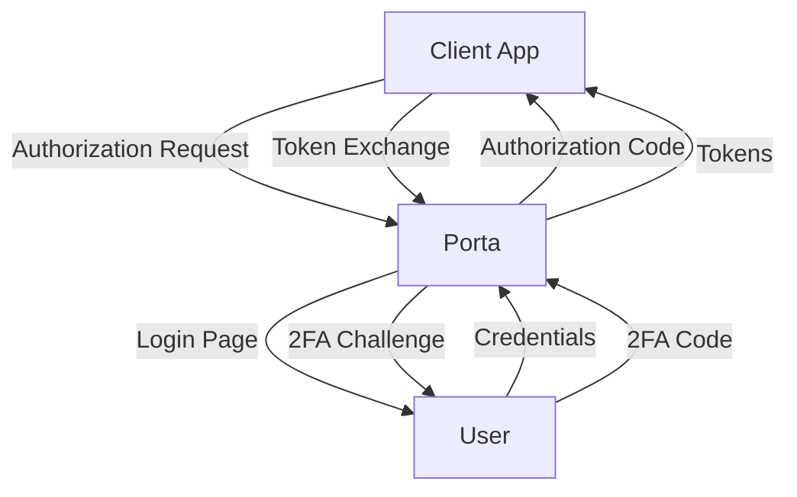

# RD-17: Setup & Usage Documentation

> **Document**: RD-17-setup-documentation.md
> **Status**: Draft
> **Created**: 2026-04-11
> **Project**: Porta v5
> **Depends On**: RD-14 (Playground Application), RD-15 (Playground Infrastructure)

---

## Feature Overview

This requirement covers comprehensive documentation that explains how to set up, use,
and integrate with Porta v5. The documentation serves two audiences:

1. **Developers** who want to understand Porta, run the playground, explore the auth
   flows, and integrate their own applications with Porta as an OIDC provider.

2. **DevOps/Operators** who need to deploy Porta to production, configure it for their
   infrastructure, manage organizations and clients, and operate it day-to-day.

All documentation lives in a `docs/` directory at the project root, written in Markdown
for easy GitHub rendering. The centerpiece is a Quickstart Guide that takes someone from
`git clone` to a fully running playground in under 10 minutes.

---

## Functional Requirements

### Must Have

- [ ] **Quickstart Guide** (`docs/QUICKSTART.md`) — A step-by-step guide that covers:

  **Prerequisites section:**
  - Node.js ≥ 22.0.0
  - Yarn Classic 1.22 (NOT npm, NOT Berry)
  - Docker + Docker Compose
  - Git
  - A modern browser (Chrome, Firefox, Edge)
  - Optional: Google Authenticator or Microsoft Authenticator for TOTP testing

  **Step-by-step walkthrough:**
  1. Clone the repository
  2. Install dependencies (`yarn install`)
  3. Copy `.env.example` to `.env` (explain key settings)
  4. Start infrastructure (`yarn docker:up`)
  5. Run playground (`yarn playground`)
  6. Open the playground in the browser (`http://localhost:4000`)
  7. Try each scenario (with screenshots/descriptions):
     - Normal password login
     - Magic link login (check MailHog)
     - Email OTP 2FA (check MailHog for code)
     - TOTP 2FA (scan QR code with authenticator app)
     - Recovery code login
     - Third-party consent screen
     - Token inspection and UserInfo
     - Logout and re-login

  **Test credentials table:**
  | Scenario | Email | Password | Notes |
  |----------|-------|----------|-------|
  | Normal Login | `user@no2fa.local` | `Playground123!` | No 2FA required |
  | Email OTP | `user@email2fa.local` | `Playground123!` | Check MailHog for code |
  | TOTP Auth | `user@totp2fa.local` | `Playground123!` | Use authenticator app |
  | TOTP Setup | `fresh@totp2fa.local` | `Playground123!` | Will prompt for setup |
  | Consent | `user@thirdparty.local` | `Playground123!` | Shows consent screen |

  **Troubleshooting section:**
  - "Docker services won't start" → Check Docker is running, ports not in use
  - "Seed script fails" → Check `.env` is configured correctly
  - "Login page shows error" → Check Porta server logs, verify org slug
  - "Emails not arriving" → Check MailHog at http://localhost:8025
  - "TOTP code invalid" → Verify system clock is synced (TOTP is time-based)

- [ ] **Architecture Overview** (`docs/ARCHITECTURE.md`) — High-level documentation:

  **System diagram** (text-based, Mermaid-compatible):
  ```
  ┌──────────────┐     OIDC      ┌──────────────┐
  │  Client App  │◄────flows────►│  Porta v5    │
  │  (SPA/Web)   │               │  (Koa + OIDC)│
  └──────────────┘               └──────┬───────┘
                                        │
                          ┌─────────────┼─────────────┐
                          │             │             │
                    ┌─────▼─────┐ ┌────▼────┐ ┌─────▼─────┐
                    │PostgreSQL │ │  Redis  │ │  MailHog  │
                    │  (Data)   │ │ (Cache) │ │  (Email)  │
                    └───────────┘ └─────────┘ └───────────┘
  ```

  **Component map:**
  | Component | Path | Purpose |
  |-----------|------|---------|
  | Config | `src/config/` | Zod-validated environment config |
  | Library | `src/lib/` | Database, Redis, logger, migrator, signing keys |
  | Middleware | `src/middleware/` | Error handler, request logger, health, tenant resolver |
  | OIDC | `src/oidc/` | Provider config, adapters, client/account finders |
  | Organizations | `src/organizations/` | Multi-tenant org management |
  | Applications | `src/applications/` | App registration and modules |
  | Clients | `src/clients/` | OIDC client and secret management |
  | Users | `src/users/` | User management, password hashing |
  | Auth | `src/auth/` | Login flows, CSRF, tokens, email, i18n |
  | RBAC | `src/rbac/` | Roles, permissions, user-role assignments |
  | Custom Claims | `src/custom-claims/` | Per-app custom claim definitions |
  | Two-Factor | `src/two-factor/` | Email OTP, TOTP, recovery codes |
  | Routes | `src/routes/` | HTTP route handlers |
  | CLI | `src/cli/` | Admin command-line interface |

  **Multi-tenancy model:**
  - Path-based: `/{org-slug}/.well-known/openid-configuration`
  - Each org has its own user pool, clients, branding, 2FA policy
  - Shared infrastructure (same DB, Redis, OIDC provider instance)

  **Authentication flow diagram** (Login → optional 2FA → Consent → Tokens)

  **Data model overview:**
  - Organizations → Applications → Clients
  - Organizations → Users
  - Applications → Roles → Permissions
  - Applications → Custom Claims
  - Users → Roles (per org)
  - Users → Custom Claim Values

- [ ] **CLI Cheat Sheet** (`docs/CLI.md`) — Quick reference for all `porta` commands:

  **Format:** Command, description, and example for each command group:

  | Command Group | Commands |
  |--------------|----------|
  | `porta health` | Check DB + Redis connectivity |
  | `porta migrate` | `up`, `down`, `status` |
  | `porta seed` | `run` |
  | `porta keys` | `list`, `generate`, `rotate` |
  | `porta config` | `list`, `get`, `set` |
  | `porta audit` | `list` (with date/event/user filters) |
  | `porta org` | `create`, `list`, `show`, `update`, `suspend`, `activate`, `archive`, `branding` |
  | `porta app` | `create`, `list`, `show`, `update`, `archive`, `module`, `role`, `permission`, `claim` |
  | `porta client` | `create`, `list`, `show`, `update`, `revoke`, `secret` |
  | `porta user` | `create`, `invite`, `list`, `show`, `update`, status commands, `set-password`, `roles`, `claims`, `2fa` |

  **Common workflow examples:**
  1. "Create a new tenant" → org create → app create → client create
  2. "Add a user with TOTP" → user create → user 2fa status
  3. "Check why login fails" → audit list → user show
  4. "Rotate signing keys" → keys generate → keys rotate

- [ ] **Integration Guide** (`docs/INTEGRATION.md`) — How to connect your own app:

  **For SPA applications:**
  1. Create an organization via CLI
  2. Create an application
  3. Create a public client with redirect URIs
  4. Use `oidc-client-ts` or similar library
  5. Discovery URL: `http://your-porta/{org-slug}/.well-known/openid-configuration`
  6. Code example (JavaScript)

  **For server-side applications:**
  1. Same org/app setup
  2. Create a confidential client
  3. Use `openid-client` (Node.js) or equivalent
  4. Token exchange with client_secret_basic
  5. Code example (Node.js)

  **For mobile applications:**
  1. Create a public client with custom scheme redirect URI
  2. Use AppAuth or similar native OIDC library
  3. PKCE is mandatory

  **Token usage:**
  - Access token: send as `Authorization: Bearer {token}` to your API
  - ID token: decode for user identity (JWT)
  - Refresh token: use to get new access tokens silently
  - UserInfo endpoint: get full user profile

  **Scopes and claims:**
  | Scope | Claims Returned |
  |-------|----------------|
  | `openid` | `sub` |
  | `profile` | `name`, `given_name`, `family_name`, `picture`, etc. |
  | `email` | `email`, `email_verified` |
  | `phone` | `phone_number`, `phone_number_verified` |
  | `address` | `address` |

  **Custom claims and RBAC:**
  - How roles appear in tokens
  - How custom claims appear in tokens
  - How to request specific claims

### Should Have

- [ ] **Environment Variables Reference** (`docs/ENVIRONMENT.md`) — Complete reference
  of all environment variables with descriptions, defaults, and examples.

  Organized by category:
  - Server (PORT, HOST, NODE_ENV)
  - Database (DATABASE_URL)
  - Redis (REDIS_URL)
  - OIDC (ISSUER_BASE_URL, COOKIE_KEYS)
  - Email (SMTP_HOST, SMTP_PORT, SMTP_FROM, etc.)
  - 2FA (TWO_FACTOR_ENCRYPTION_KEY)
  - Logging (LOG_LEVEL)

- [ ] **Production Deployment Guide** (`docs/DEPLOYMENT.md`) — High-level production
  checklist:
  - Required infrastructure (Postgres, Redis, SMTP relay)
  - Environment variable configuration for production
  - Running migrations in production
  - Generating signing keys
  - Setting up the first organization and super-admin
  - Health check endpoint for load balancers
  - Log aggregation (JSON output in production)
  - Backup strategy (database, signing keys)
  - Security hardening (COOKIE_KEYS rotation, HTTPS)

- [ ] **FAQ** (`docs/FAQ.md`) — Common questions:
  - "How do I add a new language?" → Create locale files
  - "How do I customize the login page?" → Per-org template overrides
  - "How do I enable 2FA for an organization?" → CLI command
  - "How do I create an API-only client?" → Client credentials grant
  - "How do I add custom claims to tokens?" → CLI + account-finder

### Won't Have (Out of Scope)

- Video tutorials or screencasts
- API reference documentation (Swagger/OpenAPI) — separate concern
- Contributor/development guide (separate from user-facing docs)
- Translated documentation (English only for now)

---

## Technical Requirements

### Documentation File Structure

```
docs/
├── QUICKSTART.md          # Getting started in 10 minutes
├── ARCHITECTURE.md        # System architecture and component map
├── CLI.md                 # CLI command quick reference
├── INTEGRATION.md         # How to connect your app to Porta
├── ENVIRONMENT.md         # Environment variables reference
├── DEPLOYMENT.md          # Production deployment guide
├── FAQ.md                 # Frequently asked questions
└── images/                # Architecture diagrams, screenshots
    ├── architecture.png   # System architecture diagram
    └── login-flow.png     # Authentication flow diagram
```

### Writing Style Guidelines

- **Audience-aware**: Quickstart and Integration for developers; Deployment for DevOps
- **Action-oriented**: Start with the verb ("Create an organization", "Configure the client")
- **Copy-pasteable**: All commands should be copy-pasteable as-is
- **Progressive disclosure**: Start simple, add complexity gradually
- **No assumptions**: Don't assume the reader knows OIDC, TypeScript, or Porta internals
- **Test every command**: Every command in the docs must be verified to work

### Diagram Format

Use Mermaid syntax for diagrams (renders natively on GitHub):



---

## Integration Points

### With RD-14 (Playground Application)
- Quickstart guide references the playground as the primary way to explore Porta
- Integration guide uses playground code as examples

### With RD-15 (Playground Infrastructure)
- Quickstart guide's step-by-step walkthrough uses `yarn playground`
- Test credentials table matches seed data from RD-15

### With RD-09 (CLI)
- CLI cheat sheet documents all available commands
- Workflow examples show real CLI usage

### With All RDs
- Architecture overview references all implemented modules
- Integration guide covers OIDC, auth, RBAC, custom claims, 2FA

---

## Scope Decisions

| Decision | Options Considered | Chosen | Rationale |
|----------|-------------------|--------|-----------|
| Docs location | Wiki, external site, in-repo | In-repo `docs/` | Versioned with code, renders on GitHub |
| Diagram tool | Draw.io, Excalidraw, Mermaid | Mermaid | Renders natively on GitHub, text-based, versionable |
| Guide format | Single README, multi-file | Multi-file | Each audience/topic gets focused content |
| Production depth | Full ops guide, checklist only | Checklist + key decisions | Full ops guide is RD-11 territory |

---

## Acceptance Criteria

1. [ ] `docs/QUICKSTART.md` exists and covers clone → playground → all scenarios
2. [ ] `docs/ARCHITECTURE.md` has system diagram and component map
3. [ ] `docs/CLI.md` lists all `porta` commands with examples
4. [ ] `docs/INTEGRATION.md` covers SPA, server-side, and mobile integration
5. [ ] All CLI commands in docs have been verified to work
6. [ ] All URLs in docs are correct (localhost ports, paths)
7. [ ] Test credentials in Quickstart match seed data from RD-15
8. [ ] A developer unfamiliar with Porta can follow the Quickstart from scratch
9. [ ] Documentation renders correctly on GitHub (Markdown, Mermaid diagrams)
10. [ ] No broken links between documentation files
