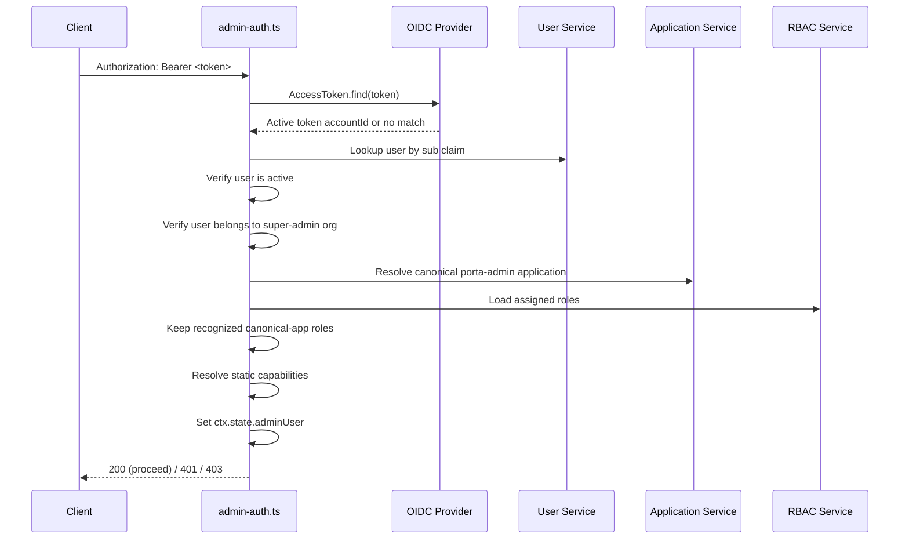
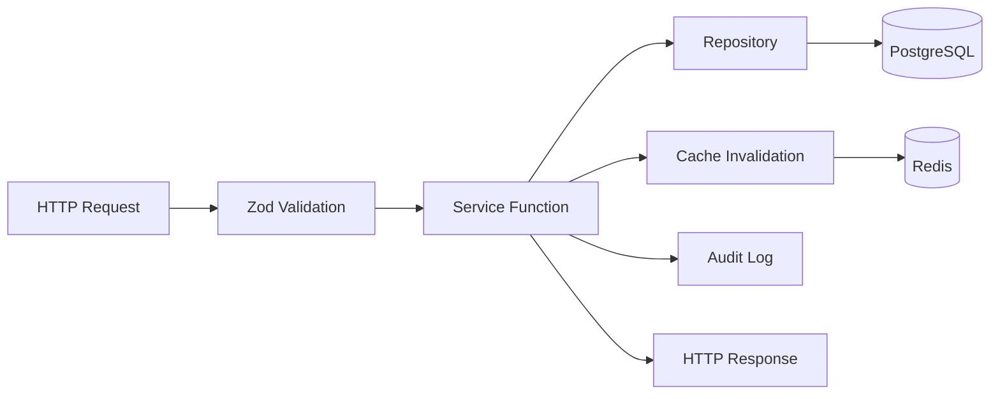

# API Design

> **Last Updated**: 2026-09-17

## Overview

Porta exposes three distinct HTTP surfaces:

1. **Admin API** (`/api/admin/*`) — RESTful management API for organizations, applications, clients, users, RBAC, and system configuration
2. **Public branding** (`/:orgSlug/branding/*`) — Anonymous delivery of uploaded organization logos and favicons
3. **OIDC Endpoints** (`/:orgSlug/*`) — OpenID Connect protocol endpoints powered by node-oidc-provider
   This document covers the design principles, conventions, and patterns used in the Admin API. For OIDC protocol details, see the [node-oidc-provider documentation](https://github.com/panva/node-oidc-provider).

## REST Conventions

### URL Structure

All admin endpoints follow a consistent RESTful pattern:

```
/api/admin/{resource}                    # Collection
/api/admin/{resource}/:id                # Single resource
/api/admin/{resource}/:id/{sub-resource} # Nested resource
```

**Nested resources** are used for tenant-scoped or application-scoped entities:

```
/api/admin/organizations/:orgId/users           # Users within an org
/api/admin/organizations/:orgId/users/:userId/roles  # User's role assignments
/api/admin/applications/:appId/roles            # Roles within an app
/api/admin/applications/:appId/permissions      # Permissions within an app
/api/admin/applications/:appId/claims           # Claim definitions within an app
```

### HTTP Methods

| Method   | Purpose                        | Idempotent | Response      |
| -------- | ------------------------------ | ---------- | ------------- |
| `GET`    | Retrieve resource(s)           | Yes        | 200 + body    |
| `POST`   | Create resource                | No         | 201 + body    |
| `PUT`    | Full update                    | Yes        | 200 + body    |
| `PATCH`  | Partial update / status change | Yes        | 200 + body    |
| `DELETE` | Remove resource                | Yes        | 204 (no body) |

### Permanent record deletion

The Admin API exposes eight physical deletion routes. Each route requires Admin authentication,
validates every path identifier, and checks its dedicated Delete permission. Nested resources are
resolved through both parent and child identifiers; a child from another parent is indistinguishable
from a missing child.

| Resource           | Route                                                             | Permission                |
| ------------------ | ----------------------------------------------------------------- | ------------------------- |
| Organization       | `DELETE /api/admin/organizations/:idOrSlug`                       | `admin:org:delete`        |
| Application        | `DELETE /api/admin/applications/:id`                              | `admin:app:delete`        |
| Application module | `DELETE /api/admin/applications/:appId/modules/:moduleId`         | `admin:module:delete`     |
| Client             | `DELETE /api/admin/clients/:id`                                   | `admin:client:delete`     |
| Role               | `DELETE /api/admin/applications/:appId/roles/:roleId`             | `admin:role:delete`       |
| Permission         | `DELETE /api/admin/applications/:appId/permissions/:permissionId` | `admin:permission:delete` |
| Claim definition   | `DELETE /api/admin/applications/:appId/claims/:claimId`           | `admin:claim:delete`      |
| User               | `DELETE /api/admin/organizations/:orgId/users/:userId`            | `admin:user:delete`       |

Most successful deletions return `204` with no response body. Role and permission deletion return
`200 { data: { reauthenticationRequired } }` so an administrator whose own authority changed can
authenticate again without an unsafe follow-up request. Role-slug updates, role-permission removal,
and user-role removal use the same result flag. A missing or parent-mismatched record returns a
fixed resource-specific `404`; it does not expose dependency counts or partial cascade details.
Repeating a completed deletion therefore returns `404` and creates no second deletion event.

### RBAC SDK and CLI contracts

The public SDK mirrors the application-qualified RBAC routes without inventing pagination or
duplicating parent identifiers in request bodies. `roles.list(appId)` and
`permissions.list(appId, { moduleId? })` validate and return complete arrays. User-role assignment
uses collection `PUT` and `DELETE` requests with `{ roleIds }`, while the conventional CLI wraps a
single selected role in a one-element array. Role, permission, role-permission, and user-role
reduction methods validate the committed `reauthenticationRequired` result before the CLI reports
success. The SDK agent reuses these same domain methods and exposes permission metadata updates
through its existing definition-driven dispatcher.

Archive, Restore, user Purge, and whole-client Revoke are not Admin API lifecycle operations.
Applications, modules, and clients retain reversible Activate/Deactivate operations; organizations
and users retain their applicable reversible status operations. Revocation remains available for
security artifacts, including client credentials, sessions, and tokens. The retained
`admin:client:revoke` permission applies to client-secret revocation, not client lifecycle.

### Endpoint Inventory

| Route File         | Base Path                                             | Endpoints | Description                                    |
| ------------------ | ----------------------------------------------------- | --------- | ---------------------------------------------- |
| `organizations.ts` | `/api/admin/organizations`                            | 10        | Org CRUD + status lifecycle + branding         |
| `applications.ts`  | `/api/admin/applications`                             | 11        | App CRUD + status + modules                    |
| `clients.ts`       | `/api/admin/clients`                                  | 10        | Client CRUD + status + secrets                 |
| `users.ts`         | `/api/admin/organizations/:orgId/users`               | 13        | User CRUD + status + password + login tracking |
| `roles.ts`         | `/api/admin/applications/:appId/roles`                | 9         | Role CRUD + permission assignment              |
| `permissions.ts`   | `/api/admin/applications/:appId/permissions`          | 6         | Permission CRUD                                |
| `user-roles.ts`    | `/api/admin/organizations/:orgId/users/:userId/roles` | 4         | User-role assignment                           |
| `custom-claims.ts` | `/api/admin/applications/:appId/claims`               | 9         | Claim definitions + user values                |
| `config.ts`        | `/api/admin/config`                                   | —         | System configuration management                |
| `keys.ts`          | `/api/admin/keys`                                     | —         | Signing key management                         |
| `audit.ts`         | `/api/admin/audit`                                    | —         | Audit log viewer with filters                  |
| `stats.ts`         | `/api/admin/stats`                                    | —         | Dashboard statistics (6 aggregate queries)     |
| `sessions.ts`      | `/api/admin/sessions`                                 | —         | Session management + revocation                |
| `bulk.ts`          | `/api/admin/bulk`                                     | —         | Bulk status operations                         |
| `branding.ts`      | `/api/admin/organizations/:orgId/branding`            | 4         | Logo/favicon metadata, bytes, upload, deletion |
| `exports.ts`       | `/api/admin/export`                                   | —         | Selective manifests and legacy report exports  |
| `imports.ts`       | `/api/admin/import`                                   | —         | Manifest preview and atomic apply              |

### Organization branding assets

Branding assets are direct organization subresources:

| Method   | Route                                            | Result                              | Permission         |
| -------- | ------------------------------------------------ | ----------------------------------- | ------------------ |
| `GET`    | `/api/admin/organizations/:orgId/branding`       | Stored asset metadata               | `admin:org:read`   |
| `GET`    | `/api/admin/organizations/:orgId/branding/:type` | Protected image bytes               | `admin:org:read`   |
| `PUT`    | `/api/admin/organizations/:orgId/branding/:type` | Stored metadata after create/update | `admin:org:update` |
| `DELETE` | `/api/admin/organizations/:orgId/branding/:type` | `204`                               | `admin:org:update` |

`type` is exactly `logo` or `favicon`. Uploads use a strict JSON object containing standard
base64 `data` and one allowed `contentType`. The server decodes once, verifies the actual PNG,
JPEG, WebP, ICO, or sanitized SVG content, and stores the verified bytes. Logo data is limited to
2 MiB and favicon data to 512 KiB. Invalid content receives one fixed `400`; database and other
operational failures continue through the global sanitized server-error boundary.

After permission checks, every operation validates the organization UUID and resolves the existing
organization before touching asset storage. Invalid and missing organization identifiers therefore
share the same `404` boundary. The SDK mirrors these four routes with `listAssets`, `getAsset`,
`uploadAsset`, and `deleteAsset`; `updateSettings` uses the existing organization branding-settings
route and returns the complete updated organization.

### Public organization branding

Authentication pages load uploaded assets from `GET /:orgSlug/branding/:type`, where `type` is
exactly `logo` or `favicon`. This route is anonymous because login pages must render before a user
authenticates. Missing organizations, unsupported types, and empty asset slots all return the same
minimal `404`, which avoids exposing whether a tenant or asset exists.

Successful responses contain only the validated stored bytes and media type. They use
`Cache-Control: public, no-cache` plus an ETag for revalidation. SVG responses also receive a
restrictive document CSP. Suspended organizations retain asset delivery so their authentication
pages remain consistently branded while an administrator repairs or reactivates them.

## Global Operational Configuration

The configuration router exposes only the 18-key application-owned operational catalog.
Infrastructure, root secrets and internal bootstrap rows cannot be read or changed through it.
Metadata comes from code; only a validated native JSONB value and timestamp come from storage.
See [configuration](../reference/configuration.md#system-config-runtime) and
[the catalog decision](../decisions/index.md#adr-016-closed-global-operational-catalog).

| Method/path | Permission | Success |
|---|---|---|
| `GET /api/admin/config` | `admin:config:read` | `{ data: ConfigEntry[] }` in catalog order |
| `GET /api/admin/config/:key` | `admin:config:read` | `{ data: ConfigEntry }` |
| `PUT /api/admin/config/:key` | `admin:config:update` | `{ data: ConfigEntry, restartRequired }` |
| `PUT /api/admin/config` | `admin:config:update` | `{ data: ConfigEntry[], restartRequired }` |

Single updates accept exactly `{ value: scalar }`; batches accept exactly a non-empty
`{ values: { key: scalar } }`. Every name is resolved before value validation or mutation.
Integer text, fractions, values outside inclusive catalog bounds, unsupported locales and extra
fields are rejected without coercion. Non-catalog names share `404 config_entry_not_found`;
invalid bodies or values share `400 config_value_invalid`. Authoritative reads and writes never
substitute runtime defaults: unavailable, missing or invalid stored rows produce the fixed
`503 config_store_unavailable` response with a request ID and no database diagnostics.

Each mutation owns one existing PostgreSQL transaction. It validates new returned rows, resolves
the live authenticated actor, and writes one `admin.config.updated` audit event containing only
sorted public keys and `restartRequired`. It is excluded from the generic mutation audit wrapper.
Update or audit failure rolls everything back without clearing the cache. Successful commit clears
only the local runtime cache. Other instances retain their existing 60-second refresh behavior.
Provider-startup lifetimes report `restartRequired: true`; they do not restart running instances.
Valid updates may replace corrupt targeted content, but missing rows are not recreated.

The SDK exposes small closed-key and native-scalar types without copying runtime policy metadata.
`config.list()` and `config.get(key)` return authoritative entries; `set(key, value)` and
`setMany(values)` retain the complete result envelope, including `restartRequired`. Arbitrary read
names are encoded into one URL segment. Mutation names are also encoded because JavaScript and
agent callers bypass TypeScript's key union; bare dot segments are rejected before transport so
URL normalization cannot redirect a configuration mutation to another administrative operation.

The conventional CLI keeps `config list|get|set`. List/get display native values, type, unit,
accepted bounds or choices, application mode and update time. Set first reads live metadata,
parses a base-ten safe integer within inclusive bounds or an exact supported string, and sends
the returned typed key with its native scalar. JSON preserves SDK results. Human output reports
that every Porta server instance must restart only when the confirmed result requires it.

The embedded Admin application's top-level `System Configuration…` command opens one maximized
four-tab Layout DSL editor with a persistent Save/Cancel footer. Its session-bound service validates
the complete closed catalog and terminal-safe metadata before rendering. Read and update permissions
remain separate, and no selected organization is required for this deployment-global policy.
Drafts retain native seconds while inline help shows exact whole-unit durations. One Save sends
only valid changed keys in one batch. Confirmed success reloads authoritative values; an unknown
outcome reads back once without replaying the mutation and retains drafts for review. Busy work
blocks edits and closure; dirty closure uses one ordinary discard confirmation. Session replacement
and shutdown release local ownership, so late results cannot repaint a cleared editor. Below the
measured fitting minimum, resize guidance replaces editable controls without discarding drafts.

## Authentication

### Admin API Authentication

All `/api/admin/*` routes (except the metadata endpoint) are protected by the `admin-auth` middleware (`packages/server/src/middleware/admin-auth.ts`):



**Key properties:**

- **Self-authentication** — Porta resolves its own opaque access tokens through the OIDC provider
- **Fail-closed token lookup** — Missing, expired, revoked, or rejected tokens receive the same
  minimal authentication failure
- **Canonical role provenance** — Only recognized built-in role slugs owned by the canonical
  `porta-admin` application grant Admin API capabilities; matching slugs in external applications
  grant nothing
- **Static capabilities** — Built-in Admin capabilities come from code definitions, not editable
  application role-permission rows
- **Nested-resource isolation** — Organization-prefixed user and user-role routes run permission
  middleware first, then require the target user to belong to the path organization before the
  handler can read or mutate it
- **Metadata endpoint** — `GET /api/admin/metadata` is unauthenticated (for CLI login discovery)

### OIDC Authentication

OIDC endpoints use standard OpenID Connect mechanisms:

- **Authorization Code + PKCE** for public clients (SPAs, CLI)
- **Client Secret Post** for confidential clients (with SHA-256 pre-hash)
- **Client Credentials** for machine-to-machine

### Magic-Link Callback Authority

`GET /:orgSlug/auth/magic-link/:token` is a public authentication callback, not an Admin API
route. The optional `interaction` query value is transport input and never replaces persisted
authority. Before any successful mutation, Porta requires the route organization, artifact
organization, current account organization, persisted interaction, and live OIDC client tenant to
agree. Invalid, expired, replayed, cross-tenant, and interaction-mismatched requests share one
generic response contract.

Successful verification commits token consumption, account state, and durable audit together. A
separate short-lived Redis continuation is created afterward and is atomically consumed only when
its tenant and interaction match independently resolved OIDC authority.

## Request Validation

All request bodies are validated using **Zod schemas** defined inline in route handlers:

```typescript
// Example: Create organization
const schema = z.object({
  name: z.string().min(1).max(255),
  slug: z
    .string()
    .min(2)
    .max(63)
    .regex(/^[a-z0-9-]+$/)
    .optional(),
  defaultLocale: z.string().max(10).optional(),
});

const body = schema.parse(ctx.request.body);
```

**Validation principles:**

- Every request body field is validated before reaching the service layer
- Zod parse errors are caught by the error handler and returned as 400 responses
- Path parameters (UUIDs) are validated with `z.string().uuid()`
- Query parameters for pagination/filtering are validated with optional schemas

## Pagination

### Offset-Based Pagination (Legacy)

Used on some list endpoints:

```
GET /api/admin/organizations?page=1&limit=20
```

Response includes pagination metadata:

```json
{
  "data": [...],
  "pagination": {
    "page": 1,
    "limit": 20,
    "total": 150,
    "totalPages": 8
  }
}
```

### Cursor-Based Keyset Pagination (Preferred)

All entity repositories support cursor-based pagination for consistent performance on large datasets:

```
GET /api/admin/organizations?cursor=<opaque>&limit=20&sort=name&order=asc
```

Response:

```json
{
  "data": [...],
  "pagination": {
    "hasMore": true,
    "nextCursor": "<opaque>",
    "limit": 20
  }
}
```

**Implementation**: Keyset pagination uses `WHERE (sort_column, id) > (last_value, last_id)` for O(1) page access regardless of offset.

## Optimistic Concurrency (ETag)

Entity updates support optimistic concurrency via ETag/If-Match headers:

```
GET /api/admin/organizations/:id
→ ETag: "abc123"

PUT /api/admin/organizations/:id
If-Match: "abc123"
→ 200 OK (if unchanged)
→ 412 Precondition Failed (if modified by another client)
```

ETags are computed from the entity's `updated_at` timestamp.

## Error Handling

### Error Response Format

All errors follow a consistent JSON format:

```json
{
  "error": "Human-readable error message",
  "status": 400
}
```

### HTTP Status Codes

| Code | Meaning               | When Used                                    |
| ---- | --------------------- | -------------------------------------------- |
| 200  | OK                    | Successful read or update                    |
| 201  | Created               | Successful resource creation                 |
| 204  | No Content            | Successful deletion                          |
| 400  | Bad Request           | Validation failure (Zod parse error)         |
| 401  | Unauthorized          | Missing or invalid authentication            |
| 403  | Forbidden             | Insufficient permissions or suspended tenant |
| 404  | Not Found             | Resource does not exist                      |
| 409  | Conflict              | Duplicate slug, email uniqueness violation   |
| 412  | Precondition Failed   | ETag mismatch                                |
| 429  | Too Many Requests     | Rate limit exceeded                          |
| 500  | Internal Server Error | Unhandled error (details hidden)             |

### Domain Error Classes

Each module defines typed error classes that the error handler maps to HTTP status codes:

```
OrganizationNotFoundError  → 404
OrganizationValidationError → 400
UserNotFoundError          → 404
UserValidationError        → 400
ClientNotFoundError        → 404
RoleNotFoundError          → 404
ClaimNotFoundError         → 404
RbacValidationError        → 400
```

## Service Layer Pattern

All route handlers follow a consistent pattern:



1. **Route handler** validates input with Zod
2. **Service function** orchestrates business logic
3. **Repository** executes parameterized SQL queries
4. **Cache** is invalidated after writes
5. **Audit log** records the action (best-effort for compatibility workflows; transaction-bound
   for covered administrative data mutations)
6. **Response** is returned as JSON

Permanent deletion tightens this pattern to one request-owned PostgreSQL transaction: lock and
capture the target graph, revoke affected tracked sessions, remove identifiable PostgreSQL OIDC
payloads, write one bounded deletion audit event, physically delete through foreign-key cascades,
and register one immutable post-commit cleanup descriptor. A failure before commit rolls back all
of those database changes and schedules no Redis work. After commit, one detached best-effort Redis
pass runs without delaying the HTTP response. See [Security](./security.md#permanent-deletion-authority)
for the authority and failure boundaries.

### Functional Style

Porta uses **standalone exported functions** rather than classes for services:

```typescript
// ✅ Porta's style
export async function createOrganization(input: CreateOrganizationInput): Promise<Organization> { ... }

// ❌ Not used
class OrganizationService { create(input) { ... } }
```

## Administrative Data Operations

Administrative data APIs use closed schemas and explicit authorization boundaries:

```text
POST /api/admin/bulk/organizations/status
POST /api/admin/bulk/users/status
POST /api/admin/export/manifest
POST /api/admin/import
GET  /api/admin/export/:entityType
```

The portability endpoints accept one strict versioned JSON contract. Export requests select an
organization or the non-control-plane environment, one or more closed data categories, and an
explicit application filter. Import requests contain that same manifest and choose `dry-run`,
`keep-existing`, or `update-existing`. Unknown fields and credential-equivalent fields are
rejected at the request boundary.

Each request requires the portability operation permission plus the complete permission union for
its selected categories. Complete-environment operations additionally require the exact
super-admin role. Responses and logs use fixed error codes and request-ID correlation without
including manifest data. The import route alone receives the dedicated 64 MiB JSON parser; other
Admin API requests retain the standard body limit. Both manifest routes set `Cache-Control:
no-store`.

Manifest export reads the selected graph through explicit, parameterized queries in one
`REPEATABLE READ` transaction. It excludes the control-plane organization, the `porta-admin`
application, credentials, sessions, and operational authentication state. The final strict
manifest is limited to 64 MiB and is committed with one content-free `admin.export` audit record
containing only the manifest version, SHA-256 digest, selection metadata, and record counts.

Import preview builds a mutation-free ordered plan from natural keys and a destination snapshot
limited to the selected categories, organization, and applications. It rejects duplicate keys,
missing or ambiguous parents, control-plane records, cross-scope references, and incompatible
existing records while still reporting all independent validation errors.

Apply rebuilds the plan inside one PostgreSQL transaction and proceeds only when it contains no
errors. All selected records and the content-free `admin.import` audit event commit together; any
write or audit failure rolls back the whole manifest. Newly created confidential clients return
their generated secret exactly once in the committed response. Targeted cache and OIDC authority
cleanup runs only after commit.

The public SDK mirrors this wire contract through `exports.manifest()`, `imports.preview()`, and
`imports.apply()`. It validates the exact bounded `409 import_plan_rejected` envelope before
returning a rejected plan; every other HTTP failure remains in the normal SDK error hierarchy. The
standalone CLI adds `porta export manifest` and `porta import manifest`. It performs local path and
selection checks, limits input files to 64 MiB, always previews before confirmation and apply, and
prints newly generated credentials only from the single committed response. Neither layer adds a
second manifest schema, mutation retry, compatibility parser, or persistence mechanism.

The embedded `porta admin` application calls the same SDK domains through a thin session-owned
adapter. Its Data portability workspace offers the same explicit export selection and the two
non-dry-run import modes. It keeps the parsed manifest in controller memory only, invalidates a
preview when the selected mode changes, and never retries an import mutation. Local cancellation
releases UI ownership but does not claim to cancel a request that may already have reached Porta.

Bulk status changes validate the complete request before persistence. Each accepted item then owns
one transaction containing a tenant-qualified row lock, status mutation, and audit record. Domain
rejections are returned in input order. A dependency failure preserves earlier commits, marks the
current and remaining items `not_attempted`, and exposes only a correlation identifier.

Exports support organizations, users, clients, roles, and audit records in CSV or JSON. Every
request requires `admin:export:read` plus the entity-specific read permission. Users and clients
are organization-scoped; roles require a proven organization/application relationship; audit
exports require an organization and bounded date range. Queries reject results above 10,000 rows,
project an exact public field allowlist, omit private audit details, and neutralize spreadsheet
formula prefixes before CSV quoting.

## Related Documentation

- [System Overview](./system-overview.md) — Architecture and middleware stack
- [Data Model](./data-model.md) — Database schema
- [Security](./security.md) — Authentication and authorization details
- [Admin API Reference](../../docs/api/overview.md) — Product documentation for API consumers
