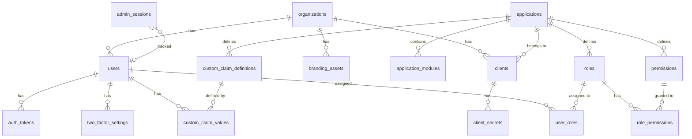

# Data Model

> **Last Updated**: 2026-09-06

## Overview

Porta's data model is defined across 25 PostgreSQL migrations in `packages/server/migrations/`. The schema implements multi-tenant isolation at the database level through foreign key relationships to the `organizations` table. All tables use UUIDs as primary keys and include `created_at`/`updated_at` timestamps.

## Entity Relationship Diagram

## Core Entities

### Organizations

The root tenant entity. Every user, client, and data record is scoped to an organization.

| Column                      | Type         | Description                                                    |
| --------------------------- | ------------ | -------------------------------------------------------------- |
| `id`                        | UUID         | Primary key                                                    |
| `name`                      | VARCHAR(255) | Display name                                                   |
| `slug`                      | CITEXT       | URL-safe identifier, unique, used in OIDC issuer path          |
| `status`                    | VARCHAR(20)  | `active`, `suspended`                                          |
| `is_super_admin`            | BOOLEAN      | Only one org can be super-admin (partial unique index)         |
| `default_locale`            | VARCHAR(10)  | Default locale for auth UI                                     |
| `two_factor_policy`         | VARCHAR(20)  | `disabled`, `optional`, `required`                             |
| `default_login_methods`     | TEXT[]       | `{password,magic_link}` — NOT NULL with DB default             |
| `branding_*`                | Various      | Logo URL, favicon URL, primary color, company name, custom CSS |
| `created_at` / `updated_at` | TIMESTAMPTZ  | Auto-managed timestamps                                        |

**Key constraint**: Partial unique index on `is_super_admin WHERE is_super_admin = TRUE` — ensures exactly one super-admin organization.

### Applications

SaaS product definitions. Applications group roles, permissions, and claim definitions.

| Column        | Type         | Description          |
| ------------- | ------------ | -------------------- |
| `id`          | UUID         | Primary key          |
| `name`        | VARCHAR(255) | Display name         |
| `slug`        | CITEXT       | Unique identifier    |
| `description` | TEXT         | Optional description |
| `status`      | VARCHAR(20)  | `active`, `inactive` |

**Application Modules** (`application_modules`): Logical groupings within an application. Composite unique key `(application_id, slug)`.

### Clients

OIDC client registrations, scoped to an organization and optionally to an application.

| Column                         | Type         | Description                                                |
| ------------------------------ | ------------ | ---------------------------------------------------------- |
| `id`                           | UUID         | Primary key                                                |
| `client_id`                    | VARCHAR(64)  | OIDC client identifier, unique                             |
| `organization_id`              | UUID         | FK → organizations                                         |
| `application_id`               | UUID         | FK → applications (nullable)                               |
| `name`                         | VARCHAR(255) | Display name                                               |
| `status`                       | VARCHAR(20)  | `active`, `inactive`                                       |
| `grant_types`                  | TEXT[]       | Allowed OIDC grant types                                   |
| `response_types`               | TEXT[]       | Allowed response types                                     |
| `redirect_uris`                | TEXT[]       | Registered redirect URIs                                   |
| `post_logout_redirect_uris`    | TEXT[]       | Post-logout redirect URIs                                  |
| `token_endpoint_auth_method`   | VARCHAR(50)  | `client_secret_post`, `none`, etc.                         |
| `login_methods`                | TEXT[]       | Per-client login method override (NULL = inherit from org) |
| `id_token_signed_response_alg` | VARCHAR(10)  | Default `ES256`                                            |
| `scope`                        | TEXT         | Allowed scopes                                             |
| `require_pkce`                 | BOOLEAN      | PKCE enforcement                                           |

### Client Secrets

Hashed client secrets with lifecycle management.

| Column          | Type         | Description                               |
| --------------- | ------------ | ----------------------------------------- |
| `id`            | UUID         | Primary key                               |
| `client_id`     | UUID         | FK → clients                              |
| `secret_hash`   | TEXT         | Argon2id hash of the secret               |
| `secret_prefix` | VARCHAR(8)   | First 8 chars for identification          |
| `secret_sha256` | VARCHAR(64)  | SHA-256 pre-hash for `client_secret_post` |
| `label`         | VARCHAR(255) | Human-readable label                      |
| `status`        | VARCHAR(20)  | `active`, `revoked`                       |
| `expires_at`    | TIMESTAMPTZ  | Optional expiry                           |
| `last_used_at`  | TIMESTAMPTZ  | Usage tracking                            |

Confidential clients can keep overlapping active secrets during rotation, with a hard maximum of
10 active secrets per client. Secret creation locks the parent client row, rechecks that the client
is still confidential and non-revoked, then counts and inserts within the same short transaction.
Secret list and mutation queries always qualify both the client and secret identifiers.

### Users

User accounts, scoped to an organization.

| Column                       | Type         | Description                                         |
| ---------------------------- | ------------ | --------------------------------------------------- |
| `id`                         | UUID         | Primary key                                         |
| `organization_id`            | UUID         | FK → organizations                                  |
| `email`                      | CITEXT       | Unique within organization (composite unique index) |
| `email_verified`             | BOOLEAN      | Email verification status                           |
| `password_hash`              | TEXT         | Argon2id hash (nullable for passwordless users)     |
| `name`                       | VARCHAR(255) | Display name                                        |
| `given_name` / `family_name` | VARCHAR(255) | Name components                                     |
| `status`                     | VARCHAR(20)  | `active`, `inactive`, `suspended`, `locked`         |
| `failed_login_count`         | INTEGER      | Brute-force tracking                                |
| `last_login_at`              | TIMESTAMPTZ  | Login tracking                                      |
| `locale`                     | VARCHAR(10)  | User's preferred locale                             |
| `metadata`                   | JSONB        | Extensible metadata                                 |

**Key constraint**: Composite unique index on `(organization_id, email)` — ensures email uniqueness per tenant.

**Status lifecycle**: `active` can be reversibly changed to `inactive`, `suspended`, or `locked`;
each of those states can return to `active`. Invitations are token-backed setup flows rather than a
user status. Permanent removal physically deletes the user and its owned rows.

## RBAC Entities

### Roles

Application-scoped role definitions.

| Column           | Type         | Description               |
| ---------------- | ------------ | ------------------------- |
| `id`             | UUID         | Primary key               |
| `application_id` | UUID         | FK → applications         |
| `name`           | VARCHAR(255) | Display name              |
| `slug`           | CITEXT       | Unique within application |
| `description`    | TEXT         | Optional description      |

### Permissions

Application-scoped permission definitions.

| Column           | Type         | Description               |
| ---------------- | ------------ | ------------------------- |
| `id`             | UUID         | Primary key               |
| `application_id` | UUID         | FK → applications         |
| `name`           | VARCHAR(255) | Display name              |
| `slug`           | CITEXT       | Unique within application |
| `description`    | TEXT         | Optional description      |

### Role-Permission Mappings

Many-to-many relationship between roles and permissions.

| Column          | Type | Description      |
| --------------- | ---- | ---------------- |
| `role_id`       | UUID | FK → roles       |
| `permission_id` | UUID | FK → permissions |

Composite primary key `(role_id, permission_id)`.

Migration 025 changes the optional `permissions.module_id` relationship from `ON DELETE SET NULL`
to `ON DELETE CASCADE`. Deleting an application module therefore deletes the permissions owned by
that module, and the existing `role_permissions.permission_id` cascade removes their role links.
Application-wide permissions whose `module_id` is null are not included in that module cascade.

### User-Role Assignments

Many-to-many relationship between users and roles, scoped to an organization.

| Column            | Type | Description        |
| ----------------- | ---- | ------------------ |
| `user_id`         | UUID | FK → users         |
| `role_id`         | UUID | FK → roles         |
| `organization_id` | UUID | FK → organizations |

Composite primary key `(user_id, role_id, organization_id)`.

## Custom Claims

### Custom Claim Definitions

Application-scoped claim type definitions.

| Column                    | Type         | Description                           |
| ------------------------- | ------------ | ------------------------------------- |
| `id`                      | UUID         | Primary key                           |
| `application_id`          | UUID         | FK → applications                     |
| `claim_name`              | VARCHAR(255) | Claim name, unique per application    |
| `claim_type`              | VARCHAR(20)  | `string`, `number`, `boolean`, `json` |
| `description`             | TEXT         | Optional description                  |
| `include_in_id_token`     | BOOLEAN      | Include the claim in ID tokens        |
| `include_in_access_token` | BOOLEAN      | Include the claim in access tokens    |
| `include_in_userinfo`     | BOOLEAN      | Include the claim in UserInfo         |

### Custom Claim Values

Per-user claim values, referencing a claim definition.

| Column     | Type  | Description                         |
| ---------- | ----- | ----------------------------------- |
| `id`       | UUID  | Primary key                         |
| `user_id`  | UUID  | FK → users                          |
| `claim_id` | UUID  | FK → custom_claim_definitions       |
| `value`    | JSONB | Typed value for the claim definition |

Composite unique constraint `(user_id, claim_id)`.

## Two-Factor Authentication

### Two-Factor Settings

Per-user 2FA configuration, scoped to an organization.

| Column                   | Type        | Description                       |
| ------------------------ | ----------- | --------------------------------- |
| `id`                     | UUID        | Primary key                       |
| `user_id`                | UUID        | FK → users                        |
| `organization_id`        | UUID        | FK → organizations                |
| `method`                 | VARCHAR(20) | `totp`, `email`                   |
| `is_enabled`             | BOOLEAN     | Whether 2FA is active             |
| `totp_secret`            | TEXT        | AES-256-GCM encrypted TOTP secret |
| `totp_verified`          | BOOLEAN     | Whether TOTP setup is confirmed   |
| `recovery_codes`         | TEXT[]      | Argon2id-hashed recovery codes    |
| `email_otp_last_sent_at` | TIMESTAMPTZ | Rate limiting for email OTP       |

Composite unique index `(user_id, organization_id)`.

## Authentication & Token Tables

### Magic-Link Tokens

`magic_link_tokens` stores only the SHA-256 digest of each bearer artifact. New rows bind the
artifact to the organization recorded by the recovery job and optionally to one OIDC interaction.
Legacy rows are retained for migration safety but are marked unbound and cannot authenticate.

| Column            | Type                   | Description                                                                   |
| ----------------- | ---------------------- | ----------------------------------------------------------------------------- |
| `id`              | UUID                   | Primary key                                                                   |
| `user_id`         | UUID                   | FK → users                                                                    |
| `organization_id` | UUID                   | Immutable tenant authority for the artifact                                   |
| `interaction_uid` | VARCHAR(128), nullable | Exact OIDC interaction authority; null denotes standalone use                 |
| `authority_bound` | BOOLEAN                | False only for migrated legacy rows that cannot be safely attributed          |
| `recovery_job_id` | UUID, nullable         | Unique durable recovery job that created the artifact                         |
| `token_hash`      | TEXT                   | Unique SHA-256 digest; plaintext exists only during delivery and presentation |
| `expires_at`      | TIMESTAMPTZ            | Token expiry                                                                  |
| `used_at`         | TIMESTAMPTZ, nullable  | Single-use marker committed with account and audit mutation                   |
| `created_at`      | TIMESTAMPTZ            | Creation time                                                                 |

Password-reset and invitation artifacts remain in their dedicated tables; they do not share a
generic discriminator column with magic links.

## OIDC Adapter Tables

### `oidc_payloads` (PostgreSQL — long-lived)

Stores AccessToken, RefreshToken, and Grant data in PostgreSQL for durability.

| Column        | Type         | Description                                     |
| ------------- | ------------ | ----------------------------------------------- |
| `id`          | VARCHAR(255) | Composite: `model_name:uid`                     |
| `model_name`  | VARCHAR(50)  | `AccessToken`, `RefreshToken`, `Grant`          |
| `payload`     | JSONB        | Full OIDC artifact data                         |
| `uid`         | VARCHAR(255) | Unique identifier                               |
| `grant_id`    | VARCHAR(255) | Associated grant (indexed for cascade deletion) |
| `user_code`   | VARCHAR(255) | Device flow user code                           |
| `expires_at`  | TIMESTAMPTZ  | Artifact expiry                                 |
| `consumed_at` | TIMESTAMPTZ  | Rotation tracking                               |

**Short-lived artifacts** (Session, Interaction, AuthorizationCode, ReplayDetection, ClientCredentials, PushedAuthorizationRequest) are stored in **Redis** for performance.

## Infrastructure Tables

### System Config

Key-value configuration store with 60-second in-memory cache.

| Column        | Type         | Description                |
| ------------- | ------------ | -------------------------- |
| `key`         | VARCHAR(255) | Config key (primary key)   |
| `value`       | JSONB        | Config value               |
| `description` | TEXT         | Human-readable description |

### Signing Keys

ES256 (ECDSA P-256) signing key pairs for JWT tokens.

| Column        | Type         | Description                                 |
| ------------- | ------------ | ------------------------------------------- |
| `id`          | UUID         | Primary key                                 |
| `kid`         | VARCHAR(255) | Key ID (for JWKS)                           |
| `public_key`  | TEXT         | PEM-encoded public key                      |
| `private_key` | TEXT         | PEM-encoded private key (encrypted at rest) |
| `status`      | VARCHAR(20)  | `active`, `rotated`, `revoked`              |
| `created_at`  | TIMESTAMPTZ  | Key creation time                           |

### Audit Log

Immutable audit trail for all administrative actions.

| Column            | Type           | Description                                                       |
| ----------------- | -------------- | ----------------------------------------------------------------- |
| `id`              | UUID           | Primary key                                                       |
| `organization_id` | UUID, nullable | Tenant context; `ON DELETE SET NULL` preserves history            |
| `user_id`         | UUID, nullable | Subject user; `ON DELETE SET NULL` preserves history              |
| `actor_id`        | UUID, nullable | Acting user; `ON DELETE SET NULL` supports successful self-delete |
| `event_type`      | VARCHAR(100)   | Closed event identifier such as `app.module.deleted`              |
| `event_category`  | VARCHAR(50)    | Event category                                                    |
| `description`     | TEXT           | Bounded description                                               |
| `metadata`        | JSONB          | Safe target identity, state, and parent metadata                  |
| `ip_address`      | INET           | Optional request address                                          |
| `user_agent`      | TEXT           | Optional request user agent                                       |
| `created_at`      | TIMESTAMPTZ    | Event timestamp                                                   |

Deletion events are inserted before the target is removed and commit in the same transaction. The
nullable foreign keys keep the audit record after an organization or user is deleted, including
when the acting user deletes their own account. Metadata excludes secrets, protocol payloads,
affected-user lists, cache keys, and raw errors. The existing automated retention policy from
migration 017 remains authoritative.

### Branding Assets (Migration 018)

Binary storage for organization logos and favicons.

| Column                      | Type         | Description                    |
| --------------------------- | ------------ | ------------------------------ |
| `id`                        | UUID         | Primary key                    |
| `organization_id`           | UUID         | FK → organizations             |
| `asset_type`                | VARCHAR(20)  | `logo` or `favicon`            |
| `data`                      | BYTEA        | Binary image data (max 512 KB) |
| `mime_type`                 | VARCHAR(100) | Image MIME type                |
| `created_at` / `updated_at` | TIMESTAMPTZ  | Auto-managed timestamps        |

**Key constraint**: Unique index on `(organization_id, asset_type)` — one logo and one favicon per organization.

### Admin Sessions (Migration 018)

OIDC session tracking for the admin session viewer and revocation UI.

| Column             | Type                   | Description                                       |
| ------------------ | ---------------------- | ------------------------------------------------- |
| `session_id`       | VARCHAR(128)           | OIDC Session identifier and primary key           |
| `user_id`          | UUID, nullable         | FK → users, cascading on user deletion            |
| `client_id`        | UUID, nullable         | FK → clients; not a complete multi-client mapping |
| `organization_id`  | UUID, nullable         | FK → organizations                                |
| `grant_id`         | VARCHAR(128), nullable | Grant captured when available                     |
| `ip_address`       | INET, nullable         | Client IP address                                 |
| `user_agent`       | TEXT, nullable         | Client user-agent string                          |
| `last_activity_at` | TIMESTAMPTZ            | Last tracking update                              |
| `expires_at`       | TIMESTAMPTZ            | Absolute Session authority expiry                 |
| `revoked_at`       | TIMESTAMPTZ, nullable  | Revocation time; null while live                  |
| `created_at`       | TIMESTAMPTZ            | Tracking-row creation time                        |

The row is an authority dependency for a Redis Session, not only an administrative mirror. Porta
persists it before publishing the Redis payload and rejects cached Sessions whose row is missing,
expired, or revoked. The nullable `client_id` is informational because one Session can authorize
several clients through its Redis payload.

### Invitation Details (Migration 019)

Adds invitation metadata to the `auth_tokens` table:

| Column       | Type  | Description                                                          |
| ------------ | ----- | -------------------------------------------------------------------- |
| `details`    | JSONB | Pre-assignment metadata: roles, claims, personalMessage, inviterName |
| `invited_by` | UUID  | FK → users — the admin who created the invitation                    |

These columns are added to the existing `auth_tokens` table (not a new table).

## Migration Strategy

Migrations are managed programmatically via `packages/server/src/lib/migrator.ts` using `node-pg-migrate`:

- **Forward-only in production** — Migrations run automatically on startup
- **CLI management** — `porta migrate up/down/status` for manual control
- **Numbered sequencing** — `001_` through `025_` prefix ensures deterministic order
- **Idempotent patterns** — `IF NOT EXISTS` used where possible

Migration 025 is deliberately forward-only. It narrows organization status to `active` or
`suspended`, application and client status to `active` or `inactive`, and makes module-owned
permissions cascade with their module. Its Down section is an explicit no-op: removed lifecycle
values and weaker module ownership are not restored.

## Related Documentation

- [System Overview](./system-overview.md) — High-level architecture
- [API Design](./api-design.md) — REST endpoint conventions
- [Security](./security.md) — Data protection and isolation
- [Configuration Reference](../reference/configuration.md) — Database connection settings
